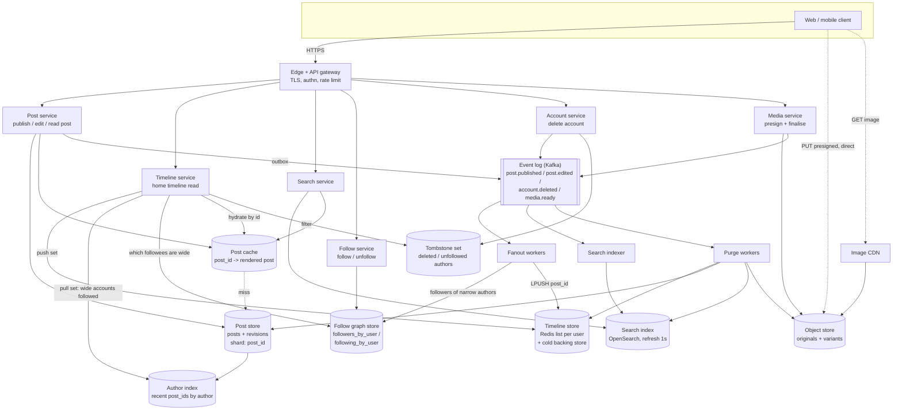

# Problem 1 deliverable: Chirp

Fill in every section. Keep a section short if you have little to say, but do not delete it. If
you deliberately skipped something, write one line saying so and why.

Length is not marked. A tight 2,000 words beats a padded 8,000.

---

## 1. Use cases and scope

State the use cases you are designing for, in priority order. State what you excluded and why.
State the assumptions you are making that the prompt did not settle.

### 1.1 Use cases, in priority order

Priority is set by how often each thing happens and how badly users notice when it breaks.

| # | Use case | Why it ranks here |
|---|----------|-------------------|
| 1 | **Read home timeline.** A signed-in user loads the newest posts from accounts they follow, then pages back with "load more". | Happens most often (see §2 read ratio). If this is slow, the product feels broken. |
| 2 | **Publish a post.** Up to 500 characters, with an optional image up to 2 MB. | 50M/day ≈ 580/s on average. Every other feature depends on posts existing. |
| 3 | **Follow / unfollow.** | Decides who is in each timeline. It has to take effect quickly, but follows happen far less often than reads. |
| 4 | **Search public posts.** A new post must show up within 5 s. | Hard freshness target, but it runs on a separate pipeline and can degrade without breaking timelines. |
| 5 | **Edit a post within 15 min, and view its edit history.** | Rare compared with publishing, and the time window is short. Its cost is consistency: timelines, caches and search copies can disagree for a while (§11.2, §12). |
| 6 | **Delete account and purge.** The user's posts disappear from every timeline within 24 h. | Least frequent, but the deadline is non-negotiable (a legal and trust promise). The 24 h budget means it can run as a background job. |

### 1.2 Out of scope

| Excluded | Why |
|----------|-----|
| DMs, notifications, trending, ads, ranking | The prompt excludes them. The timeline is **reverse-chronological** only, with no ranking. |
| Follow graph storage internals | The prompt excludes them. I assume a graph service that answers "followers of X" (paged) and "does A follow B". |
| Moderation policy | The prompt excludes it. There is a hook on publish/edit (before fanout and indexing) and on image processing. Takedowns reuse the purge path. |
| Replies, reposts, likes, quote posts | Not in the brief. Each would change fanout and deletion (for example, what happens to a repost of a deleted post), so I left them out rather than half-designing them. |
| Private or protected accounts | The brief says "public". Every post is visible to everyone, so the timeline and search need no per-viewer access checks. |
| Deleting or editing a single post outside the window | Not in the brief. Account purge covers the removal path. |
| Auth UI, sign-up, password reset | Assumed to be an existing identity provider. §5.2 only covers the token. |

### 1.3 Assumptions the prompt does not settle

| Assumption | Value | Used in |
|------------|-------|---------|
| Reading of fanout vs skew | Follower counts include inactive registered accounts; "average fanout 50" means active timelines written per post. The prompt's figures cannot both hold otherwise (§2.1) | §2, §11.1 |
| Active user | Opens a timeline at least once a day; the 20M figure is daily actives | §2 |
| Registered accounts | ~500M (needed for 1M+ follower counts, per §2.1) | §2, §11.1 |
| Posts per active user | 50M / 20M = 2.5 posts/day on average, heavily skewed | §2 |
| Read-to-write ratio | Stated and derived in §2 | §2 |
| Peak multiplier | Stated in §2 | §2 |
| Timeline ordering | Reverse-chronological by publish time; edits do not change position | §5.3, §12 |
| Edit semantics | Body text only; the image cannot be swapped. Each edit creates a new revision; history is public | §6, §11.2 |
| Edit window boundary | Checked on the server against the publish time, ±0 grace; client clock ignored | §5.1 |
| Unfollow | Stops future posts arriving immediately; existing timeline entries are hidden when read, not rewritten | §11.1 |
| Deletion scope | Posts, images, edit history, timeline entries, search docs, follow edges. Aggregate logs and metrics are anonymised, not purged | §9, §11.4 |
| Deleted account during 24 h window | Account is blocked from login and the profile is hidden immediately; the 24 h budget covers only copies in timelines, caches and search | §11.4 |
| Timeline depth | Materialised timelines keep only the newest ~800 entries per user; older pages are rebuilt on demand | §2, §6 |
| Single region | Designed for one region with multi-AZ; multi-region noted in §14 | §3, §8 |

---

## 2. Capacity estimation

Show the arithmetic. Every figure gets its working.

Cover at least:

- Write rate in posts per second, average and peak. State the peak multiplier you assume.
- Fanout writes per second at the average fanout.
- The skew case: what one post from an account with over 1 million followers costs, and what that
  does to your write path.
- Storage per month: post bodies, images, edit history, materialised timelines, search index.
  Treat each separately and state the assumptions behind each.
- **Your read-to-write ratio, stated explicitly**, and the read load in requests per second that
  follows from it. Say how you chose the ratio and cross-check it against per-user behaviour.
- Egress bandwidth for images, and what it implies for caching.

If two constraints in the prompt do not reconcile arithmetically, show the calculation that proves
it and state the reading you adopt.

### 2.1 Average fanout and follower skew do not reconcile

```
Top accounts        = 20,000,000 active users × 0.1%      = 20,000 accounts
Edges they need     = 20,000 × 1,000,000 followers (min)   = 20,000,000,000 follows
Edges at avg 50     = 20,000,000 users × 50                =  1,000,000,000 follows
Gap                 = 20B / 1B                             = 20× more than the whole graph
Per active user     = 20B / 20M                            = must follow ≥ 1,000 top accounts
```

Both figures cannot describe the same 20M users.

**Reading I adopt:**
- Follower counts include **all registered accounts** (~500M assumed, §1.3), most of them inactive.
- "Average fanout 50" is the number of **active timelines one post is written into**, averaged over
  posts. Most posts come from small accounts, which keeps the per-post average low.

**What this does to the write path:** pushing one post from a 1M-follower account means ≥ 1M
timeline writes for one post, 20,000× the average post's 50. Large accounts are therefore not
fanned out at write time (§11.1).

---

## 3. High-level design and diagram

One diagram, in a Mermaid fenced code block, showing components and the direction of data flow.
Then prose that walks the write path and the read path.

The diagram and the prose must agree. So must the diagram and section 4.

### 3.1 The shape, in one sentence

Posts are written once to a durable log; **narrow** authors (< 100,000 followers) are fanned out to
materialised timelines at write time, **wide** authors are merged in at read time, and every
materialised timeline entry is an **ID reference, never a copy of the body** — which is what makes
edits and purges cheap.

Three numbers drive the whole shape (§2):

```
50,000,000 posts/day ÷ 86,400          =    579 posts/s average, ~1,736/s at 3× peak
579/s × 50 average fanout              = 28,935 timeline writes/s average, ~86,800/s at peak
one post from a 3,000,000-follower account = 3,000,000 timeline writes
                                         = 3,000,000 ÷ 28,935 ≈ 104 s of the entire
                                           average fanout budget, for one post
```

Pure write-time fanout cannot absorb the skew case; pure read-time merge makes the common read
(50 followed accounts) a 50-way scatter. Hence the hybrid (decision record §11.1).

### 3.2 Diagram



### 3.3 Write path (publish)

1. If the post has an image, the client first calls `POST /v1/media` and receives a presigned URL;
   the 2 MB upload goes **client → object store directly**, never through the API tier. That keeps
   ~225M images/month (§2) off the request path. The media service emits `media.ready` when the
   variants are generated.
2. `POST /v1/posts` with an idempotency key hits the post service. It validates ≤ 500 characters,
   mints a **time-ordered 64-bit post ID** (Snowflake-style: 41-bit ms timestamp, 10-bit shard,
   12-bit sequence), and writes the post row plus revision 1 in a single partition write to the post
   store, sharded by `post_id`.
3. The same transaction writes an **outbox row**, which is tailed into the event log. This is the
   only publication point: fanout, search indexing and purge all consume from it, so they can never
   see a post the post store does not have.
4. The API returns 201 as soon as step 3 is durable — **before** fanout completes. Publish latency
   does not depend on follower count.
5. Fanout workers consume `post.published`. They ask the follow service whether the author is
   narrow or wide:
   - **narrow** (< 100,000 followers): page `followers_by_user`, `LPUSH (post_id, author_id)` onto
     each follower's timeline list, trim to 800 entries. 24 bytes per entry, so the whole
     materialised set is 20M × 800 × 24 B ≈ **384 GB** — it fits in RAM across a Redis cluster.
   - **wide** (≥ 100,000 followers): **no fanout at all.** The post is only recorded in the author
     index, which the read path merges.
6. The search indexer consumes the same event and writes to OpenSearch with a 1 s refresh interval.
   Budget for the 5 s freshness requirement is in §11.3.

### 3.4 Read path (home timeline)

1. `GET /v1/timeline/home?cursor=&limit=20` reaches the timeline service.
2. It fetches two sets and merges them:
   - **push set** — a slice of the viewer's Redis list, already in reverse-chronological order
     because post IDs are time-ordered;
   - **pull set** — for each *wide* account the viewer follows (the follow service keeps a small
     `wide_followees` set per user; at 50 average followees this is typically 0–3 entries), a
     bounded range read of that author's recent post IDs from the author index.
3. A k-way merge on post ID descending produces one ordered list. The **cursor is the post ID of
   the last item returned**, so it is meaningful against both sets: the next page asks for
   `post_id < cursor` on each. Posts published mid-pagination have higher IDs and therefore appear
   on refresh, not interleaved into the page the reader is on (§5.3, §12).
4. Tombstone filter: IDs whose author is in the deleted-or-unfollowed set are dropped here. This is
   how "gone immediately" is delivered while the physical purge runs inside its 24 h budget (§11.4).
5. Hydration: one multi-get against the post cache by post ID, falling back to the post store on
   miss. **The timeline never stores the body**, so a hydrate always returns the current revision.
   That is the whole edit-propagation story: an edit invalidates one cache key, and every timeline
   that references the post picks up the new revision on its next read. No timeline is rewritten
   (§11.2).
6. The response carries `revision`, `edited_at` and an `edit_count` so the frontend can render the
   edited indicator.

### 3.5 Where the moderation hook goes

Out of scope per the prompt, but the seam is: a synchronous check in the post service between
step 2 and step 3 (reject before the post exists), and an asynchronous consumer on
`post.published`/`media.ready` that can call the purge path for a single post. Noted; not designed.

---

## 4. Core components

One subsection per component: responsibility, what it stores, how it scales, what happens when it
is unavailable. These are exactly the components in §3.2 and the ones whose state §12 tracks.

### 4.1 Edge and API gateway

**Responsibility.** TLS termination, token validation (§5.2), per-token and per-IP rate limiting,
request routing, idempotency-key pass-through.
**Stores.** Nothing durable. A short-lived counter store for rate limits.
**Scales.** Stateless, horizontally; sized against read RPS from §2, not write RPS.
**Unavailable.** Total outage of the product. Run ≥ 3 AZs behind an anycast load balancer; this is
the one component with no graceful degradation, so it holds no business logic.

### 4.2 Post service

**Responsibility.** Publish, edit (enforcing the 15-minute window against the server-side publish
time), read a single post, read edit history. Owns ID minting and the outbox.
**Stores.** Writes the post store; writes and invalidates the post cache.
**Scales.** Stateless; ~579 writes/s average, ~1,736/s peak — small. Sized by the read-through path
on cache misses, not by writes.
**Unavailable.** Publishing and editing fail with a retryable 503. **Timelines keep serving** from
the post cache, so the read path degrades to "no new posts" rather than an outage.

### 4.3 Post store

**Responsibility.** The durable record of every post and every revision. Source of truth.
**Stores.** `posts` (partition key `post_id`) and `post_revisions` (partition `post_id`, clustering
`revision`). ~1.5 B posts/month × ~600 B ≈ **900 GB/month** of bodies and metadata (§2).
**Scales.** Wide-column store (Cassandra/ScyllaDB) partitioned by `post_id`. Post IDs are
time-ordered but hashed into partitions, so writes spread rather than hot-spotting the newest
shard. Growth is linear and additive.
**Unavailable.** Publish fails. Reads survive for whatever is cached; cache misses return 503 for
individual posts, which the timeline renders as a gap rather than failing the whole page.

### 4.4 Post cache

**Responsibility.** Serve hydration. Keyed `post:{post_id}` → rendered post JSON including
`revision`.
**Stores.** Hot window only — roughly the last 48 h of posts plus anything recently read. At
100M posts in a 48 h window × ~700 B ≈ 70 GB, sharded.
**Scales.** Redis cluster, consistent hashing on `post_id`.
**Unavailable.** Every hydration falls through to the post store. Timeline read latency rises
sharply and the post store becomes the bottleneck — this is the second thing that breaks under
load (§7).

### 4.5 Event log

**Responsibility.** The ordering and delivery backbone. Topics: `post.published`, `post.edited`,
`account.deleted`, `media.ready`. Partitioned by `author_id` so all events for one author are
ordered.
**Stores.** 7-day retention, which is the replay window for a fanout or indexer bug.
**Scales.** Kafka. ~579 events/s average is trivial; partition count is chosen for consumer
parallelism (fanout), not throughput.
**Unavailable.** The post service's outbox rows accumulate and publish still succeeds; fanout,
indexing and purge stall. Search freshness and new-post delivery degrade, timelines keep serving
existing entries. Backlog drains on recovery because consumers are idempotent (§4.6).

### 4.6 Fanout workers

**Responsibility.** Consume `post.published`, expand narrow authors' follower lists, write timeline
entries. Skip wide authors entirely.
**Stores.** Consumer offsets only.
**Scales.** ~28,935 timeline writes/s average, ~86,800/s at peak. Workers are partitioned by
`author_id`; a large narrow author (say 90,000 followers) is chunked into follower pages of 10,000
so one post never occupies a worker for long. Writes are `LPUSH`+`LTRIM`, idempotent on replay
because the entry is keyed by `post_id` — a duplicate delivery re-pushes the same ID and the
de-duplication happens at merge time in §4.8.
**Unavailable.** New posts from narrow authors stop appearing in followers' timelines; posts from
wide authors keep appearing, because they come through the read-time merge. Backlog is bounded by
log retention.

### 4.7 Timeline store

**Responsibility.** The materialised push set: per user, a list of `(post_id, author_id)` capped at
800 entries.
**Stores.** 20M × 800 × 24 B ≈ **384 GB** in RAM. Anything older than 800 entries is not stored;
deep pagination falls back to the author-index path (§4.8).
**Scales.** Redis cluster keyed by `user_id`. Purely horizontal; a user's whole timeline lives on
one shard, so a page is one round trip.
**Unavailable (node lost).** The users on that shard lose their push set. The timeline service
detects the empty/errored read and serves a **degraded timeline from the pull path plus the author
index for followed accounts**, marked stale in the response. Lost lists are rebuilt lazily from the
author indexes rather than by replaying Kafka.

### 4.8 Timeline service

**Responsibility.** The read path in §3.4: fetch push set, fetch pull set for wide followees,
k-way merge, de-duplicate by post ID, apply the tombstone filter, hydrate, emit the cursor.
**Stores.** Nothing. This is where all the fiddly correctness lives, so it is deliberately
stateless.
**Scales.** The busiest service in the system — read load per §2. Horizontal; each request is
bounded by `limit` (max 100) and by the number of wide followees.
**Unavailable.** Home timeline is down. Single posts, profiles and search still work.

### 4.9 Author index

**Responsibility.** "Recent post IDs by author, newest first" — the read-time half of the hybrid,
and the rebuild source for lost timeline shards.
**Stores.** Partition `author_id`, clustering `post_id` descending; retains the newest ~1,000 IDs
per author in the hot tier. ~24 B per entry.
**Scales.** Same store as §4.3, written on the publish path. Wide authors are read-heavy but there
are few of them (20,000 accounts over 1M followers, §2.1), so these partitions are cached
aggressively.
**Unavailable.** Posts from wide accounts vanish from timelines until it recovers; narrow-author
posts are unaffected. This is the inverse failure of §4.6, which is the point of the hybrid.

### 4.10 Follow service and follow graph store

**Responsibility.** `follow`/`unfollow`, `followers_of(user)` paged, `following(user)`, the
`is_wide` flag, and the per-user `wide_followees` set the read path needs. Storage internals are
out of scope per the prompt; this is the interface the timeline depends on.
**Stores.** `followers_by_user` (partition `user_id`, clustering `follower_id`) and
`following_by_user`. ~1 B edges at 20M × 50 (§2.1).
**Scales.** Partitioned by `user_id`. Wide accounts' follower partitions are huge — they are only
read by purge, never by fanout, which is why the hybrid keeps them cold.
**Unavailable.** Follow/unfollow returns 503. Fanout stalls (it cannot list followers); read-time
merge degrades to the last cached `wide_followees` set.

### 4.11 Search indexer and search index

**Responsibility.** Consume `post.published`/`post.edited`, transform to a search document, index
it. Serve `GET /v1/search`.
**Stores.** OpenSearch, time-sliced indexes, `refresh_interval: 1s`. Body plus author and timestamp
metadata for 1.5 B docs/month.
**Scales.** Indexing at ~579 docs/s is modest; the index is sharded by time so the hot shard is
today's. Query load scales by adding replicas.
**Unavailable.** Search returns 503 or stale results; **timelines and publishing are unaffected**,
which is why search sits on its own consumer group. If it merely falls behind, the 5 s freshness
SLO breaks first and is alerted on before results become visibly wrong (§10).

### 4.12 Media service, object store and CDN

**Responsibility.** Issue presigned uploads, validate the finished object (content type by magic
bytes, size ≤ 2 MB, re-encode to strip metadata), generate variants, emit `media.ready`.
**Stores.** Object store: originals plus ~2 variants. At 15% of posts carrying an image,
225M images/month × 1.2 MB × 1.5 ≈ **405 TB/month** (§2) — the dominant storage cost by two orders
of magnitude, which is why it never touches the API tier or any database.
**Scales.** Object store scales on its own; processing workers scale on the queue.
**Unavailable.** Publish with an image fails at the presign step, before any post exists — so there
is no orphaned post. Text-only publishing is unaffected. If delivery (CDN/object store) is down,
posts render with a broken-image placeholder; text still reads.

### 4.13 Account service, tombstone set and purge workers

**Responsibility.** Account deletion. The account service immediately blocks login, hides the
profile, and writes the author to the **tombstone set**; it emits `account.deleted`. Purge workers
then physically remove posts, revisions, search docs, images, follow edges and timeline entries
inside the 24 h budget (§11.4).
**Stores.** Tombstone set: a small replicated set of author IDs, read on every hydration, entries
retired once the purge for that author completes.
**Scales.** Purge is a background job partitioned by author; the 24 h budget is what makes it
affordable to walk a wide account's follower partitions.
**Unavailable (job fails halfway).** Posts are already invisible via the tombstone filter, so the
user-visible promise holds; the job is resumable by checkpointed follower page and re-runs are
idempotent (delete-if-present). Recovery is covered in §8.

---

## 5. API contract

Cover all of the following.

### 5.1 Endpoints

Method, path, request body, response body, status codes. Cover at least: publish a post, read a
home timeline, read a single post, edit a post, read a post's edit history, search, follow,
unfollow, delete an account.

### 5.2 Authentication and authorisation

The scheme, where the credential lives, its lifetime, and how you revoke it.

### 5.3 Pagination

The mechanism and why. State what happens when new posts arrive mid-page.

### 5.4 Idempotency

Which operations are idempotent, and how a client retries a publish safely.

### 5.5 Error model

The shape of an error response. The status codes you use, and what each means in your system.
Distinguish retryable from terminal.

**Your frontend in `frontend/` must implement this contract. Write it so you can code against it.**

---

## 6. Data model

Entities, fields, keys, indexes and relationships. State your partitioning or sharding key for
each store and justify it against the access patterns in section 5.

Say explicitly how you store: the post, the edit history, the materialised timeline (if you use
one), the follow graph, and the search document.

---

## 7. Scaling and bottlenecks

Name the first component that breaks as load grows, and at what load. Then the second, and the
third. For each, say what you do about it.

---

## 8. Failure modes and reliability

For each significant failure, state the effect a user sees and the recovery.

Cover at least: a fanout worker dies mid post, the search indexer falls behind, the image store
is unavailable on publish, a timeline cache node is lost, the primary datastore fails over, a
purge job fails halfway.

State your consistency model, per read path. Say where you accept staleness and for how long.

---

## 9. Security

Cover at least: authentication and session handling, authorisation on edit and delete, abuse and
rate limiting, image upload handling (content type, size, malicious payloads), output escaping
for post bodies, personal data and what deletion actually removes, and transport.

---

## 10. Deployment and observability

How the system is deployed and released. Then: the metrics that tell you it is healthy, the
alerts you would page on, and the traces or logs you would need to debug the worked trace in
section 12.

Name the service level objective for the home timeline read and for search freshness.

---

## 11. Decision records

**This section is heavily weighted.** Write one record for each of the five decisions below. Use
the template exactly.

For each record, "the numbers that forced it" must cite specific figures from `PROMPT.md` or from
your own section 2 arithmetic. A record that cites no number scores zero for that record.

### Template

> **Decision:** what you chose.
> **Alternative rejected:** one real alternative, described well enough that it is clear you
> considered it.
> **The numbers that forced it:** the specific figures that made the choice.
> **What this costs:** what you gave up, stated plainly.
> **What would change my mind:** the observation or measurement that would make you switch.

### The five decisions

1. **Fanout strategy.** Write-time fanout, read-time merge, or a hybrid.
2. **Edit propagation.** What happens to timelines and caches when a post is edited inside the
   15 minute window.
3. **Search freshness.** How a post becomes searchable within 5 seconds.
4. **Deletion purge.** How an account deletion removes that user's posts from every timeline
   within 24 hours.
5. **Image handling.** Upload, storage, resizing, delivery and lifecycle.

---

## 12. Worked trace

**This section is heavily weighted.** Walk this exact scenario end to end.

> An account with 3 million followers edits a post 10 minutes after publishing it, while one of
> its followers is part way through paginating their home timeline.

Requirements:

- Invent identifiers and keep them consistent throughout: user identifiers, post identifiers,
  cursor values, revision numbers.
- Number the steps.
- After each step, state the resulting state at each component you named in section 4.
- Show the actual request and response payloads at each API call, matching section 5.
- State what the paginating follower sees, and whether they can see the post twice, zero times,
  or in two different versions.
- Name every point at which the system is inconsistent, and for how long.

The trace must agree with your diagram, your data model and your API contract. A disagreement
between them is the single most common reason this section loses marks.

---

## 13. Self-critique

**This section is heavily weighted.** Name the three weakest parts of your design.

For each one:

- What is weak, stated without hedging.
- Why you accepted it.
- **The specific test, experiment or measurement that would expose it.** Name the load, the
  metric and the threshold at which you would say the design has failed.

"It might not scale" is not a critique. "The purge job is untested above 5 million timeline
entries per account, and a load test at 5 billion entries would show whether the 24 hour target
holds" is.

---

## 14. Trade-offs and what you would do with more time

What you traded away deliberately. What you would build next, in order, and why that order.
