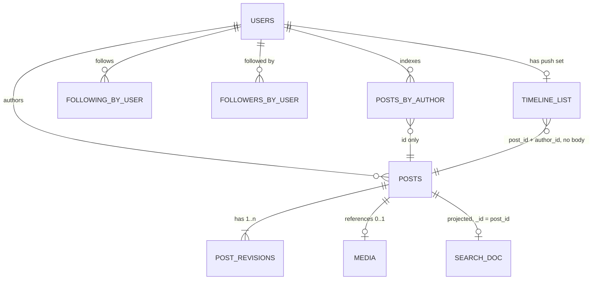

# Problem 1 deliverable: Chirp

Fill in every section. Keep a section short if you have little to say, but do not delete it. If
you deliberately skipped something, write one line saying so and why.

Length is not marked. A tight 2,000 words beats a padded 8,000.

---

## 1. Use cases and scope

State the use cases you are designing for, in priority order. State what you excluded and why.
State the assumptions you are making that the prompt did not settle.

### 1.1 Use cases, in priority order

Priority is set by how often each thing happens and how badly users notice when it breaks.

| # | Use case | Why it ranks here |
|---|----------|-------------------|
| 1 | **Read home timeline.** A signed-in user loads the newest posts from accounts they follow, then pages back with "load more". | Happens most often (see §2 read ratio). If this is slow, the product feels broken. |
| 2 | **Publish a post.** Up to 500 characters, with an optional image up to 2 MB. | 50M/day ≈ 580/s on average. Every other feature depends on posts existing. |
| 3 | **Follow / unfollow.** | Decides who is in each timeline. It has to take effect quickly, but follows happen far less often than reads. |
| 4 | **Search public posts.** A new post must show up within 5 s. | Hard freshness target, but it runs on a separate pipeline and can degrade without breaking timelines. |
| 5 | **Edit a post within 15 min, and view its edit history.** | Rare compared with publishing, and the time window is short. Its cost is consistency: timelines, caches and search copies can disagree for a while (§11.2, §12). |
| 6 | **Delete account and purge.** The user's posts disappear from every timeline within 24 h. | Least frequent, but the deadline is non-negotiable (a legal and trust promise). The 24 h budget means it can run as a background job. |

### 1.2 Out of scope

| Excluded | Why |
|----------|-----|
| DMs, notifications, trending, ads, ranking | The prompt excludes them. The timeline is **reverse-chronological** only, with no ranking. |
| Follow graph storage internals | The prompt excludes them. I assume a graph service that answers "followers of X" (paged) and "does A follow B". |
| Moderation policy | The prompt excludes it. There is a hook on publish/edit (before fanout and indexing) and on image processing. Takedowns reuse the purge path. |
| Replies, reposts, likes, quote posts | Not in the brief. Each would change fanout and deletion (for example, what happens to a repost of a deleted post), so I left them out rather than half-designing them. |
| Private or protected accounts | The brief says "public". Every post is visible to everyone, so the timeline and search need no per-viewer access checks. |
| Deleting or editing a single post outside the window | Not in the brief. Account purge covers the removal path. |
| Auth UI, sign-up, password reset | Assumed to be an existing identity provider. §5.2 only covers the token. |

### 1.3 Assumptions the prompt does not settle

| Assumption | Value | Used in |
|------------|-------|---------|
| Reading of fanout vs skew | Follower counts include inactive registered accounts; "average fanout 50" means active timelines written per post. The prompt's figures cannot both hold otherwise (§2.1) | §2, §11.1 |
| Active user | Opens a timeline at least once a day; the 20M figure is daily actives | §2 |
| Registered accounts | ~500M (needed for 1M+ follower counts, per §2.1) | §2, §11.1 |
| Posts per active user | 50M / 20M = 2.5 posts/day on average, heavily skewed | §2 |
| Read-to-write ratio | Stated and derived in §2 | §2 |
| Peak multiplier | Stated in §2 | §2 |
| Timeline ordering | Reverse-chronological by publish time; edits do not change position | §5.3, §12 |
| Edit semantics | Body text only; the image cannot be swapped. Each edit creates a new revision; history is public | §6, §11.2 |
| Edit window boundary | Checked on the server against the publish time, ±0 grace; client clock ignored | §5.1 |
| Unfollow | Stops future posts arriving immediately; existing timeline entries are hidden when read, not rewritten | §11.1 |
| Deletion scope | Posts, images, edit history, timeline entries, search docs, follow edges. Aggregate logs and metrics are anonymised, not purged | §9, §11.4 |
| Deleted account during 24 h window | Account is blocked from login and the profile is hidden immediately; the 24 h budget covers only copies in timelines, caches and search | §11.4 |
| Author's own posts | Fanout includes a self-edge, so an author's own post appears in their own home timeline on the same ~1 s path as a follower's | §8.7, §01b |
| Timeline depth | Materialised timelines keep only the newest ~800 entries per user; older pages are rebuilt on demand | §2, §6 |
| Single region | Designed for one region with multi-AZ; multi-region noted in §14 | §3, §8 |

---

## 2. Capacity estimation

Show the arithmetic. Every figure gets its working.

Cover at least:

- Write rate in posts per second, average and peak. State the peak multiplier you assume.
- Fanout writes per second at the average fanout.
- The skew case: what one post from an account with over 1 million followers costs, and what that
  does to your write path.
- Storage per month: post bodies, images, edit history, materialised timelines, search index.
  Treat each separately and state the assumptions behind each.
- **Your read-to-write ratio, stated explicitly**, and the read load in requests per second that
  follows from it. Say how you chose the ratio and cross-check it against per-user behaviour.
- Egress bandwidth for images, and what it implies for caching.

If two constraints in the prompt do not reconcile arithmetically, show the calculation that proves
it and state the reading you adopt.

### 2.1 Average fanout and follower skew do not reconcile

```
Top accounts        = 20,000,000 active users × 0.1%      = 20,000 accounts
Edges they need     = 20,000 × 1,000,000 followers (min)   = 20,000,000,000 follows
Edges at avg 50     = 20,000,000 users × 50                =  1,000,000,000 follows
Gap                 = 20B / 1B                             = 20× more than the whole graph
Per active user     = 20B / 20M                            = must follow ≥ 1,000 top accounts
```

Both figures cannot describe the same 20M users.

**Reading I adopt:**
- Follower counts include **all registered accounts** (~500M assumed, §1.3), most of them inactive.
- "Average fanout 50" is the number of **active timelines one post is written into**, averaged over
  posts. Most posts come from small accounts, which keeps the per-post average low.

**What this does to the write path:** pushing one post from a 1M-follower account means ≥ 1M
timeline writes for one post, 20,000× the average post's 50. Large accounts are therefore not
fanned out at write time (§11.1).

---

## 3. High-level design and diagram

One diagram, in a Mermaid fenced code block, showing components and the direction of data flow.
Then prose that walks the write path and the read path.

The diagram and the prose must agree. So must the diagram and section 4.

### 3.1 The shape, in one sentence

Posts are written once to a durable log; **narrow** authors (< 100,000 followers) are fanned out to
materialised timelines at write time, **wide** authors are merged in at read time, and every
materialised timeline entry is an **ID reference, never a copy of the body** — which is what makes
edits and purges cheap.

Three numbers drive the whole shape (§2):

```
50,000,000 posts/day ÷ 86,400          =    579 posts/s average, ~1,736/s at 3× peak
579/s × 50 average fanout              = 28,935 timeline writes/s average, ~86,800/s at peak
one post from a 3,000,000-follower account = 3,000,000 timeline writes
                                         = 3,000,000 ÷ 28,935 ≈ 104 s of the entire
                                           average fanout budget, for one post
```

Pure write-time fanout cannot absorb the skew case; pure read-time merge makes the common read
(50 followed accounts) a 50-way scatter. Hence the hybrid (decision record §11.1).

### 3.2 Diagram


### 3.3 Write path (publish)

1. If the post has an image, the client first calls `POST /v1/media` and receives a presigned URL;
   the 2 MB upload goes **client → object store directly**, never through the API tier. That keeps
   ~225M images/month (§2) off the request path. The media service emits `media.ready` when the
   variants are generated.
2. `POST /v1/posts` with an idempotency key hits the post service. It validates ≤ 500 characters,
   mints a **time-ordered 64-bit post ID** (Snowflake-style: 41-bit ms timestamp, 10-bit shard,
   12-bit sequence), and writes the post row plus revision 1 in a single partition write to the post
   store, sharded by `post_id`.
3. The same transaction writes an **outbox row**, which is tailed into the event log. This is the
   only publication point: fanout, search indexing and purge all consume from it, so they can never
   see a post the post store does not have.
4. The API returns 201 as soon as step 3 is durable — **before** fanout completes. Publish latency
   does not depend on follower count.
5. Fanout workers consume `post.published`. They ask the follow service whether the author is
   narrow or wide:
   - **narrow** (< 100,000 followers): page `followers_by_user`, `LPUSH (post_id, author_id)` onto
     each follower's timeline list, trim to 800 entries. 24 bytes per entry, so the whole
     materialised set is 20M × 800 × 24 B ≈ **384 GB** — it fits in RAM across a Redis cluster.
   - **wide** (≥ 100,000 followers): **no fanout at all.** The post is only recorded in the author
     index, which the read path merges.
6. The search indexer consumes the same event and writes to OpenSearch with a 1 s refresh interval.
   Budget for the 5 s freshness requirement is in §11.3.

### 3.4 Read path (home timeline)

1. `GET /v1/timeline/home?cursor=&limit=20` reaches the timeline service.
2. It fetches two sets and merges them:
   - **push set** — a slice of the viewer's Redis list, already in reverse-chronological order
     because post IDs are time-ordered;
   - **pull set** — for each *wide* account the viewer follows (the follow service keeps a small
     `wide_followees` set per user; at 50 average followees this is typically 0–3 entries), a
     bounded range read of that author's recent post IDs from the author index.
3. A k-way merge on post ID descending produces one ordered list. The **cursor is the post ID of
   the last item returned**, so it is meaningful against both sets: the next page asks for
   `post_id < cursor` on each. Posts published mid-pagination have higher IDs and therefore appear
   on refresh, not interleaved into the page the reader is on (§5.3, §12).
4. Tombstone filter: IDs whose author is in the deleted-or-unfollowed set are dropped here. This is
   how "gone immediately" is delivered while the physical purge runs inside its 24 h budget (§11.4).
5. Hydration: one multi-get against the post cache by post ID, falling back to the post store on
   miss. **The timeline never stores the body**, so a hydrate always returns the current revision.
   That is the whole edit-propagation story: an edit invalidates one cache key, and every timeline
   that references the post picks up the new revision on its next read. No timeline is rewritten
   (§11.2).
6. The response carries `revision`, `edited_at` and an `edit_count` so the frontend can render the
   edited indicator.

### 3.5 Where the moderation hook goes

Out of scope per the prompt, but the seam is: a synchronous check in the post service between
step 2 and step 3 (reject before the post exists), and an asynchronous consumer on
`post.published`/`media.ready` that can call the purge path for a single post. Noted; not designed.

---

## 4. Core components

One subsection per component: responsibility, what it stores, how it scales, what happens when it
is unavailable. These are exactly the components in §3.2 and the ones whose state §12 tracks.

### 4.1 Edge and API gateway

**Responsibility.** TLS termination, token validation (§5.2), per-token and per-IP rate limiting,
request routing, idempotency-key pass-through.
**Stores.** Nothing durable. A short-lived counter store for rate limits.
**Scales.** Stateless, horizontally; sized against read RPS from §2, not write RPS.
**Unavailable.** Total outage of the product. Run ≥ 3 AZs behind an anycast load balancer; this is
the one component with no graceful degradation, so it holds no business logic.

### 4.2 Post service

**Responsibility.** Publish, edit (enforcing the 15-minute window against the server-side publish
time), read a single post, read edit history. Owns ID minting and the outbox.
**Stores.** Writes the post store; writes and invalidates the post cache.
**Scales.** Stateless; ~579 writes/s average, ~1,736/s peak — small. Sized by the read-through path
on cache misses, not by writes.
**Unavailable.** Publishing and editing fail with a retryable 503. **Timelines keep serving** from
the post cache, so the read path degrades to "no new posts" rather than an outage.

### 4.3 Post store

**Responsibility.** The durable record of every post and every revision. Source of truth.
**Stores.** `posts` (partition key `post_id`) and `post_revisions` (partition `post_id`, clustering
`revision`). ~1.52 B posts/month × ~355 B ≈ **540 GB/month** raw, **1.62 TB/month** at RF 3. The
per-row breakdown is in §6.2.
**Scales.** Wide-column store (Cassandra/ScyllaDB) partitioned by `post_id`. Post IDs are
time-ordered but hashed into partitions, so writes spread rather than hot-spotting the newest
shard. Growth is linear and additive.
**Unavailable.** Publish fails. Reads survive for whatever is cached; cache misses return 503 for
individual posts, which the timeline renders as a gap rather than failing the whole page.

### 4.4 Post cache

**Responsibility.** Serve hydration. Keyed `post:{post_id}` → rendered post JSON including
`revision`.
**Stores.** Hot window only — roughly the last 48 h of posts plus anything recently read. At
100M posts in a 48 h window × ~700 B ≈ 70 GB, sharded.
**Scales.** Redis cluster, consistent hashing on `post_id`.
**Unavailable.** Every hydration falls through to the post store. Timeline read latency rises
sharply and the post store becomes the bottleneck — this is the second thing that breaks under
load (§7).

### 4.5 Event log

**Responsibility.** The ordering and delivery backbone. Topics: `post.published`, `post.edited`,
`account.deleted`, `media.ready`. Partitioned by `author_id` so all events for one author are
ordered.
**Stores.** 7-day retention, which is the replay window for a fanout or indexer bug.
**Scales.** Kafka. ~579 events/s average is trivial; partition count is chosen for consumer
parallelism (fanout), not throughput.
**Unavailable.** The post service's outbox rows accumulate and publish still succeeds; fanout,
indexing and purge stall. Search freshness and new-post delivery degrade, timelines keep serving
existing entries. Backlog drains on recovery because consumers are idempotent (§4.6).

### 4.6 Fanout workers

**Responsibility.** Consume `post.published`, expand narrow authors' follower lists, write timeline
entries. Skip wide authors entirely.
**Stores.** Consumer offsets only.
**Scales.** ~28,935 timeline writes/s average, ~86,800/s at peak. Workers are partitioned by
`author_id`; a large narrow author (say 90,000 followers) is chunked into follower pages of 10,000
so one post never occupies a worker for long. Writes are `LPUSH`+`LTRIM`, idempotent on replay
because the entry is keyed by `post_id` — a duplicate delivery re-pushes the same ID and the
de-duplication happens at merge time in §4.8.
**Unavailable.** New posts from narrow authors stop appearing in followers' timelines; posts from
wide authors keep appearing, because they come through the read-time merge. Backlog is bounded by
log retention.

### 4.7 Timeline store

**Responsibility.** The materialised push set: per user, a list of `(post_id, author_id)` capped at
800 entries.
**Stores.** 20M × 800 × 24 B ≈ **384 GB** in RAM. Anything older than 800 entries is not stored;
deep pagination falls back to the author-index path (§4.8).
**Scales.** Redis cluster keyed by `user_id`. Purely horizontal; a user's whole timeline lives on
one shard, so a page is one round trip.
**Unavailable (node lost).** The users on that shard lose their push set. The timeline service
detects the empty/errored read and serves a **degraded timeline from the pull path plus the author
index for followed accounts**, marked stale in the response. Each shard therefore runs a replica for
fast promotion; lazy rebuild from the author indexes is the second line of defence, not the first,
because an unthrottled rebuild storm exceeds the post store's whole read budget (the arithmetic is
in §8.4). Kafka is never replayed for this.

### 4.8 Timeline service

**Responsibility.** The read path in §3.4: fetch push set, fetch pull set for wide followees,
k-way merge, de-duplicate by post ID, apply the tombstone filter, hydrate, emit the cursor.
**Stores.** Nothing. This is where all the fiddly correctness lives, so it is deliberately
stateless.
**Scales.** The busiest service in the system — read load per §2. Horizontal; each request is
bounded by `limit` (max 100) and by the number of wide followees.
**Unavailable.** Home timeline is down. Single posts, profiles and search still work.

### 4.9 Author index

**Responsibility.** "Recent post IDs by author, newest first" — the read-time half of the hybrid,
and the rebuild source for lost timeline shards.
**Stores.** Partition `author_id`, clustering `post_id` descending; retains the newest ~1,000 IDs
per author in the hot tier. ~24 B per entry.
**Scales.** Same store as §4.3, written on the publish path. Wide authors are read-heavy but there
are few of them (20,000 accounts over 1M followers, §2.1), so these partitions are cached
aggressively.
**Unavailable.** Posts from wide accounts vanish from timelines until it recovers; narrow-author
posts are unaffected. This is the inverse failure of §4.6, which is the point of the hybrid.

### 4.10 Follow service and follow graph store

**Responsibility.** `follow`/`unfollow`, `followers_of(user)` paged, `following(user)`, the
`is_wide` flag, and the per-user `wide_followees` set the read path needs. Storage internals are
out of scope per the prompt; this is the interface the timeline depends on.
**Stores.** `followers_by_user` (partition `(user_id, bucket)`, clustering `follower_id`; §6.6) and
`following_by_user`. ~1 B edges at 20M × 50 (§2.1).
**Scales.** Partitioned by `user_id`, with follower lists split into 10,000-edge buckets (§6.6). Wide accounts' follower partitions are huge — they are only
read by purge, never by fanout, which is why the hybrid keeps them cold.
**Unavailable.** Follow/unfollow returns 503. Fanout stalls (it cannot list followers); read-time
merge degrades to the last cached `wide_followees` set.

### 4.11 Search indexer and search index

**Responsibility.** Consume `post.published`/`post.edited`, transform to a search document, index
it. Serve `GET /v1/search`.
**Stores.** OpenSearch, time-sliced indexes, `refresh_interval: 1s`. Body plus author and timestamp
metadata for 1.5 B docs/month.
**Scales.** Indexing at ~579 docs/s is modest; the index is sharded by time so the hot shard is
today's. Query load scales by adding replicas.
**Unavailable.** Search returns 503 or stale results; **timelines and publishing are unaffected**,
which is why search sits on its own consumer group. If it merely falls behind, the 5 s freshness
SLO breaks first and is alerted on before results become visibly wrong (§10).

### 4.12 Media service, object store and CDN

**Responsibility.** Issue presigned uploads, validate the finished object (content type by magic
bytes, size ≤ 2 MB, re-encode to strip metadata), generate variants, emit `media.ready`.
**Stores.** Object store: originals plus ~2 variants. At 15% of posts carrying an image,
225M images/month × 1.2 MB × 1.5 ≈ **405 TB/month** (§2) — the dominant storage cost by two orders
of magnitude, which is why it never touches the API tier or any database.
**Scales.** Object store scales on its own; processing workers scale on the queue.
**Unavailable.** Publish with an image fails at the presign step, before any post exists — so there
is no orphaned post. Text-only publishing is unaffected. If delivery (CDN/object store) is down,
posts render with a broken-image placeholder; text still reads.

### 4.13 Account service, tombstone set and purge workers

**Responsibility.** Account deletion. The account service immediately blocks login, hides the
profile, and writes the author to the **tombstone set**; it emits `account.deleted`. Purge workers
then physically remove posts, revisions, search docs, images, follow edges and timeline entries
inside the 24 h budget (§11.4).
**Stores.** Tombstone set: a small replicated set of author IDs, read on every hydration, entries
retired once the purge for that author completes.
**Scales.** Purge is a background job partitioned by author; the 24 h budget is what makes it
affordable to walk a wide account's follower partitions.
**Unavailable (job fails halfway).** Posts are already invisible via the tombstone filter, so the
user-visible promise holds; the job is resumable by checkpointed follower page and re-runs are
idempotent (delete-if-present). Recovery is covered in §8.

---

## 5. API contract

JSON over HTTPS, base path `/v1`. Everything below is what the frontend in `frontend/` codes
against.

### 5.0 Conventions and shared objects

**IDs are strings.** Post IDs are 64-bit Snowflake values (§3.3). `2^63` exceeds JavaScript's
`Number.MAX_SAFE_INTEGER` (`2^53 − 1`), so every ID crosses the wire as a decimal string. This is a
contract rule, not a style preference — a numeric `id` silently corrupts in any JSON parser using
IEEE-754 doubles.

**Timestamps** are RFC 3339 UTC with millisecond precision: `2026-09-17T10:00:00.000Z`.

**`Post`** — the single representation used by the timeline, single-post reads, search results and
the publish response. One shape, so the frontend has one type.

```json
{
  "id": "1827639201234567890",
  "author": {
    "id": "88213004",
    "handle": "grace",
    "display_name": "Grace",
    "avatar_url": "https://cdn.chirp.example/a/88213004/64.webp"
  },
  "text": "the post body, at most 500 characters",
  "image": {
    "url": "https://cdn.chirp.example/m/9f21c/1280.webp",
    "width": 1280,
    "height": 720,
    "alt": null
  },
  "created_at": "2026-09-17T10:00:00.000Z",
  "revision": 1,
  "edited_at": null,
  "edit_count": 0,
  "editable_until": "2026-09-17T10:15:00.000Z"
}
```

| Field | Notes |
|---|---|
| `id` | Time-ordered, so `id` descending **is** reverse-chronological order (§3.4). |
| `image` | `null` when the post has no image. Never partially populated. |
| `revision` | 1 on publish, incremented per edit. The hydration path always returns the current revision (§3.4 step 5). |
| `edited_at`, `edit_count` | `null` / `0` until the first edit. **`edit_count > 0` is the edited indicator** the frontend renders; it links to `/posts/{id}/revisions`. |
| `editable_until` | Present **only** when the caller is the author and the 15-minute window is still open; absent otherwise. It is advisory — the server re-checks on `PATCH` (§1.3). |

Authors do not carry a `follower_count`. The wide/narrow split (§3.3) is an internal routing
decision and is not exposed.

### 5.1 Endpoints

| # | Method | Path | Purpose |
|---|--------|------|---------|
| 1 | `POST` | `/v1/posts` | Publish |
| 2 | `GET` | `/v1/timeline/home` | Home timeline |
| 3 | `GET` | `/v1/posts/{post_id}` | Single post |
| 4 | `PATCH` | `/v1/posts/{post_id}` | Edit inside the window |
| 5 | `GET` | `/v1/posts/{post_id}/revisions` | Edit history |
| 6 | `GET` | `/v1/search` | Search the public corpus |
| 7 | `PUT` | `/v1/users/{user_id}/follow` | Follow |
| 8 | `DELETE` | `/v1/users/{user_id}/follow` | Unfollow |
| 9 | `DELETE` | `/v1/accounts/me` | Delete account, start purge |
| 10 | `POST` | `/v1/media` | Presigned image upload (precedes 1) |

---

**1. `POST /v1/posts` — publish**

```http
POST /v1/posts
Authorization: Bearer <access token>
Idempotency-Key: 5f2b8c1e-0a3d-4e77-9b21-6c0d1a7e4f9b
Content-Type: application/json

{ "text": "first post", "media_id": "9f21c7a0-...", "alt": null }
```

`text`: 1–500 characters, counted as Unicode code points after NFC normalisation, so a family emoji
costs 1, not 11 UTF-16 units. `media_id` optional (from endpoint 10), `alt` optional and ≤ 400
characters. A post must have `text`; an image alone is rejected.

`201 Created`, `Location: /v1/posts/{id}`, body is a `Post`. Returned as soon as the outbox write is
durable — **before fanout** (§3.3 step 4), so latency does not depend on follower count.

| Status | Meaning |
|---|---|
| 201 | Published. Repeat of a completed `Idempotency-Key` also returns 201 with the original body. |
| 400 | `validation_failed` — empty or > 500 characters, bad `alt`. |
| 401 | Missing/expired token. |
| 409 | `media_not_ready` (no object uploaded at that `media_id`) or `idempotency_key_reuse` (same key, different body). |
| 429 | Publish rate limit (§5.5). |
| 503 | Post service or post store down (§4.2, §4.3). Retryable with the same key. |

---

**2. `GET /v1/timeline/home` — home timeline**

```http
GET /v1/timeline/home?limit=20&cursor=eyJ2IjoxLCJiIjoiMTgyNzYzOTIwMTIzNDU2Nzg5MCJ9
Authorization: Bearer <access token>
```

`limit` 1–100, default 20. `cursor` omitted for the first page.

```json
{
  "items": [ { "...": "Post" } ],
  "page": {
    "next_cursor": "eyJ2IjoxLCJiIjoiMTgyNzYzOTE4NzAwMDAwMDAwMCJ9",
    "has_more": true
  },
  "degraded": false
}
```

`degraded: true` means the push set was unavailable and the page was served from the pull path alone
(§4.7) — fewer items than usual, narrow-author posts may be missing. The frontend shows a banner and
keeps rendering; it is not an error.

`next_cursor` is `null` exactly when `has_more` is `false`.

| Status | Meaning |
|---|---|
| 200 | Including an empty `items` array — an empty timeline is not an error. |
| 400 | `invalid_cursor` — malformed or truncated cursor. Terminal; the client restarts at page 1. |
| 401 | Missing/expired token. |
| 503 | Timeline service unavailable (§4.8). Retryable. |

---

**3. `GET /v1/posts/{post_id}` — single post**

`200` with a `Post`. `404 post_not_found` if the ID does not exist, if the post was purged, **or if
the author is in the tombstone set** (§4.13) — a deleted author's posts are indistinguishable from
absent ones from outside. `503` on a post-store failure with a cold cache (§4.3).

---

**4. `PATCH /v1/posts/{post_id}` — edit**

```http
PATCH /v1/posts/1827639201234567890
Authorization: Bearer <access token>
If-Match: "3"
Content-Type: application/json

{ "text": "first post (fixed a typo)" }
```

Body text only — the image cannot be swapped (§1.3), so there is no `media_id` here. `If-Match`
carries the revision the client believes it is editing, as an ETag; every `Post` read carries
`ETag: "<revision>"`. Omitting it is allowed (last-write-wins); sending a stale one gets 412. This
is the concurrent-edit guard for the same author on two devices.

`200 OK` with the updated `Post`: `revision` incremented, `edited_at` set, `edit_count` incremented.

| Status | Meaning |
|---|---|
| 200 | Edited. Invalidates `post:{post_id}` in the post cache; no timeline is rewritten (§3.4 step 5). |
| 400 | `validation_failed`. |
| 403 | `not_author` — authorisation is ownership, checked server-side against the token subject. |
| 404 | `post_not_found`. |
| 409 | `edit_window_closed` — more than 15 minutes after `created_at`, measured server-side. **Terminal**: retrying never succeeds, and the frontend must say so rather than offering a retry button. |
| 412 | `revision_conflict` — `If-Match` did not match the current revision. |

---

**5. `GET /v1/posts/{post_id}/revisions` — edit history**

Public, per §1.3. Newest first, at most 1 + the number of edits possible in 15 minutes, so no
pagination.

```json
{
  "post_id": "1827639201234567890",
  "revisions": [
    { "revision": 2, "text": "first post (fixed a typo)", "created_at": "2026-09-17T10:10:00.000Z" },
    { "revision": 1, "text": "first post", "created_at": "2026-09-17T10:00:00.000Z" }
  ]
}
```

`200`, or `404 post_not_found` under the same rules as endpoint 3.

---

**6. `GET /v1/search` — public corpus**

`GET /v1/search?q=coffee&limit=20&cursor=...`. `q` is 1–128 characters. Results are
reverse-chronological, not relevance-ranked (ranking is out of scope, §1.2), which lets search reuse
**the same post-ID cursor as the timeline** — one cursor implementation, one frontend type.

Same envelope as endpoint 2 minus `degraded`, plus `"freshness_lag_ms": 820` — the indexer's current
lag, exposed so the 5-second SLO (§11.3) is observable by clients and by the tests that check it.

`200` / `400 validation_failed` (empty or over-long `q`) / `503 search_unavailable` (retryable;
timelines are unaffected, §4.11).

---

**7–8. `PUT` / `DELETE /v1/users/{user_id}/follow`**

No request body. `204 No Content` on success, and both are naturally idempotent — following twice is
a no-op that still returns 204, so no `Idempotency-Key` is needed. `403 cannot_follow_self`,
`404 user_not_found`, `429`, `503 follow_service_unavailable` (§4.10).

Unfollow takes effect on the **next** timeline read via the tombstone/unfollow filter; existing
materialised entries are not rewritten (§1.3, §3.4 step 4).

---

**9. `DELETE /v1/accounts/me` — delete account**

```http
DELETE /v1/accounts/me
Authorization: Bearer <access token>
Content-Type: application/json

{ "confirm_handle": "grace" }
```

`202 Accepted` — the work is asynchronous by design:

```json
{
  "purge_id": "prg_01J9X2",
  "accepted_at": "2026-09-17T10:20:00.000Z",
  "visible_removal": "immediate",
  "purge_deadline": "2026-09-18T10:20:00.000Z"
}
```

`visible_removal: immediate` is the tombstone write plus login block; `purge_deadline` is
`accepted_at + 24 h`, the prompt's budget (§11.4). All sessions are revoked as part of the 202, so
the token used for this call is dead on return. `400 confirm_mismatch`, `401`, `409 purge_in_flight`.

---

**10. `POST /v1/media` — presigned upload**

```http
POST /v1/media
{ "content_type": "image/jpeg", "byte_size": 1843200 }
```

`201`:

```json
{
  "media_id": "9f21c7a0-4b6e-4f0b-8f02-a1d33c9e7b10",
  "upload_url": "https://uploads.chirp.example/...&X-Amz-Expires=900",
  "expires_at": "2026-09-17T10:15:00.000Z"
}
```

The client `PUT`s the bytes straight to `upload_url` (§3.3 step 1), then passes `media_id` to
endpoint 1. `413 image_too_large` if `byte_size > 2097152`, `415 unsupported_media_type` for anything
outside JPEG/PNG/WebP. Declared size and type are only a fast rejection — the media service
re-validates by magic bytes and re-encodes (§4.12, §9).

### 5.2 Authentication and authorisation

**Scheme.** `Authorization: Bearer <jwt>` on every endpoint above. Search and single-post reads
accept an absent token and serve the public view; everything else is 401 without one.

**Where it lives.** Two credentials:

- **Access token** — a JWT signed with EdDSA, claims `sub` (user ID), `sid` (session ID), `iat`,
  `exp`. **15-minute lifetime.** Held in memory by the client, never in `localStorage` (an XSS-
  readable store, §9).
- **Refresh token** — opaque, 30-day sliding lifetime, in an `HttpOnly; Secure; SameSite=Strict`
  cookie scoped to `/v1/auth`. `POST /v1/auth/refresh` exchanges it for a new access token and
  rotates the refresh token; a reused rotated token revokes the whole session family.

The gateway (§4.1) verifies the signature locally — no per-request call to an identity service at
timeline read rates.

**Authorisation** is ownership only, because every post is public (§1.2). Edit and delete compare
`sub` against the post's `author_id` **in the post service**, never at the gateway and never from a
client-supplied author field.

**Revocation.** A 15-minute access token cannot be withdrawn mid-life by signature checks alone, so
the gateway consults a **revoked-`sid` set** (Redis, entries expiring after 15 minutes — bounded
because it only needs to outlive the longest-lived token). Deleting an account, logging out, or a
password change writes every one of that user's `sid` values into it. Worst-case exposure is
therefore 0 seconds, not 15 minutes, at the cost of one cached set lookup per request.

### 5.3 Pagination

**Mechanism: forward-only cursor, descending post ID.** The cursor is an opaque base64url string;
its current payload is `{"v":1,"b":"<post_id>"}`, the ID of the last item returned. Clients must
treat it as opaque — the `v` field exists so the encoding can change without breaking live clients.

**Why not offset.** An offset over a feed that gains ~579 posts/s (§3.1) shifts under the reader: a
post inserted at the head while they page makes `OFFSET 20` return an item they already saw.
Offsets also force the merge in §3.4 to materialise and count everything before the offset, which
gets more expensive the deeper the page. A cursor is O(depth of one page) and is meaningful against
**both** halves of the hybrid — the Redis list slice and the author-index range read both accept
"give me IDs `< cursor`" (§3.4 step 3).

**New posts arriving mid-page.** They get higher IDs than the cursor, and pagination only ever moves
toward lower IDs, so:

- **No duplicates.** A post already returned has an ID ≥ the cursor and cannot appear on a later page.
- **No new posts mid-scroll.** Anything published after page 1 is invisible until the client
  restarts from `cursor = null`. That is deliberate: the alternative injects items above the reader's
  scroll position.
- The first response's newest `id` is what the client keeps to poll for "N new posts" and to decide
  whether a refresh is warranted.

**Trimmed depth.** Materialised timelines hold 800 entries (§4.7). Paging past 800 does not 404 —
the timeline service falls through to the author-index path for the viewer's followees and keeps
serving, more slowly. The frontend sees no difference beyond latency.

**Edits during pagination.** An edit does not change a post's ID, so it does not move between pages.
A reader who already passed the post keeps revision N in their rendered DOM; a page fetched after
the edit hydrates revision N+1. Both are correct views of different read times; §12 traces this.

### 5.4 Idempotency

| Operation | Idempotent? | Mechanism |
|---|---|---|
| `POST /v1/posts` | Yes, with a key | `Idempotency-Key` header, required |
| `POST /v1/media` | No | A wasted presign is garbage-collected after 15 minutes |
| `PATCH /v1/posts/{id}` | Effectively | `If-Match` makes a duplicate retry fail 412 instead of double-editing |
| `PUT`/`DELETE` follow | Yes, naturally | Set semantics; repeat returns 204 |
| `DELETE /v1/accounts/me` | Yes | Second call returns 409 `purge_in_flight` with the original `purge_id` |

**How a client retries a publish safely.** The client generates a UUIDv4 before the first attempt and
reuses it for every retry of *that* post. The post service stores `(user_id, key) → (request hash,
status, reserved post_id, response body)` for 24 hours. The key row and the post row are in
different partitions and cannot be written atomically, so the server **reserves before it writes**:
mint the `post_id`, insert the key row as `in_progress` carrying that ID, write the post, mark the
key `completed`. A retry that finds `in_progress` looks up the reserved `post_id` and either returns
the post that is already there or re-drives the write with that same ID. A crash at any point
therefore yields one post or none, never two. §6.8 has the table.

- Same key, same body, original completed → 201 with the stored body. The client sees one post.
- Same key, same body, original still in flight → `409 idempotency_in_progress`, retryable after
  `Retry-After`.
- Same key, **different** body → `409 idempotency_key_reuse`. Terminal: it means a client bug.

This is what makes the frontend's optimistic write safe. On a timeout the client cannot tell whether
the post was created, and retrying with the same key resolves that ambiguity without a duplicate
post — the alternative is an optimistic UI that occasionally publishes twice.

### 5.5 Error model

Every non-2xx response has this body, and nothing else ever appears in an error position:

```json
{
  "error": {
    "code": "edit_window_closed",
    "message": "This post can no longer be edited.",
    "retryable": false,
    "request_id": "01J9X2K3M4N5P6Q7R8S9T0",
    "details": { "editable_until": "2026-09-17T10:15:00.000Z" }
  }
}
```

| Field | Contract |
|---|---|
| `code` | Stable `snake_case` enum. The frontend switches on this, never on `message`. |
| `message` | Human-readable, already end-user safe. Never contains internal identifiers. |
| `retryable` | **Machine-readable.** `true` means the identical request may succeed later. The frontend shows a retry affordance if and only if this is `true`. |
| `request_id` | Echoed in `X-Request-Id`, the trace key for §10 and §12. Shown in the UI so a user report is debuggable. |
| `details` | Optional, code-specific. Absent by default. |

| Status | Retryable | Codes | What it means here |
|---|---|---|---|
| 400 | no | `validation_failed`, `invalid_cursor`, `confirm_mismatch` | Malformed request. Retrying the same bytes always fails. |
| 401 | no* | `unauthenticated`, `token_expired` | *Terminal for the request, but `token_expired` triggers one silent refresh (§5.2) and one replay. |
| 403 | no | `not_author`, `cannot_follow_self` | Authenticated, not permitted. |
| 404 | no | `post_not_found`, `user_not_found` | Absent, purged, or tombstoned — deliberately indistinguishable. |
| 409 | mixed | `edit_window_closed` (no), `media_not_ready` (no), `idempotency_key_reuse` (no), `idempotency_in_progress` (**yes**), `purge_in_flight` (no) | State conflict. `retryable` is per code, which is exactly why it is a field and not inferred from the status. |
| 412 | no | `revision_conflict` | Client must re-read and re-apply. |
| 413 | no | `image_too_large` | Over 2 MB. |
| 415 | no | `unsupported_media_type` | Not JPEG/PNG/WebP. |
| 429 | **yes** | `rate_limited` | With `Retry-After` and `details.limit` / `details.reset_at`. Publish 300/h/user, timeline 120/min, search 60/min, follow 600/day, all per token; anonymous reads 60/min per IP. |
| 500 | **yes** | `internal_error` | Unclassified. Never leaks a stack trace. |
| 503 | **yes** | `post_service_unavailable`, `timeline_unavailable`, `search_unavailable`, `follow_service_unavailable` | A named dependency from §4 is down. `Retry-After` present. Clients back off exponentially with jitter. |

Note that 429 and 503 are the only codes that should ever drive an automatic client retry, and the
backoff belongs in one HTTP layer in the frontend rather than at each call site.

**Reaching the error path in the mock.** The fixture layer in `frontend/` honours a `?fault=<code>`
query parameter and an equivalent toggle in the UI, so any row of this table can be produced without
editing code (SPEC requirement). The parameter is a mock affordance, not part of the production
contract.

---

## 6. Data model

One rule generates most of what follows: **the post body is stored in exactly one place.** Every
other store holds IDs and points at it. That is what makes an edit a single-row update plus one
cache delete (§11.2), and a purge an enumeration rather than a rewrite (§11.4).

### 6.1 Stores at a glance

| Store | Technology | Partition / shard key | Holds |
|---|---|---|---|
| Post store | Cassandra / ScyllaDB | `post_id`, `author_id`, `(user_id, key)` per table | Posts, revisions, author index, idempotency records |
| Timeline store | Redis cluster | `user_id` | Materialised push set, 800 entries |
| Follow graph store | Cassandra | `(user_id, bucket)` and `user_id` | Follower and following edges |
| Search index | OpenSearch | Daily index, doc `_id = post_id` | The searchable document |
| Post cache | Redis cluster | `post_id` | Rendered post JSON |
| Read caches | Redis cluster | `user_id` | Follow-graph read set, tombstones |
| Object store | S3-compatible | Object key | Image original and variants |

### 6.2 The post

```sql
CREATE TABLE posts (
  post_id     bigint,      -- Snowflake (§3.3): 41-bit ms | 10-bit shard | 12-bit seq
  author_id   bigint,
  text        text,        -- current revision, <= 500 code points (§5.1)
  media_id    uuid,        -- null when the post has no image
  alt         text,
  created_at  timestamp,   -- authoritative; the 15-minute window is measured from this
  revision    int,         -- 1 on publish
  edit_count  int,
  edited_at   timestamp,   -- null until the first edit
  PRIMARY KEY ((post_id))
);
```

**Partition key `post_id`, one row per partition.** Justified by §5: endpoint 3 and every timeline
hydration (§3.4 step 5) are point lookups by post ID, and hydration issues a multi-get of ~20 IDs
that scatters evenly across the ring precisely *because* the partitions are single-row. There is no
access pattern anywhere in §5 that reads a range of posts by time across all authors — search does
that, and search is OpenSearch's job.

Post IDs are time-ordered but the **partitioner hashes them**, so today's writes spread across the
ring instead of hot-spotting one partition (§4.3).

Sizing, refining the estimate in §4.3:

```
post_id 8 + author_id 8 + created_at 8 + text 182 (140 chars avg, ~1.3 B/char UTF-8)
        + media_id 2 (16 B on the 15% of posts with an image) + revision/edit_count/edited_at 14   =   222 B
x 1.6 wide-column per-cell overhead (column names, cell timestamps)        =   355 B
1,522,000,000 posts/month x 355 B                                          =   540 GB/month raw
x RF 3                                                                     =  1.62 TB/month on disk
```

`text` is duplicated between `posts` and `post_revisions` below. That is deliberate: hydration is
the hottest read in the system and must not do two reads to render one post. Both tables share the
partition key `post_id`, so publish and edit write them in a **single-partition logged batch** —
same token, same replica set, atomic and cheap.

### 6.3 The edit history

```sql
CREATE TABLE post_revisions (
  post_id    bigint,
  revision   int,
  text       text,
  created_at timestamp,
  PRIMARY KEY ((post_id), revision)
) WITH CLUSTERING ORDER BY (revision DESC);
```

**Same partition key as `posts`.** §5 endpoint 5 is therefore one partition read, already
newest-first, and needs no pagination — the 15-minute window bounds the row count per partition to
something tiny. Revision 1 is written at publish, so history is never missing its origin.

Append-only. An edit writes revision N+1 and updates `posts.text`/`revision`/`edited_at`; it never
mutates a prior revision. Storage cost at an assumed 5% of posts edited, 1.4 edits each:

```
1,522,000,000 x 0.05 x 1.4 = 107M revision rows/month x 355 B = 38 GB/month  (7% on top of posts)
```

### 6.4 The author index

```sql
CREATE TABLE posts_by_author (
  author_id bigint,
  post_id   bigint,
  PRIMARY KEY ((author_id), post_id)
) WITH CLUSTERING ORDER BY (post_id DESC);
```

A hand-maintained index, not a Cassandra secondary index — a secondary index would scatter the
query to every node, and this is on the timeline read path. Written on publish in the same request
as the post row.

One table, three access patterns, which is why it is worth its write cost:

1. **The pull half of the hybrid** (§3.4 step 2): `WHERE author_id = ? AND post_id < ? LIMIT n` —
   exactly the cursor semantics of §5.3, served as one clustering-range read.
2. **Timeline rebuild** after a Redis shard loss (§4.7), by unioning this over the viewer's
   followees.
3. **Purge enumeration**: "every post this deleted author wrote" (§4.13).

Hot tier retains the newest ~1,000 IDs per author (§4.9) — `1,000 x 24 B = 23 KB` per partition,
which is why wide authors' partitions cache trivially.

### 6.5 The materialised timeline

Not a table. A Redis list per user:

```
key    tl:{user_id}
value  LIST of 16-byte packed entries:  [post_id int64 | author_id int64]
write  LPUSH tl:{user_id} <entry>  ;  LTRIM tl:{user_id} 0 799
read   LRANGE for the page, or scan-to-cursor for page 2+
```

**Shard key `user_id`**, so a user's entire push set lives on one node and a page is one round trip
— the dominant read in §5 (endpoint 2) costs one network hop.

```
16 B packed + ~8 B Redis quicklist node overhead        =  24 B/entry
20,000,000 users x 800 entries x 24 B                   = 384 GB   (matches §4.7)
```

**`author_id` is stored alongside `post_id` even though it is derivable** from the post. It has to
be: the tombstone and unfollow filters in §3.4 step 4 run *before* hydration, so the merge must know
each entry's author without fetching the post. Eight extra bytes buys the filter.

**No body, ever.** This is the single most load-bearing choice in the design. An edit touches
`posts` and deletes one cache key; the 3,000,000 timelines referencing that post in §12 are not
written to at all.

**There is no cold copy beyond 800 entries.** Deep pagination falls through to `posts_by_author`
(§6.4) — slower, but no second store to keep consistent.

A companion key `tlmeta:{user_id}` holds `built_at`. Its **absence** is how the timeline service
distinguishes "this user genuinely has no posts" (200 with `items: []`) from "this shard was lost"
(200 with `degraded: true`, §5.1 endpoint 2). Without it those two cases are the same empty `LRANGE`.

### 6.6 The follow graph

Storage internals are out of scope (§1.2); this is the shape the timeline and purge paths require.

```sql
CREATE TABLE followers_by_user (          -- "who follows X", for fanout and purge
  user_id     bigint,
  bucket      int,
  follower_id bigint,
  created_at  timestamp,
  PRIMARY KEY ((user_id, bucket), follower_id)
);

CREATE TABLE following_by_user (          -- "who X follows", for the read path
  user_id     bigint,                     -- the follower
  followee_id bigint,
  bucket      int,                        -- where the reverse edge landed
  is_wide     boolean,                    -- denormalised snapshot of the followee's class
  created_at  timestamp,
  PRIMARY KEY ((user_id), followee_id)
);
```

**`bucket` exists because of the skew figure**, and it is the one place the prompt's top-0.1%
constraint reaches into the physical model:

```
follower_id 8 + created_at 8 = 16 B, x 1.6 per-cell overhead (as §6.2)  = ~26 B/edge
3,000,000 followers x 26 B in one partition = 78 MB, 3,000,000 rows
Cassandra guidance: keep partitions under ~100 MB and ~100,000 rows
  -> bytes are inside the guidance; rows are 30x over it. Row count is what forces the split.
At 10,000 edges per bucket: 3,000,000 / 10,000 = 300 partitions of 260 KB each
A narrow author at the 99,999-follower ceiling (§3.3) = 10 partitions -> 10 reads per fanout
An average 50-follower account                        =  1 partition
```

Buckets fill in **append order**. `users.active_bucket` (int) names the bucket new edges go into,
and a counter table tracks how full each bucket is:

```sql
CREATE TABLE bucket_fill (user_id bigint, bucket int, edges counter,
                          PRIMARY KEY ((user_id), bucket));
```

A follow writes into `active_bucket` and increments `edges`; when `edges` reaches 10,000 the follow
service advances the pointer with a lightweight transaction,
`UPDATE users SET active_bucket = n+1 WHERE user_id = ? IF active_bucket = n`, so two services racing
to advance it cannot skip a bucket. Append order, not a hash, because both consumers walk buckets
sequentially and want to checkpoint: fanout pages followers (§4.6) and purge resumes from a bucket
index (§4.13). At the 24 h budget, a 300-bucket account allows **288 s per bucket**, which is why
purging a 3M-follower account is comfortable rather than tight.

`following_by_user.bucket` is what makes unfollow a point delete: without it, removing one reverse
edge would mean searching 300 partitions for the row.

**What the bucket scheme does not guarantee**, stated so it is not mistaken for an oversight:

- **Buckets overfill under concurrent follows.** The fill check and the pointer advance are not
  atomic with the edge write (a counter cannot take part in a conditional update), so every follow
  that lands between "edges hit 10,000" and "pointer advanced" still goes into the full bucket.
  Overfill ≈ follow rate × advance latency. Assuming a viral account gains 1,000 followers/s and an
  LWT round-trip takes ~50 ms: 1,000 x 0.05 = ~50 extra edges, 0.5% over target. 10,000 is a
  target, not a limit; the ceiling that matters is 100,000 rows, 10x away.
- **Unfollows leave holes that are never compacted.** New edges only go into the active bucket, so
  an old account's bucket 0 can shrink from 10,000 to 2,000 edges and stay there. Cost is extra
  partitions per fanout or purge walk, not correctness: 3M followers with 30% churned still spans
  300 buckets holding 2.1M edges, 30% of reads wasted. Rebucketing would move edges under a live
  fanout, which the checkpointed walk cannot tolerate, so it is not done.
- **A follow is three writes to three partitions.** The two edge rows (`following_by_user`,
  `followers_by_user`) go in a **multi-partition logged batch**: if the coordinator dies mid-write,
  the batchlog replays it, so the pair converges rather than half-existing. That is eventual, not
  isolated — for up to the batchlog replay delay a follower can have the forward edge without the
  reverse one, and a post fanned out in that window misses them (the 60 s `fg:` cache already
  allows a window this size). The `bucket_fill` and `follower_count` increments cannot join the batch
  (Cassandra rejects counters in a mixed batch) and are not idempotent on retry, so both counters
  drift. Accepted: `follower_count` only feeds the 100,000 `is_wide` threshold, and drift of a few
  hundred at that scale does not flip a verdict; `bucket_fill` drift only moves the overfill point.

Two small companions:

```sql
CREATE TABLE users (
  user_id bigint PRIMARY KEY, handle text, display_name text,
  avatar_media_id uuid, is_wide boolean, state text   -- active | deleting | deleted
);
CREATE TABLE user_counters (user_id bigint PRIMARY KEY, follower_count counter);
```

Counters live in their own table because Cassandra forbids mixing counter and non-counter columns.
`is_wide` is the materialised verdict of `follower_count >= 100,000`, flipped by a job.

**The wide/narrow flip is the hazard in this model.** When an author crosses the threshold, every
`following_by_user.is_wide` flag pointing at them is stale, and during the flip a post can be *both*
fanned out and pulled. That is survivable only because §4.8 de-duplicates by `post_id` at merge —
the flip is the reason that de-duplication is not optional.

**Read cache.** The read path cannot afford a Cassandra read per timeline request, so the viewer's
followee set is cached as `fg:{user_id}` → hash of `followee_id → is_wide`, 60 s TTL. One structure
serves both jobs in §3.4 step 4: membership is the unfollow filter, and the flagged subset is
`wide_followees`. Stale-cache behaviour is exactly what §4.10 promises.

```
20,000,000 users x 50 followees x 17 B = 17 GB
```

### 6.7 The search document

```json
{
  "_id":        "1827639201234567890",
  "post_id":    "1827639201234567890",
  "sort_id":    1827639201234567890,
  "author_id":  "88213004",
  "handle":     "grace",
  "text":       "the post body",
  "created_at": "2026-09-17T10:00:00.000Z",
  "revision":   2,
  "has_image":  true
}
```

**`_id = post_id` is the whole edit and replay story for search.** Indexing an edit is an
overwrite, not a second document, so a post can never appear twice in results; and a duplicate
Kafka delivery re-indexes identical content, which makes the indexer idempotent (§4.5) for free.

`sort_id` is the numeric twin of `post_id`, present so §5.1 endpoint 6's cursor is a `range` filter
(`sort_id < cursor`) on the same descending order the timeline uses. The API renders it back as a
string (§5.0).

**Index per day**, `posts-YYYY-MM-DD`, `refresh_interval: 1s` (§4.11). Daily slicing means the write
load hits one hot index, retention is an index drop rather than a delete-by-query, and a query with
no date filter fans out over aliases.

```
source ~210 B/doc; inverted index ~1.3x source
1.52B docs/month x 210 B x 2.3 = 0.73 TB/month per replica
```

The document carries `handle`, duplicated from `users`, so a result renders without a join. It goes
stale on a handle change — accepted, because search results are re-hydrated against the post cache
before display (§4.11) and the index copy is only used for matching.

### 6.8 Idempotency records

```sql
CREATE TABLE idempotency_keys (
  user_id      bigint,
  key          uuid,
  request_hash blob,
  status       text,     -- in_progress | completed
  post_id      bigint,   -- reserved before the post is written
  response     blob,
  PRIMARY KEY ((user_id, key))
) WITH default_time_to_live = 86400;   -- the 24 h window promised in §5.4
```

Partitioned by `(user_id, key)` so a retry is a point read on the path it needs to be fast on.

This table is in a **different partition from the post row**, so the two cannot be written
atomically. The publish path therefore *reserves* rather than *records*: mint `post_id` → insert
the key row `in_progress` carrying that `post_id` → write the post and revision 1 → update the key
row to `completed`. A retry that finds `in_progress` reads `posts` by the reserved `post_id`: if the
row is there it returns 201 with it, and if it is not it re-drives the write **with the same
`post_id`**, which is idempotent because the ID was fixed before the crash. No interleaving produces
two posts.

### 6.9 Caches and tombstones

| Key | Value | TTL | Invalidated by |
|---|---|---|---|
| `post:{post_id}` | Rendered post JSON, ~700 B | 48 h | `DEL` on edit (§11.2) |
| `fg:{user_id}` | Followee → `is_wide` hash | 60 s | TTL, and on follow/unfollow |
| `tomb:authors` | Set of deleted `author_id` | Until purge completes | Purge completion (§4.13) |

`post:{post_id}` embeds the author's handle and display name so hydration is one multi-get, which
means a display-name change is visible only as cached copies expire — up to 48 h. Accepted and
recorded in §8. Deletion is *not* subject to that staleness, because the tombstone filter runs
before hydration and never consults the cached copy.

The tombstone set stays small: at an assumed 0.01% of 20M actives deleting per day, `2,000
entries x 8 B = 16 KB` held for at most 24 h. It is cheap to replicate to every timeline service
instance, which is what makes a per-entry filter check free.

### 6.10 Media

```sql
CREATE TABLE media (
  media_id uuid PRIMARY KEY, owner_id bigint, state text,  -- presigned | uploaded | ready | rejected
  content_type text, byte_size int, width int, height int, sha256 blob, created_at timestamp
);
```

Object keys are `m/{media_id}/orig`, `m/{media_id}/1280.webp`, `m/{media_id}/640.webp` — derivable
from `media_id` alone, so `posts` stores only the UUID and no URLs. `state` is what §5.1 endpoint 1
checks to return `409 media_not_ready`. Rows in `presigned` or `uploaded` with no referencing post
after 24 h are the orphan-collection target.

### 6.11 Relationships



### 6.12 Access pattern → store

Every endpoint in §5, and what it touches. If a row here needed a scan or a secondary index, the
model would be wrong.

| §5 endpoint | Reads / writes | Key used | Cost |
|---|---|---|---|
| 1 publish | `idempotency_keys` → `posts` + `post_revisions` (batch) → `posts_by_author` → outbox | `(user_id,key)`, `post_id`, `author_id` | 4 single-partition writes |
| 2 home timeline | `tl:{uid}` + `fg:{uid}` + `posts_by_author` (wide only) + `post:{id}` multi-get | `user_id`, then `post_id` | 1 hop + 0–3 range reads + 1 multi-get |
| 3 single post | `post:{id}`, miss → `posts` | `post_id` | 1 point read |
| 4 edit | `posts` read, window check, batch write both tables, `DEL post:{id}` | `post_id` | 1 read + 1 batch + 1 del |
| 5 revisions | `post_revisions` | `post_id` | 1 partition read, pre-sorted |
| 6 search | OpenSearch, then `post:{id}` multi-get | `sort_id` range | 1 query + 1 multi-get |
| 7/8 follow | `users.active_bucket` → logged batch of `following_by_user` + `followers_by_user` → `bucket_fill` + `follower_count` increments | `user_id`, `(user_id,bucket)` | 1 read + 1 batch (2 edges) + 2 counter writes; LWT only when a bucket fills |
| 9 delete account | `users.state`, `tomb:authors`, then async walk of `posts_by_author` and follower buckets | `author_id`, `(user_id,bucket)` | 2 sync writes, rest background |
| 10 media | `media` insert | `media_id` | 1 write |

### 6.13 What is deliberately not stored

| Not stored | Why |
|---|---|
| Post body in timeline entries | The edit and purge story (§6.5) |
| `follower_count` on a post or in the API | Internal routing input only (§5.0) |
| A reverse index of "which timelines contain post P" | Never queried. Purge walks the author's followers instead, which is the same set and already exists |
| Timeline entries older than 800 | `posts_by_author` reconstructs them (§6.5) |
| Per-viewer read state, seen markers | Not in scope (§1.2), and it would be 20M × 800 rows of write amplification on the read path |

---

## 7. Scaling and bottlenecks

Name the first component that breaks as load grows, and at what load. Then the second, and the
third. For each, say what you do about it.

### 7.0 The read load these numbers are measured against

§7 is measured against the peak figures from §2. Restated here so this section can be read on its
own:

```
writes      50,000,000 posts/day ÷ 86,400        =    579 posts/s,      1,736/s at 3x peak
fanout      579 x 50 average                     = 28,935 entries/s,   86,806/s at 3x peak
reads       20,000,000 actives x 25 timeline requests/day
                                                 = 500,000,000/day
                                                 =  5,787 req/s,       17,361/s at 3x peak
hydration   500,000,000 x 20 posts per page      = 10,000,000,000 post reads/day
                                                 = 115,741/s,         347,222/s at 3x peak
ratio       (500M timeline + 100M profile/single-post + 20M search) ÷ 50M writes
                                                 = 620M ÷ 50M         = 12.4 : 1
```

The 3x peak multiplier is a diurnal assumption (§2): a single-region product concentrates traffic
into roughly an 8-hour band, so the busy hour runs ~3x the 24-hour mean.

### 7.1 How I rank what breaks first

Not by absolute size — by **headroom multiple**: capacity ÷ today's peak demand. Small headroom
first, because that is the component that a bad week, not a bad year, takes out.

| # | Component | Peak demand today | Capacity as designed | Headroom | Breaks when |
|---|---|---|---|---|---|
| 1 | Fanout → timeline store | 190k–295k entries/s (see 7.2) | ~400k entries/s | **1.4x** | Posting rate rises ~40%, or the follower mix shifts up |
| 2 | Post cache → post store | 347k hydrations/s, 17.4k/s of misses | ~25k reads/s on the post store | **1.4x** | Cache hit rate falls from 95% to 90% |
| 3 | Search indexer → 5 s freshness | 1,736 docs/s | ~3,500 docs/s per hot shard set | **2x** | Indexer lag exceeds ~3 s, breaking the SLO before capacity |
| 4 | Read-time merge (wide followees) | 0–3 wide followees per viewer | ~10 before the merge doubles read latency | ~3x | Wide accounts get more popular, or the threshold drops |
| 5 | Purge of a wide account | 35 deletes/s per account | thousands/s | >50x | Mass-deletion event, not organic growth |
| 6 | Image egress | 10.4 GB/s at peak | CDN-bound, origin 6 TB/day | high | CDN hit rate drops below ~95% |

Items 1 and 2 are within a factor of 1.5 of their ceiling today. Everything below item 3 is a
year-two problem.

### 7.2 First to break: fanout into the timeline store

**The average fanout figure hides the demand.** The timeline cluster is sized by memory, not
throughput — 20M × 800 × 24 B ≈ 384 GB (§4.7), which at 48 GB per shard is 8 shards. At ~100k
simple ops/s per shard and 2 ops per entry (`LPUSH` + `LTRIM`):

```
capacity      8 shards x 100,000 ops/s ÷ 2 ops  = 400,000 entries/s
naive demand  86,806 entries/s at peak          = 4.6x headroom
```

4.6x looks comfortable. It is wrong, because fanout demand is driven by the **follower
distribution**, not by the mean. Posts from near-threshold authors — just under the 100,000
wide/narrow cut in §3.3 — dominate:

```
one post from a 99,999-follower author = 100,000 entries
100,000 ÷ 400,000 entries/s            = 0.25 s of the ENTIRE cluster, for one post
so 4 such posts in the same second saturate every shard
```

Against 1,736 posts/s at peak, **four** posts is a rounding error. Modelling the mix explicitly
(the fraction of posts from large-but-narrow authors is my assumption; the prompt gives only a
mean):

```
0.2% of posts from authors averaging 60,000 followers:
  1,736 x 0.002 x 60,000 =  208,332 entries/s
  1,736 x 0.998 x     50 =   86,631 entries/s
  total                  =  294,963 entries/s  = 74% of capacity  (headroom 1.4x)

0.1% at 60,000 followers : 190,884 entries/s   = 48% of capacity  (headroom 2.1x)
0.5% at 20,000 followers : 259,981 entries/s   = 65% of capacity  (headroom 1.5x)
```

All three plausible mixes land between 1.4x and 2.1x. The mean-based 4.6x is a fiction.

**What it looks like when it breaks.** Not an error — Kafka absorbs it as **consumer lag**. A burst
of 40 near-threshold posts in one second is 4,000,000 entries, 10 seconds of full-cluster time,
and every follower of every narrow author in the system waits behind it. Users see "my friend
posted five minutes ago and it isn't in my timeline". Publish still returns 201 in milliseconds
(§3.3 step 4), so nothing alerts unless lag is the thing being watched.

**What I do about it.**

1. **The wide/narrow threshold is a runtime dial, not a constant.** It is the only parameter that
   converts write amplification into read amplification, and it can be moved while the system is
   running. Dropping it from 100,000 to 25,000 removes every near-threshold author from the push
   path — the 0.2%/60,000 mix above falls from 295k to ~87k entries/s — at the cost of more
   accounts in each viewer's `wide_followees` set, which is bottleneck #4 and has 3x headroom to
   spend. **Shedding into a bottleneck with more headroom is the whole point of the hybrid.**
2. **Alert on fanout lag, not on CPU.** Page at p99 fanout lag > 30 s (§10).
3. **Two consumer lanes**, partitioned by author size: small authors (< 5,000 followers, the vast
   majority of posts) never queue behind a 100,000-follower expansion. Costs nothing but a
   partitioning rule; without it, one big author adds seconds of latency to thousands of small ones.
4. **Shard for headroom, not just for memory.** 16 shards × 24 GB doubles ops capacity to 800k
   entries/s for the same RAM. This is the cheap move and it is why the cluster is sized in shards
   rather than in nodes.

### 7.3 Second: post cache hit rate, and the post store behind it

Every timeline read hydrates by ID (§3.4 step 5), so the hydration rate is 20x the request rate:
347,222 post reads/s at peak. The post cache holds a ~48 h window, ~100M posts at ~700 B ≈ 70 GB
(§4.4). Reverse-chronological timelines are recency-concentrated, so I assume a 95% hit rate. The
exposure is that **the miss rate, not the hit rate, is the load**:

```
hit 95% : 347,222 x 0.05 = 17,361 reads/s on the post store
hit 90% : 347,222 x 0.10 = 34,722 reads/s     (2x, for a 5-point drop)
hit 85% : 347,222 x 0.15 = 52,083 reads/s     (3x)
```

The post store is sized for 1,736 writes/s plus ~25k reads/s. A five-point change in a parameter I
assumed rather than measured doubles its read load. Three things move that parameter and none of
them are traffic growth:

- **Deep pagination.** Past 800 entries the read falls through to the author index (§4.7) and
  those posts are older than 48 h — a ~0% hit rate for that page.
- **A cache flush or a cold shard.** A rolling restart puts 100% of hydration on the post store:
  347k reads/s, 14x its sizing. This is the failure §4.4 refers to.
- **Edits.** Every edit invalidates one key (§11.2); volume is small, but each invalidation is a
  miss on a post that is by definition in the hot window.

**What I do about it.**

1. **Never fill a cold cache from live traffic.** New cache nodes are warmed from the post store at
   a controlled rate before joining the ring, and restarts are one shard at a time.
2. **Per-request hydration budget with partial results.** A hydration that cannot complete returns
   the posts it has plus `degraded: true` (§5.1) rather than a 503 for the page. Rendering 17 of 20
   posts beats rendering an error.
3. **Concurrency limit on post-store reads, shared across the timeline fleet**, so a hit-rate
   collapse sheds load instead of taking the store down and turning a slow timeline into no
   timeline.
4. **Measure the hit rate as an SLI and alert below 92%** — it is the leading indicator for this
   whole bottleneck, and it is currently an assumption (§13).

### 7.4 Third: search index freshness

The 5 s freshness requirement is a **latency budget**, not a throughput one, which is why it breaks
at 2x rather than at capacity. The budget:

```
publish → outbox → Kafka        ~200 ms
indexer consume + transform     ~300 ms
OpenSearch refresh_interval     1,000 ms  (worst case; §4.11)
replication + query visibility  ~500 ms
                        total   ~2.0 s of the 5 s budget
                        slack   ~3.0 s
```

Throughput is easy: 1,736 docs/s at peak against a hot shard set that handles ~3,500 docs/s. The
SLO breaks first, and it breaks on **lag**, from three sources: a segment-merge pause on today's
time-sliced index, an edit storm re-indexing existing documents, or a single slow consumer holding
a partition. Any of those spends the 3 s slack in one go.

**What I do about it.** Measure freshness end-to-end rather than inferring it: the indexer stamps
`indexed_at`, a synthetic prober publishes a post every 10 s and searches for it, and the SLO is
"p99 publish-to-searchable < 5 s" (§10). Edits go to a separate consumer group from publishes, so
re-indexing never delays first-time visibility — a new post missing its 5 s window is a broken
promise, an edit appearing at 8 s is not. Today's index carries more primary shards than the
archive slices, so the hot shard is never the merge bottleneck.

### 7.5 The next three, more briefly

**Read-time merge amplification (#4).** Each wide account a viewer follows adds one bounded range
read to the author index per page (§3.4 step 2). At 50 followees averaging 0–3 wide, the merge is
cheap. It stops being cheap around 10 wide followees, and 7.2's mitigation — dropping the
threshold — pushes it in exactly that direction. The two bottlenecks are coupled, and the coupling
is the thing to watch: the dial has a range, not a direction. Bound it by capping the pull set per
request (newest N wide followees, the rest served on refresh) and by caching each wide author's
recent-ID list — 20,000 wide accounts × 1,000 IDs × 24 B ≈ 480 MB, so it fits everywhere and the
merge reads memory, not Cassandra.

**Purge throughput (#5).** A 3M-follower account deleting is 3M timeline entries, but the budget is
24 h: 3,000,000 ÷ 86,400 ≈ **35 deletes/s**, which is nothing. Purge is safe because of the
tombstone filter (§3.4 step 4) doing the user-visible work immediately. The real risk is
**correlated** deletion — a bot purge removing 100,000 accounts at once — where the aggregate walk
of follower partitions competes with live fanout. Purge workers therefore run with an explicit rate
cap and a lower priority than fanout; the 24 h budget is what buys the right to deprioritise them.

**Image egress (#6).** 15% of posts carry an image, so a 20-post page delivers ~3:

```
500,000,000 pages/day x 3 images x 200 KB = 300 TB/day = 3.47 GB/s, 10.4 GB/s at peak
origin at 95% CDN hit rate  = 15 TB/day
origin at 98% CDN hit rate  =  6 TB/day
```

This is the largest number in the system by an order of magnitude, and it never touches a service I
operate: uploads go client → object store directly, reads go CDN → object store (§3.3 step 1,
§4.12). The scaling work here is cache policy, not capacity — immutable content-addressed variant
URLs, long max-age, and a fixed set of variant sizes so the CDN's key space stays small. A 3-point
drop in CDN hit rate costs 9 TB/day of origin egress, which is a bill rather than an outage.

### 7.6 What does not break

Worth naming, because it is where the design spent its complexity budget. Publish latency is
independent of follower count (201 returns before fanout, §3.3 step 4), so the skew case cannot
slow down the write path. Post and revision storage grows linearly and additively at ~1.62 TB/month
at RF 3 (§4.3) with no read amplification. Edits are O(1) regardless of how many timelines
reference the post, because no timeline stores a body (§11.2) — the same property that makes purge
a background job. None of these three has a cliff; they have a bill.

---

## 8. Failure modes and reliability

### 8.0 The two properties everything else is built to protect

1. **A post that returned 201 is never lost.** The post row and the outbox row are written in one
   partition write (§3.3 step 3), so there is no window in which the API has acknowledged a post
   that the log will not eventually carry. Every downstream consumer — fanout, indexer, purge — is
   a replayable function of that log, with 7 days of retention (§4.5). Recovery for most of this
   section is therefore "restart the consumer and let it drain", and the interesting question is
   *how long the drain takes*, which is what I compute below.
2. **Nothing on the read path is allowed to fail the whole page.** Every dependency of
   `GET /v1/timeline/home` has a defined degraded answer: a partial page with `degraded: true`
   (§5.1 endpoint 2), a gap where one post would be, or a stale-but-ordered list. A 503 for the
   timeline is reserved for the timeline service itself being gone.

**Blast radius, by dependency.** Read this as "what a user can still do".

| Dependency down | Publish | Home timeline | Single post | Search | Follow |
|---|---|---|---|---|---|
| Fanout workers (§4.6) | works | stale (no new narrow-author posts); wide authors still appear | works | works | works |
| Event log (§4.5) | works (outbox buffers) | stale | works | stale | works |
| Timeline store (§4.7) | works | `degraded: true`, pull path only | works | works | works |
| Post cache (§4.4) | works | slow, then shed (§7.3) | slow | slow | works |
| Post store (§4.3) | **fails 503** | cached posts only, gaps elsewhere | 503 on miss | works (index has its own copy) | works |
| Object store / CDN (§4.12) | text-only works, image publish fails | text renders, broken-image placeholder | same | works | works |
| Search index (§4.11) | works | works | works | **503** | works |
| Follow graph (§4.10) | works | last cached `wide_followees`, push set unaffected | works | works | **503** |

Only two rows take the product down in any real sense, and they are the two stores that hold
something nothing else holds.

### 8.1 A fanout worker dies mid-post

**What happens.** A worker is part-way through a 90,000-follower narrow author, chunked into nine
10,000-follower pages (§4.6). It has committed pages 1–4 and dies before committing its offset.

**What the user sees.** 40,000 followers already have the post. The other 50,000 do not, for as long
as the partition is unassigned — Kafka rebalance, a few seconds. Then a new worker resumes from the
last committed offset, which is *before* page 1, and re-pushes all nine pages.

**Why the duplicate work is safe.** Redelivery `LPUSH`es post IDs that are already in those 40,000
lists, so those lists now contain the same `post_id` twice. The merge in §4.8 de-duplicates by post
ID before hydration, so the reader never sees the post twice. The cost is one wasted entry out of
800 per affected list — a 0.125% shortening of timeline depth for those users, reclaimed as the list
trims naturally. I accept that rather than paying a per-entry existence check on every one of
~87,000 writes/s at peak.

**Recovery time for a real backlog.** A five-minute total fanout outage at peak:

```
backlog        86,806 entries/s x 300 s          = 26,041,800 entries
drain surplus  400,000 capacity - 86,806 live    =    313,194 entries/s
drain time     26,041,800 / 313,194              =         83 s
```

So a 5-minute outage costs ~6.4 minutes of staleness, not 5 minutes of permanent loss. That ratio
only holds while the cluster has headroom; at the 1.4x headroom of §7.2 the same outage drains in
`26,041,800 / (400,000 - 294,963) ≈ 248 s`, three times slower. **Headroom is recovery speed** —
that is the second argument for the 16-shard split in §7.2, independent of steady-state capacity.

**Detection.** Consumer lag per partition, paged at p99 fanout lag > 30 s (§10). Nothing else
alerts: publish still returns 201 in milliseconds (§3.3 step 4).

### 8.2 The search indexer falls behind

**What the user sees.** A post published now is not findable. There is no error and no wrong result
— search returns a correct answer to an older corpus, and `GET /v1/search` reports
`freshness_lag_ms` (§5.1 endpoint 6) so the client can say "results may be up to N seconds old"
rather than silently lying.

**Budget and recovery.** The 5 s requirement has ~3 s of slack against a ~2 s steady-state path
(§7.4). A ten-minute indexer stall:

```
backlog       1,736 docs/s x 600 s        = 1,041,600 docs
drain surplus 3,500 - 1,736               =     1,764 docs/s
drain time    1,041,600 / 1,764           =       590 s  (~10 min)
```

Roughly 1:1 — a ten-minute stall is a twenty-minute freshness incident. Recovery is automatic
(replay from the log) and requires no reindex, because indexing is idempotent on `post_id` +
`revision`: a replayed document overwrites itself.

**Why edits do not make this worse.** Edits are a separate consumer group (§7.4). An edit storm
re-indexing existing documents cannot delay first-time visibility of new posts, which is the
promise with the 5 s number attached to it.

**Total index loss.** The index is a derived store, so the recovery path exists — replay
`post.published` from the archive — but the log holds 7 days and the corpus is 1.5 B docs/month
(§4.11). Rebuilding from the post store is a days-long bulk job. I would restore from a snapshot and
replay only the tail; the honest version is that full search rebuild is a multi-hour to multi-day
degradation, and I have not designed it (§13).

### 8.3 The image store is unavailable on publish

**Which step fails matters.**

- **At presign** — `POST /v1/media` returns `503`. No post exists, so there is nothing to clean up.
  At 15% image rate, `1,736 x 0.15 ≈ 260 posts/s` at peak are blocked and the other ~1,476/s
  publish normally. The client's correct behaviour is to offer "post without the image", which keeps
  85% of the write path alive during a total object-store outage.
- **After upload, before finalise** — the media row is stuck in `uploaded` (§6.10), so
  `POST /v1/posts` returns `409 media_not_ready`, which is non-retryable per §5.5. The client
  re-uploads. Orphaned objects with no referencing post are collected after 24 h (§6.10).
- **On delivery** — posts render with a broken-image placeholder; text reads normally. This is the
  cheapest failure in the system precisely because images never pass through a service I operate
  (§3.3 step 1).

**The ordering rule that makes this simple:** media is durable *before* the post that references it
exists. There is never a post pointing at an object that was never written — the failure is always
"no post", never "post with a dead image".

### 8.4 A timeline cache node is lost

**What the user sees.** The timeline store is 8 shards (§7.2), so one lost shard is
`20,000,000 / 8 = 2,500,000` users whose push set is empty. Their next read gets a page assembled
from the pull path alone, with `degraded: true`: posts from wide accounts they follow, and nothing
from narrow accounts. For a typical viewer with 0–3 wide followees that is a **nearly empty
timeline**, which is why the flag exists — the frontend must distinguish "you follow nobody" from
"we are missing data", and without the flag both are the same empty `LRANGE` (§6.5).

**Why lazy rebuild is not enough on its own.** Rebuilding a user's list means range-reading the
author index for their followees (§4.9), which lives in the post store:

```
2,500,000 users rebuilt within 1 h = 694 users/s x 50 followees = 34,722 reads/s
post store sized for                                            ≈ 25,000 reads/s
```

The rebuild storm is 1.4x the post store's entire read capacity — **the recovery mechanism is
bigger than the thing it is recovering**, and it lands on the store that is already bottleneck #2
(§7.3). Spreading it over six hours gets to 5,787 reads/s, which fits, but six hours of degraded
timelines for 2.5 M users is not acceptable either.

**So the timeline cluster runs one replica per shard.** Cost: a second 384 GB, i.e. 768 GB of RAM
total. Failover promotes the replica in seconds and the push set survives; lazy rebuild is kept as
the second line of defence for a genuine double failure, and it runs under a global concurrency cap
so it can never exceed the post store's budget. This is the one place I buy redundancy outright
rather than derive it, and the 34,722-vs-25,000 line above is the reason.

**Data loss on failover is acceptable here.** The timeline store is a derived cache; a promoted
replica missing the last few seconds of `LPUSH`es loses a handful of entries, and those posts are
still reachable through the author index and the post's own page. I do not enable AOF fsync for it.

### 8.5 The primary datastore fails over

The post store is a quorum-replicated wide-column cluster (§4.3), not a single primary, so "failover"
has two distinct meanings.

**A replica or a whole AZ is lost.** RF 3 across 3 AZs, writes and reads at `LOCAL_QUORUM` (2 of 3).
Losing one AZ leaves 2 of 3 replicas — quorum is still achievable, publish keeps working, and the
returning nodes catch up by hinted handoff and repair. No user-visible effect beyond latency, which
is the reason for choosing a leaderless store for the one thing that must accept writes.

**A second replica is lost.** Quorum is unreachable for the affected token ranges. Publish returns
`503 post_service_unavailable` (§5.5, retryable, with the same `Idempotency-Key`, so a client retry
after recovery produces exactly one post — §5.4). Reads for those ranges fail on cache miss; the
timeline renders the posts it could hydrate and marks the page `degraded: true` (§7.3 point 2)
rather than 503-ing the page. Search still works, because the index holds its own copy of the body.

**The stateful things that *do* have a primary** — the Redis clusters (§4.4, §4.7) and their
failovers — are covered above: both are derived, both tolerate losing seconds of writes, and neither
can lose data that is not reconstructible from the post store or the log.

**What this costs on the write path.** `LOCAL_QUORUM` means every publish waits for 2 of 3 replicas.
That is the durability price for property (1) in §8.0, and it is paid on 1,736 writes/s at peak,
which is small enough that I do not trade it for `ONE`.

### 8.6 A purge job fails halfway

**The user-visible promise is already kept before the job starts.** Deletion writes the author to
the tombstone set synchronously (§4.13); the timeline filter (§3.4 step 4) and search drop that
author's posts from that moment. So a purge that dies halfway is an *unfinished cleanup*, not a
visible resurrection: the 24 h requirement is about copies, and copies are already unreachable.

**Resumability.** A 3 M-follower account is `3,000,000 / 10,000 = 300` follower buckets (§6.6). The
job checkpoints per bucket, and every operation is delete-if-present, so re-running a bucket is a
no-op. A crash costs at most one bucket of re-work — 10,000 deletes, well under a second against a
budget of `3,000,000 / 86,400 ≈ 35 deletes/s` (§7.5).

**The failure that actually matters is a purge that never completes**, because the tombstone entry
cannot be retired until it does (§6.9). A stuck purge is therefore a slow leak in a set that is
supposed to hold ~2,000 entries (16 KB) and is replicated to every timeline service instance. The
guard is an SLO on purge completion — alert at 18 h against the 24 h budget, six hours of margin to
intervene — plus a hard rule that the tombstone entry is removed only on verified completion, never
on a timer. **Leaking a tombstone is cheap; retiring one early un-deletes a user's posts.**

**Partial-purge auditability.** Each purge writes a per-store completion record (`posts`,
`revisions`, `timelines`, `search`, `media`, `follow edges`). That record is the evidence for a
"has this user's data actually been removed" question, which is the one question a deletion feature
gets asked under audit.

### 8.7 Consistency model, per read path

The system is **strongly consistent for everything that answers "what is this post?", and
eventually consistent for everything that answers "which posts are there?"**. That split is
deliberate: the first question has one answer in one place (§6's rule — the body is stored once),
the second is assembled from derived stores that are allowed to lag.

| Read path | Model | Staleness accepted | Bounded by |
|---|---|---|---|
| `GET /v1/posts/{id}` | Read-your-writes | ~0 | `PATCH` returns only after the post-store write is durable **and** the cache key is deleted, so any later read is ≥ the new revision |
| `GET /v1/posts/{id}/revisions` | Strong | 0 | Same partition as the post (§6.3) |
| `POST /v1/posts` → author's own timeline | Eventual | p50 ~1 s, p99 30 s | Fanout lag; the frontend's optimistic insert covers the gap (§01b) |
| `GET /v1/timeline/home` — membership | Eventual | p50 ~1 s, p99 30 s, alert at 30 s | Fanout lag (§8.1). Wide-author posts are *not* subject to this: the pull path reads the author index live |
| `GET /v1/timeline/home` — content of an item | Read-time current | ≤ 1 cache round trip | Hydration always fetches the current revision; no timeline stores a body (§11.2) |
| Across pages of one paginating session | **No monotonic-read guarantee** | Unbounded within the session | Page 1 may show revision 1 and page 3 revision 2 of different posts; each page is correct as of its own read time (§12) |
| `GET /v1/search` | Eventual, with an SLO | **≤ 5 s p99**, reported per response as `freshness_lag_ms` | Indexer lag (§7.4) |
| Deleted account's posts | Effectively immediate | ≤ tombstone replication, ~1 s | Tombstone filter, not the purge (§8.6) |
| Unfollowed author's posts | Immediate on read, entries not rewritten | ~0 for hiding; ≤ 60 s for "stops arriving" | `fg:{user_id}` TTL (§6.9) |
| Wide/narrow reclassification | Eventual | ≤ 60 s, during which a post may be both pushed and pulled | De-duplicated by `post_id` at merge (§4.8, §6.6) |
| Author display name / handle in a rendered post | Eventual | **up to 48 h** | `post:{post_id}` embeds it for one-multi-get hydration (§6.9) |

**Where I knowingly give something up.** Two entries above are worse than a user would guess:

- **No monotonic reads across a paginating session.** Fixing it would mean pinning a read timestamp
  per cursor and hydrating "as of" that time — which means keeping old revisions readable per
  session and defeats the entire point of hydrate-at-read-time. The visible symptom is a reader
  seeing two versions of *different* posts in one scroll. Named and traced in §12.
- **48 h staleness on an author's display name.** The alternative is a second multi-get against a
  user store on every hydration — 347,222 extra reads/s at peak (§7.0) to make a rename propagate
  faster. I chose the cache embed. A handle change is rare; 347k reads/s is not.

**What I am not defending against.** Region loss. §1.3 assumes a single region with multi-AZ, so an
entire-region outage is total unavailability with an RPO bounded by cross-region backups of the post
store, and I have not designed the failover (§14).

---

## 9. Security

Cover at least: authentication and session handling, authorisation on edit and delete, abuse and
rate limiting, image upload handling (content type, size, malicious payloads), output escaping
for post bodies, personal data and what deletion actually removes, and transport.

---

## 10. Deployment and observability

How the system is deployed and released. Then: the metrics that tell you it is healthy, the
alerts you would page on, and the traces or logs you would need to debug the worked trace in
section 12.

Name the service level objective for the home timeline read and for search freshness.

---

## 11. Decision records

**This section is heavily weighted.** Write one record for each of the five decisions below. Use
the template exactly.

For each record, "the numbers that forced it" must cite specific figures from `PROMPT.md` or from
your own section 2 arithmetic. A record that cites no number scores zero for that record.

### Template

> **Decision:** what you chose.
> **Alternative rejected:** one real alternative, described well enough that it is clear you
> considered it.
> **The numbers that forced it:** the specific figures that made the choice.
> **What this costs:** what you gave up, stated plainly.
> **What would change my mind:** the observation or measurement that would make you switch.

### The five decisions

1. **Fanout strategy.** Write-time fanout, read-time merge, or a hybrid.
2. **Edit propagation.** What happens to timelines and caches when a post is edited inside the
   15 minute window.
3. **Search freshness.** How a post becomes searchable within 5 seconds.
4. **Deletion purge.** How an account deletion removes that user's posts from every timeline
   within 24 hours.
5. **Image handling.** Upload, storage, resizing, delivery and lifecycle.

---

## 12. Worked trace

**This section is heavily weighted.** Walk this exact scenario end to end.

> An account with 3 million followers edits a post 10 minutes after publishing it, while one of
> its followers is part way through paginating their home timeline.

Requirements:

- Invent identifiers and keep them consistent throughout: user identifiers, post identifiers,
  cursor values, revision numbers.
- Number the steps.
- After each step, state the resulting state at each component you named in section 4.
- Show the actual request and response payloads at each API call, matching section 5.
- State what the paginating follower sees, and whether they can see the post twice, zero times,
  or in two different versions.
- Name every point at which the system is inconsistent, and for how long.

The trace must agree with your diagram, your data model and your API contract. A disagreement
between them is the single most common reason this section loses marks.

---

## 13. Self-critique

**This section is heavily weighted.** Name the three weakest parts of your design.

For each one:

- What is weak, stated without hedging.
- Why you accepted it.
- **The specific test, experiment or measurement that would expose it.** Name the load, the
  metric and the threshold at which you would say the design has failed.

"It might not scale" is not a critique. "The purge job is untested above 5 million timeline
entries per account, and a load test at 5 billion entries would show whether the 24 hour target
holds" is.

---

## 14. Trade-offs and what you would do with more time

What you traded away deliberately. What you would build next, in order, and why that order.
