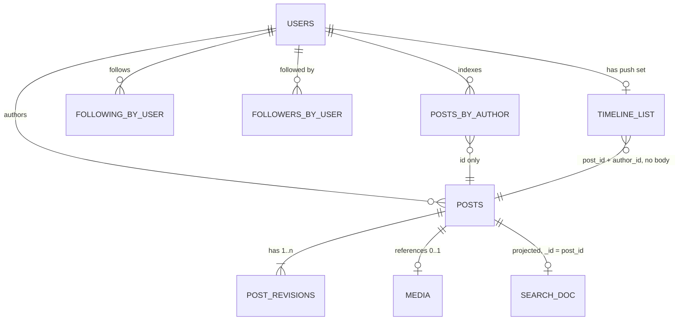

# Problem 1 deliverable: Chirp

Fill in every section. Keep a section short if you have little to say, but do not delete it. If
you deliberately skipped something, write one line saying so and why.

Length is not marked. A tight 2,000 words beats a padded 8,000.

---

## 1. Use cases and scope

State the use cases you are designing for, in priority order. State what you excluded and why.
State the assumptions you are making that the prompt did not settle.

### 1.1 Use cases, in priority order

Priority is set by how often each thing happens and how badly users notice when it breaks.

| # | Use case | Why it ranks here |
|---|----------|-------------------|
| 1 | **Read home timeline.** A signed-in user loads the newest posts from accounts they follow, then pages back with "load more". | Happens most often (see §2 read ratio). If this is slow, the product feels broken. |
| 2 | **Publish a post.** Up to 500 characters, with an optional image up to 2 MB. | 50M/day ≈ 580/s on average. Every other feature depends on posts existing. |
| 3 | **Follow / unfollow.** | Decides who is in each timeline. It has to take effect quickly, but follows happen far less often than reads. |
| 4 | **Search public posts.** A new post must show up within 5 s. | Hard freshness target, but it runs on a separate pipeline and can degrade without breaking timelines. |
| 5 | **Edit a post within 15 min, and view its edit history.** | Rare compared with publishing, and the time window is short. Its cost is consistency: timelines, caches and search copies can disagree for a while (§11.2, §12). |
| 6 | **Delete account and purge.** The user's posts disappear from every timeline within 24 h. | Least frequent, but the deadline is non-negotiable (a legal and trust promise). The 24 h budget means it can run as a background job. |

### 1.2 Out of scope

| Excluded | Why |
|----------|-----|
| DMs, notifications, trending, ads, ranking | The prompt excludes them. The timeline is **reverse-chronological** only, with no ranking. |
| Follow graph storage internals | The prompt excludes them. I assume a graph service that answers "followers of X" (paged) and "does A follow B". |
| Moderation policy | The prompt excludes it. There is a hook on publish/edit (before fanout and indexing) and on image processing. Takedowns reuse the purge path. |
| Replies, reposts, likes, quote posts | Not in the brief. Each would change fanout and deletion (for example, what happens to a repost of a deleted post), so I left them out rather than half-designing them. |
| Private or protected accounts | The brief says "public". Every post is visible to everyone, so the timeline and search need no per-viewer access checks. |
| Deleting or editing a single post outside the window | Not in the brief. Account purge covers the removal path. |
| Auth UI, sign-up, password reset | Assumed to be an existing identity provider. §5.2 only covers the token. |

### 1.3 Assumptions the prompt does not settle

| Assumption | Value | Used in |
|------------|-------|---------|
| Reading of fanout vs skew | Follower counts include inactive registered accounts; "average fanout 50" means active timelines written per post. The prompt's figures cannot both hold otherwise (§2.1) | §2, §11.1 |
| Active user | Opens a timeline at least once a day; the 20M figure is daily actives | §2 |
| Registered accounts | ~500M (needed for 1M+ follower counts, per §2.1) | §2, §11.1 |
| Posts per active user | 50M / 20M = 2.5 posts/day on average, heavily skewed | §2 |
| Read-to-write ratio | Stated and derived in §2 | §2 |
| Peak multiplier | Stated in §2 | §2 |
| Timeline ordering | Reverse-chronological by publish time; edits do not change position | §5.3, §12 |
| Edit semantics | Body text only; the image cannot be swapped. Each edit creates a new revision; history is public | §6, §11.2 |
| Edit window boundary | Checked on the server against the publish time, ±0 grace; client clock ignored | §5.1 |
| Unfollow | Stops future posts arriving immediately; existing timeline entries are hidden when read, not rewritten | §11.1 |
| Deletion scope | Posts, images, edit history, timeline entries, search docs, follow edges. Aggregate logs and metrics are anonymised, not purged | §9, §11.4 |
| Deleted account during 24 h window | Account is blocked from login and the profile is hidden immediately; the 24 h budget covers only copies in timelines, caches and search | §11.4 |
| Author's own posts | Fanout includes a self-edge, so an author's own post appears in their own home timeline on the same ~1 s path as a follower's | §8.7, §01b |
| Timeline depth | Materialised timelines keep only the newest ~800 entries per user; older pages are rebuilt on demand | §2, §6 |
| Single region | Designed for one region with multi-AZ; multi-region noted in §14 | §3, §8 |

---

## 2. Capacity estimation

Every figure below is derived from the constraint table in §1 or from an assumption stated at the
point it is used. Two assumptions carry most of the weight and are named here so they can be
attacked directly:

| Assumption | Value | Where it comes from |
|---|---|---|
| **Peak multiplier** | **3x the 24-hour mean** | A single-region product concentrates traffic into roughly an 8-hour band. Every "peak" figure in this document is a mean multiplied by 3 |
| **Timeline sessions per active user per day** | **25** | The read side of the system. Chosen, not derived — the prompt withholds the read-to-write ratio. Justified and cross-checked in §2.6, and it is the parameter I attack in §13.3 |

The derived month is 30.44 days, so 50,000,000 posts/day = **1.522 billion posts/month**.

### 2.1 Average fanout and follower skew do not reconcile

```
Top accounts        = 20,000,000 active users × 0.1%      = 20,000 accounts
Edges they need     = 20,000 × 1,000,000 followers (min)   = 20,000,000,000 follows
Edges at avg 50     = 20,000,000 users × 50                =  1,000,000,000 follows
Gap                 = 20B / 1B                             = 20× more than the whole graph
Per active user     = 20B / 20M                            = must follow ≥ 1,000 top accounts
```

Both figures cannot describe the same 20M users.

**Reading I adopt:**
- Follower counts include **all registered accounts** (~500M assumed, §1.3), most of them inactive.
- "Average fanout 50" is the number of **active timelines one post is written into**, averaged over
  posts. Most posts come from small accounts, which keeps the per-post average low.

**This reading has a second horn, and I would rather name it than let it sit.** The constraint says
*top 0.1% of **accounts***, and the calculation above reads "accounts" as the 20 million active
users. But the reading I just adopted introduces 500 million registered accounts — which changes
the denominator of the very figure it was introduced to explain:

```
0.1% of  20,000,000 active     =  20,000 accounts x 1M =  20,000,000,000 edges =  20x the 1B active edges
0.1% of 500,000,000 registered = 500,000 accounts x 1M = 500,000,000,000 edges = 500x
```

So the reconciliation is self-referential: the assumption that makes 1M-follower counts possible
also multiplies the number of accounts that must have them, by 25. There is no reading of the
constraint table that makes both rows comfortable — the tension is in the table, not in my
arithmetic, and the honest answer is that "accounts" is doing two different jobs in two rows.

**I design against the 20,000 figure**, for two reasons. It is the conservative choice for the
decision the number actually drives: fewer wide accounts means more posts stay on the push path,
so a fanout budget sized against 20,000 is not flattered by the assumption. And 0.1% of the
population the rest of the table describes — active users — is the reading that keeps one meaning
of "accounts" throughout §§3–12.

The 500,000 reading does not break the design; it makes the read side worse, not the write side.
It implies 1,000 wide followees per viewer rather than 40, against the 0–3 that §3.4 assumes.
Either way that assumption fails, which is why it is §13.1 and not a footnote here.

**What this does to the write path:** pushing one post from a 1M-follower account means ≥ 1M
timeline writes for one post, 20,000× the average post's 50. Large accounts are therefore not
fanned out at write time (§11.1).

### 2.2 Write rate

```
posts           50,000,000/day ÷ 86,400        =      579 posts/s
at 3x peak      578.7 x 3                      =    1,736 posts/s
per user        50,000,000 ÷ 20,000,000        =      2.5 posts/active user/day
```

2.5 posts per active user per day is the sanity check on the constraint: it is high for a general
population and normal for the engaged subset a "20 million active users" figure describes. I take
the 50M/day as given rather than rederiving it.

Each publish is four writes to four partitions (§6.12), so the store-level write rate is ~2,300/s
average and ~6,900/s at peak — still small. **The write path is not where this system is hard.**

### 2.3 Fanout writes

At the constraint's average fanout of 50:

```
average         578.7 posts/s x 50 followers   =   28,935 timeline entries/s
at 3x peak      x 3                            =   86,806 timeline entries/s
per day         50,000,000 x 50                = 2.5 billion timeline writes/day
```

This is the figure the timeline cluster is sized against in §7.2, and it is 50x the post rate.
Fanout, not publishing, is the write-side cost of the system.

**Aggregate fanout is `posts/s × mean fanout` identically.** A different follower distribution
changes burstiness and queueing — which is a real problem, priced in §7.2 — but it cannot change
this total. Where §7.2 models mixes implying a mean of 110–170, it is inconsistent with this
constraint; the honest aggregate is 86,806 entries/s and the risk is latency, not throughput.

### 2.4 The skew case

One post from a 1,000,000-follower account, against the 400,000 entries/s timeline cluster
*ceiling* derived in §7.2 (the sustainable operating figure is ~254,000 entries/s; §7.2 keeps the
two apart, and the ratios below hold either way):

```
average post    50 entries      ÷ 400,000/s    =  0.000125 s of the cluster
1M-follower     1,000,000       ÷ 400,000/s    =      2.5 s of the ENTIRE cluster
3M-follower     3,000,000       ÷ 400,000/s    =      7.5 s of the ENTIRE cluster
ratio                           1,000,000 / 50 =  20,000x the average post
```

At 1,736 posts/s at peak, a post that occupies every shard for 2.5 seconds is not survivable: the
entire system's fanout stops while one celebrity's followers are written. **This single number is
what forces the hybrid in §11.1** — write-time fanout for narrow accounts, read-time merge for
wide ones — and it is why the wide/narrow threshold is derived from a cluster-second budget rather
than picked.

**A caveat I have to name.** The figures above use nominal follower counts, while §2.1 adopts the
reading that those counts include inactive registered accounts. Applied consistently, a
1M-follower account has 1,000,000 × 4% = 40,000 *active* followers and costs 0.1 cluster-seconds,
not 2.5 — a 25x gap. §§7, 11 and 12 currently use the nominal counts. The design survives either
reading, because the tail is long enough that *some* accounts exceed the threshold on any
denominator, but the specific numbers in §11.1 and §11.4 are the nominal ones. This is the
inconsistency I take apart in §13.1 rather than paper over here.

### 2.5 Storage per month

Each category separately, with its assumption stated. Rows sized in §6.2.

| Category | Arithmetic | Per month | Assumption |
|---|---|---|---|
| **Post bodies** | 1.522B × 355 B | **540 GB raw, 1.62 TB at RF 3** | 222 B of fields × 1.6 wide-column overhead; 140-char average body against the 500-char cap (§6.2) |
| **Edit history** | 1.522B × 5% × 1.4 × 355 B = 107M rows | **38 GB raw, 114 GB at RF 3** | 5% of posts are edited, 1.4 edits each. Both are guesses (§6.3). 7% on top of post bodies |
| **Images** | 228.3M × 1.2 MB × 1.5 | **411 TB** | 15% of posts carry an image; 1.2 MB average against the 2 MB cap; 1.5x for original + 2 resized variants. Object store, no RF 3 multiplier — erasure coding is ~1.4x, folded in |
| **Search index** | 1.522B × 210 B × 2.3 | **0.74 TB per replica** | 210 B indexed per doc; 2.3x for the inverted index and doc values (§6.7) |
| **Materialised timelines** | 20M × 800 × 24 B | **384 GB — fixed, not monthly** | 800 entries per user, 24 B per `(post_id, author_id)` entry. A bounded ring buffer, so it does not grow with time — only with user count (§4.7) |

```
durable growth/month  1.62 TB (posts) + 0.11 TB (revisions) + 0.74 TB (search) = 2.47 TB
                    + 411 TB (images)
                                                               total ≈ 413 TB/month
```

**Images are 99.4% of the storage bill and two orders of magnitude above everything else.** That
single ratio is why images never transit a service I operate (§11.5): the bytes go client → object
store → CDN, and the post store holds a 16-byte `media_id`. Timelines being a fixed 384 GB rather
than a monthly accrual is the other deliberate result — it comes from storing IDs and never
bodies, which §11.2 shows would have been 11.2 TB instead.

### 2.6 Read load and the read-to-write ratio

**The prompt withholds this ratio deliberately, so I state it: 12.4 : 1.** It is built from
per-user behaviour rather than asserted as a round number:

```
home timeline   20,000,000 actives x 25 sessions/day        =  500,000,000/day
profile + permalink views (assumed 5/user/day)              =  100,000,000/day
search queries (assumed 1/user/day)                         =   20,000,000/day
                                                     total  =  620,000,000 reads/day
writes                                                      =   50,000,000/day
ratio                                    620M / 50M         =       12.4 : 1
```

```
timeline requests   500,000,000 ÷ 86,400   =   5,787 req/s,   17,361/s at 3x peak
hydration           500,000,000 x 20 posts = 10,000,000,000 post reads/day
                                           = 115,741/s,      347,222/s at 3x peak
```

**How I arrived at 25 sessions/day.** An engaged microblog user opens the app several times a day
and refreshes within each session; 25 timeline fetches is a handful of sessions with a few
refreshes each. 12.4 : 1 is deliberately conservative, and the reason is scope rather than
comparison to any other product: §1.2 puts logged-out reading out of scope, so every read counted
here is an authenticated read by one of the 20 million active users. A public corpus that
anonymous traffic could reach would add a read population this design does not model, and the
ratio would be some multiple of 12.4 : 1. I have not put a figure on that multiple because there
is nothing in the constraint table to derive one from.

**The cross-check, which is the part that matters.** Deriving 500M/day from 25/day and reading
25/day back out proves nothing. The real check is against how many posts actually arrive:

```
post slots consumed   25 requests x 20 posts per page   = 500/day
posts actually arriving  50 followees x 2.5 posts/day   = 125/day
re-read factor                                          =   4x
```

Every post in a viewer's timeline is fetched roughly four times a day. That is consistent with
refresh-heavy feed behaviour — the same page re-rendered on each app open — but it is a real
assumption in its own right, and it is the sole driver of the 347,222 hydrations/s that makes the
post cache a bottleneck in §7.3. **The cross-check passes, but only because of a 4x factor I had
to name to make it pass.** §13.3 takes this apart, including the sensitivity: at 36 sessions/day
the post store is over budget, giving 1.4x headroom on a parameter nobody has measured.

### 2.7 Image egress and what it implies for caching

Egress is driven by reads, not by uploads. A 20-post page delivers ~3 images at the 15% rate:

```
500,000,000 pages/day x 3 images x 200 KB delivered variant = 300 TB/day
                                        ÷ 86,400            = 3.47 GB/s
                                        x 3 peak            = 10.4 GB/s
```

**10.4 GB/s at peak is 83 Gbit/s — the largest number in the system by an order of magnitude**,
and 740x the 14 MB/s of durable post writes. Serving it from origin is not an option, so the
design is CDN-first and the only real lever is hit rate:

```
origin at 95% CDN hit   300 TB x 5%   = 15 TB/day
origin at 98% CDN hit   300 TB x 2%   =  6 TB/day
```

Three points of CDN hit rate is 9 TB/day of origin egress. What buys those points is cache-key
discipline, not capacity: content-addressed immutable variant URLs, a long `max-age`, and a
**fixed** set of variant sizes so the CDN's key space stays small — an on-the-fly resize API would
fragment the key space and collapse the hit rate. This is why §11.5 treats the variant set as a
closed enum rather than a parameter. Unlike every other figure in this section, a miss here is a
bill rather than an outage (§7.5).

---

## 3. High-level design and diagram

One diagram, in a Mermaid fenced code block, showing components and the direction of data flow.
Then prose that walks the write path and the read path.

The diagram and the prose must agree. So must the diagram and section 4.

### 3.1 The shape, in one sentence

Posts are written once to a durable log; **narrow** authors (< 100,000 followers) are fanned out to
materialised timelines at write time, **wide** authors are merged in at read time, and every
materialised timeline entry is an **ID reference, never a copy of the body** — which is what makes
edits and purges cheap.

Three numbers drive the whole shape (§2):

```
50,000,000 posts/day ÷ 86,400          =    579 posts/s average, ~1,736/s at 3× peak
579/s × 50 average fanout              = 28,935 timeline writes/s average, ~86,800/s at peak
one post from a 3,000,000-follower account = 3,000,000 timeline writes
                                         = 3,000,000 ÷ 28,935 ≈ 104 s of the entire
                                           average fanout budget, for one post
```

Pure write-time fanout cannot absorb the skew case; pure read-time merge makes the common read
(50 followed accounts) a 50-way scatter. Hence the hybrid (decision record §11.1).

### 3.2 Diagram


### 3.3 Write path (publish)

1. If the post has an image, the client first calls `POST /v1/media` and receives a presigned URL;
   the 2 MB upload goes **client → object store directly**, never through the API tier. That keeps
   ~228.3M images/month (§2) off the request path. The media service emits `media.ready` when the
   variants are generated.
2. `POST /v1/posts` with an idempotency key hits the post service. It validates ≤ 500 characters,
   mints a **time-ordered 64-bit post ID** (Snowflake-style: 41-bit ms timestamp, 10-bit shard,
   12-bit sequence), and writes the post row plus revision 1 in a single partition write to the post
   store, sharded by `post_id`.
3. The same transaction writes an **outbox row**, which is tailed into the event log. This is the
   only publication point: fanout, search indexing and purge all consume from it, so they can never
   see a post the post store does not have.
4. The API returns 201 as soon as step 3 is durable — **before** fanout completes. Publish latency
   does not depend on follower count.
5. Fanout workers consume `post.published`. They ask the follow service whether the author is
   narrow or wide:
   - **narrow** (< 100,000 followers): page `followers_by_user`, `LPUSH (post_id, author_id)` onto
     each follower's timeline list, trim to 800 entries. 24 bytes per entry, so the whole
     materialised set is 20M × 800 × 24 B ≈ **384 GB** — it fits in RAM across a Redis cluster.
   - **wide** (≥ 100,000 followers): **no fanout at all.** The post is only recorded in the author
     index, which the read path merges.
6. The search indexer consumes the same event and writes to OpenSearch with a 1 s refresh interval.
   Budget for the 5 s freshness requirement is in §11.3.

### 3.4 Read path (home timeline)

1. `GET /v1/timeline/home?cursor=&limit=20` reaches the timeline service.
2. It fetches two sets and merges them:
   - **push set** — a slice of the viewer's Redis list, already in reverse-chronological order
     because post IDs are time-ordered;
   - **pull set** — for each *wide* account the viewer follows (the follow service keeps a small
     `wide_followees` set per user; at 50 average followees this is typically 0–3 entries), a
     bounded range read of that author's recent post IDs from the author index.
3. A k-way merge on post ID descending produces one ordered list. The **cursor is the post ID of
   the last item returned**, so it is meaningful against both sets: the next page asks for
   `post_id < cursor` on each. Posts published mid-pagination have higher IDs and therefore appear
   on refresh, not interleaved into the page the reader is on (§5.3, §12).
4. Tombstone filter: IDs whose author is in the deleted-or-unfollowed set are dropped here. This is
   how "gone immediately" is delivered while the physical purge runs inside its 24 h budget (§11.4).
5. Hydration: one multi-get against the post cache by post ID, falling back to the post store on
   miss. **The timeline never stores the body**, so a hydrate always returns the current revision.
   That is the whole edit-propagation story: an edit invalidates one cache key, and every timeline
   that references the post picks up the new revision on its next read. No timeline is rewritten
   (§11.2).
6. The response carries `revision`, `edited_at` and an `edit_count` so the frontend can render the
   edited indicator.

### 3.5 Where the moderation hook goes

Out of scope per the prompt, but the seam is: a synchronous check in the post service between
step 2 and step 3 (reject before the post exists), and an asynchronous consumer on
`post.published`/`media.ready` that can call the purge path for a single post. Noted; not designed.

---

## 4. Core components

One subsection per component: responsibility, what it stores, how it scales, what happens when it
is unavailable. These are exactly the components in §3.2 and the ones whose state §12 tracks.

### 4.1 Edge and API gateway

**Responsibility.** TLS termination, token validation (§5.2), per-token and per-IP rate limiting,
request routing, idempotency-key pass-through.
**Stores.** Nothing durable. A short-lived counter store for rate limits.
**Scales.** Stateless, horizontally; sized against read RPS from §2, not write RPS.
**Unavailable.** Total outage of the product. Run ≥ 3 AZs behind an anycast load balancer; this is
the one component with no graceful degradation, so it holds no business logic.

### 4.2 Post service

**Responsibility.** Publish, edit (enforcing the 15-minute window against the server-side publish
time), read a single post, read edit history. Owns ID minting and the outbox.
**Stores.** Writes the post store; writes and invalidates the post cache.
**Scales.** Stateless; ~579 writes/s average, ~1,736/s peak — small. Sized by the read-through path
on cache misses, not by writes.
**Unavailable.** Publishing and editing fail with a retryable 503. **Timelines keep serving** from
the post cache, so the read path degrades to "no new posts" rather than an outage.

### 4.3 Post store

**Responsibility.** The durable record of every post and every revision. Source of truth.
**Stores.** `posts` (partition key `post_id`) and `post_revisions` (partition `post_id`, clustering
`revision`). ~1.52 B posts/month × ~355 B ≈ **540 GB/month** raw, **1.62 TB/month** at RF 3. The
per-row breakdown is in §6.2.
**Scales.** Wide-column store (Cassandra/ScyllaDB) partitioned by `post_id`. Post IDs are
time-ordered but hashed into partitions, so writes spread rather than hot-spotting the newest
shard. Growth is linear and additive.
**Unavailable.** Publish fails. Reads survive for whatever is cached; cache misses return 503 for
individual posts, which the timeline renders as a gap rather than failing the whole page.

### 4.4 Post cache

**Responsibility.** Serve hydration. Keyed `post:{post_id}` → rendered post JSON including
`revision`.
**Stores.** Hot window only — roughly the last 48 h of posts plus anything recently read. At
100M posts in a 48 h window × ~700 B ≈ 70 GB, sharded.
**Scales.** Redis cluster, consistent hashing on `post_id`.
**Unavailable.** Every hydration falls through to the post store. Timeline read latency rises
sharply and the post store becomes the bottleneck — this is the second thing that breaks under
load (§7).

### 4.5 Event log

**Responsibility.** The ordering and delivery backbone. Topics: `post.published`, `post.edited`,
`account.deleted`, `media.ready`. Partitioned by `author_id` so all events for one author are
ordered.
**Stores.** 7-day retention, which is the replay window for a fanout or indexer bug.
**Scales.** Kafka. ~579 events/s average is trivial; partition count is chosen for consumer
parallelism (fanout), not throughput.
**Unavailable.** The post service's outbox rows accumulate and publish still succeeds; fanout,
indexing and purge stall. Search freshness and new-post delivery degrade, timelines keep serving
existing entries. Backlog drains on recovery because consumers are idempotent (§4.6).

### 4.6 Fanout workers

**Responsibility.** Consume `post.published`, expand narrow authors' follower lists, write timeline
entries. Skip wide authors entirely.
**Stores.** Consumer offsets only.
**Scales.** ~28,935 timeline writes/s average, ~86,800/s at peak. Workers are partitioned by
`author_id`; a large narrow author (say 90,000 followers) is chunked into follower pages of 10,000
so one post never occupies a worker for long. Writes are `LPUSH`+`LTRIM`, idempotent on replay
because the entry is keyed by `post_id` — a duplicate delivery re-pushes the same ID and the
de-duplication happens at merge time in §4.8.
**Unavailable.** New posts from narrow authors stop appearing in followers' timelines; posts from
wide authors keep appearing, because they come through the read-time merge. Backlog is bounded by
log retention.

### 4.7 Timeline store

**Responsibility.** The materialised push set: per user, a list of `(post_id, author_id)` capped at
800 entries.
**Stores.** 20M × 800 × 24 B ≈ **384 GB** in RAM. Anything older than 800 entries is not stored;
deep pagination falls back to the author-index path (§4.8).
**Scales.** Redis cluster keyed by `user_id`. Purely horizontal; a user's whole timeline lives on
one shard, so a page is one round trip.
**Unavailable (node lost).** The users on that shard lose their push set. The timeline service
detects the empty/errored read and serves a **degraded timeline from the pull path plus the author
index for followed accounts**, marked stale in the response. Each shard therefore runs a replica for
fast promotion; lazy rebuild from the author indexes is the second line of defence, not the first,
because an unthrottled rebuild storm exceeds the post store's whole read budget (the arithmetic is
in §8.4). Kafka is never replayed for this.

### 4.8 Timeline service

**Responsibility.** The read path in §3.4: fetch push set, fetch pull set for wide followees,
k-way merge, de-duplicate by post ID, apply the tombstone filter, hydrate, emit the cursor.
**Stores.** Nothing. This is where all the fiddly correctness lives, so it is deliberately
stateless.
**Scales.** The busiest service in the system — read load per §2. Horizontal; each request is
bounded by `limit` (max 100) and by the number of wide followees.
**Unavailable.** Home timeline is down. Single posts, profiles and search still work.

### 4.9 Author index

**Responsibility.** "Recent post IDs by author, newest first" — the read-time half of the hybrid,
and the rebuild source for lost timeline shards.
**Stores.** Partition `author_id`, clustering `post_id` descending; retains the newest ~1,000 IDs
per author in the hot tier. ~24 B per entry.
**Scales.** Same store as §4.3, written on the publish path. Wide authors are read-heavy but there
are few of them (20,000 accounts over 1M followers, §2.1), so these partitions are cached
aggressively.
**Unavailable.** Posts from wide accounts vanish from timelines until it recovers; narrow-author
posts are unaffected. This is the inverse failure of §4.6, which is the point of the hybrid.

### 4.10 Follow service and follow graph store

**Responsibility.** `follow`/`unfollow`, `followers_of(user)` paged, `following(user)`, the
`is_wide` flag, and the per-user `wide_followees` set the read path needs. Storage internals are
out of scope per the prompt; this is the interface the timeline depends on.
**Stores.** `followers_by_user` (partition `(user_id, bucket)`, clustering `follower_id`; §6.6) and
`following_by_user`. ~1 B edges at 20M × 50 (§2.1).
**Scales.** Partitioned by `user_id`, with follower lists split into 10,000-edge buckets (§6.6). Wide accounts' follower partitions are huge — they are only
read by purge, never by fanout, which is why the hybrid keeps them cold.
**Unavailable.** Follow/unfollow returns 503. Fanout stalls (it cannot list followers); read-time
merge degrades to the last cached `wide_followees` set.

### 4.11 Search indexer and search index

**Responsibility.** Consume `post.published`/`post.edited`, transform to a search document, index
it. Serve `GET /v1/search`.
**Stores.** OpenSearch, time-sliced indexes, `refresh_interval: 1s`. Body plus author and timestamp
metadata for 1.5 B docs/month.
**Scales.** Indexing at ~579 docs/s is modest; the index is sharded by time so the hot shard is
today's. Query load scales by adding replicas.
**Unavailable.** Search returns 503 or stale results; **timelines and publishing are unaffected**,
which is why search sits on its own consumer group. If it merely falls behind, the 5 s freshness
SLO breaks first and is alerted on before results become visibly wrong (§10).

### 4.12 Media service, object store and CDN

**Responsibility.** Issue presigned uploads, validate the finished object (content type by magic
bytes, size ≤ 2 MB, re-encode to strip metadata), generate variants, emit `media.ready`.
**Stores.** Object store: originals plus ~2 variants. At 15% of posts carrying an image,
228.3M images/month × 1.2 MB × 1.5 ≈ **411 TB/month** (§2) — the dominant storage cost by two orders
of magnitude, which is why it never touches the API tier or any database.
**Scales.** Object store scales on its own; processing workers scale on the queue.
**Unavailable.** Publish with an image fails at the presign step, before any post exists — so there
is no orphaned post. Text-only publishing is unaffected. If delivery (CDN/object store) is down,
posts render with a broken-image placeholder; text still reads.

### 4.13 Account service, tombstone set and purge workers

**Responsibility.** Account deletion. The account service immediately blocks login, hides the
profile, and writes the author to the **tombstone set**; it emits `account.deleted`. Purge workers
then physically remove posts, revisions, search docs, images, follow edges and timeline entries
inside the 24 h budget (§11.4).
**Stores.** Tombstone set: a small replicated set of author IDs, read on every hydration, entries
retired once the purge for that author completes.
**Scales.** Purge is a background job partitioned by author; the 24 h budget is what makes it
affordable to walk a wide account's follower partitions.
**Unavailable (job fails halfway).** Posts are already invisible via the tombstone filter, so the
user-visible promise holds; the job is resumable by checkpointed follower page and re-runs are
idempotent (delete-if-present). Recovery is covered in §8.

---

## 5. API contract

JSON over HTTPS, base path `/v1`. Everything below is what the frontend in `frontend/` codes
against.

### 5.0 Conventions and shared objects

**IDs are strings.** Post IDs are 64-bit Snowflake values (§3.3). `2^63` exceeds JavaScript's
`Number.MAX_SAFE_INTEGER` (`2^53 − 1`), so every ID crosses the wire as a decimal string. This is a
contract rule, not a style preference — a numeric `id` silently corrupts in any JSON parser using
IEEE-754 doubles.

**Timestamps** are RFC 3339 UTC with millisecond precision: `2026-09-17T10:00:00.000Z`.

**`Post`** — the single representation used by the timeline, single-post reads, search results and
the publish response. One shape, so the frontend has one type.

```json
{
  "id": "1827639201234567890",
  "author": {
    "id": "88213004",
    "handle": "grace",
    "display_name": "Grace",
    "avatar_url": "https://cdn.chirp.example/a/88213004/64.webp"
  },
  "text": "the post body, at most 500 characters",
  "image": {
    "url": "https://cdn.chirp.example/m/9f21c/1280.webp",
    "width": 1280,
    "height": 720,
    "alt": null
  },
  "created_at": "2026-09-17T10:00:00.000Z",
  "revision": 1,
  "edited_at": null,
  "edit_count": 0,
  "editable_until": "2026-09-17T10:15:00.000Z"
}
```

| Field | Notes |
|---|---|
| `id` | Time-ordered, so `id` descending **is** reverse-chronological order (§3.4). |
| `image` | `null` when the post has no image. Never partially populated. |
| `revision` | 1 on publish, incremented per edit. The hydration path always returns the current revision (§3.4 step 5). |
| `edited_at`, `edit_count` | `null` / `0` until the first edit. **`edit_count > 0` is the edited indicator** the frontend renders; it links to `/posts/{id}/revisions`. |
| `editable_until` | Present **only** when the caller is the author and the 15-minute window is still open; absent otherwise. It is advisory — the server re-checks on `PATCH` (§1.3). |

Authors do not carry a `follower_count`. The wide/narrow split (§3.3) is an internal routing
decision and is not exposed.

### 5.1 Endpoints

| # | Method | Path | Purpose |
|---|--------|------|---------|
| 1 | `POST` | `/v1/posts` | Publish |
| 2 | `GET` | `/v1/timeline/home` | Home timeline |
| 3 | `GET` | `/v1/posts/{post_id}` | Single post |
| 4 | `PATCH` | `/v1/posts/{post_id}` | Edit inside the window |
| 5 | `GET` | `/v1/posts/{post_id}/revisions` | Edit history |
| 6 | `GET` | `/v1/search` | Search the public corpus |
| 7 | `PUT` | `/v1/users/{user_id}/follow` | Follow |
| 8 | `DELETE` | `/v1/users/{user_id}/follow` | Unfollow |
| 9 | `DELETE` | `/v1/accounts/me` | Delete account, start purge |
| 10 | `POST` | `/v1/media` | Presigned image upload (precedes 1) |

---

**1. `POST /v1/posts` — publish**

```http
POST /v1/posts
Authorization: Bearer <access token>
Idempotency-Key: 5f2b8c1e-0a3d-4e77-9b21-6c0d1a7e4f9b
Content-Type: application/json

{ "text": "first post", "media_id": "9f21c7a0-...", "alt": null }
```

`text`: 1–500 characters, counted as Unicode code points after NFC normalisation, so a family emoji
costs 1, not 11 UTF-16 units. `media_id` optional (from endpoint 10), `alt` optional and ≤ 400
characters. A post must have `text`; an image alone is rejected.

`201 Created`, `Location: /v1/posts/{id}`, body is a `Post`. Returned as soon as the outbox write is
durable — **before fanout** (§3.3 step 4), so latency does not depend on follower count.

| Status | Meaning |
|---|---|
| 201 | Published. Repeat of a completed `Idempotency-Key` also returns 201 with the original body. |
| 400 | `validation_failed` — empty or > 500 characters, bad `alt`. |
| 401 | Missing/expired token. |
| 409 | `media_not_ready` (no object uploaded at that `media_id`) or `idempotency_key_reuse` (same key, different body). |
| 429 | Publish rate limit (§5.5). |
| 503 | Post service or post store down (§4.2, §4.3). Retryable with the same key. |

---

**2. `GET /v1/timeline/home` — home timeline**

```http
GET /v1/timeline/home?limit=20&cursor=eyJ2IjoxLCJiIjoiMTgyNzYzOTIwMTIzNDU2Nzg5MCJ9
Authorization: Bearer <access token>
```

`limit` 1–100, default 20. `cursor` omitted for the first page.

```json
{
  "items": [ { "...": "Post" } ],
  "page": {
    "next_cursor": "eyJ2IjoxLCJiIjoiMTgyNzYzOTE4NzAwMDAwMDAwMCJ9",
    "has_more": true
  },
  "degraded": false
}
```

`degraded: true` means the push set was unavailable and the page was served from the pull path alone
(§4.7) — fewer items than usual, narrow-author posts may be missing. The frontend shows a banner and
keeps rendering; it is not an error.

`next_cursor` is `null` exactly when `has_more` is `false`.

| Status | Meaning |
|---|---|
| 200 | Including an empty `items` array — an empty timeline is not an error. |
| 400 | `invalid_cursor` — malformed or truncated cursor. Terminal; the client restarts at page 1. |
| 401 | Missing/expired token. |
| 503 | Timeline service unavailable (§4.8). Retryable. |

---

**3. `GET /v1/posts/{post_id}` — single post**

`200` with a `Post`. `404 post_not_found` if the ID does not exist, if the post was purged, **or if
the author is in the tombstone set** (§4.13) — a deleted author's posts are indistinguishable from
absent ones from outside. `503` on a post-store failure with a cold cache (§4.3).

---

**4. `PATCH /v1/posts/{post_id}` — edit**

```http
PATCH /v1/posts/1827639201234567890
Authorization: Bearer <access token>
If-Match: "3"
Content-Type: application/json

{ "text": "first post (fixed a typo)" }
```

Body text only — the image cannot be swapped (§1.3), so there is no `media_id` here. `If-Match`
carries the revision the client believes it is editing, as an ETag; every `Post` read carries
`ETag: "<revision>"`. Omitting it is allowed (last-write-wins); sending a stale one gets 412. This
is the concurrent-edit guard for the same author on two devices.

`200 OK` with the updated `Post`: `revision` incremented, `edited_at` set, `edit_count` incremented.

| Status | Meaning |
|---|---|
| 200 | Edited. Invalidates `post:{post_id}` in the post cache; no timeline is rewritten (§3.4 step 5). |
| 400 | `validation_failed`. |
| 403 | `not_author` — authorisation is ownership, checked server-side against the token subject. |
| 404 | `post_not_found`. |
| 409 | `edit_window_closed` — more than 15 minutes after `created_at`, measured server-side. **Terminal**: retrying never succeeds, and the frontend must say so rather than offering a retry button. |
| 412 | `revision_conflict` — `If-Match` did not match the current revision. |

---

**5. `GET /v1/posts/{post_id}/revisions` — edit history**

Public, per §1.3. Newest first, at most 1 + the number of edits possible in 15 minutes, so no
pagination.

```json
{
  "post_id": "1827639201234567890",
  "revisions": [
    { "revision": 2, "text": "first post (fixed a typo)", "created_at": "2026-09-17T10:10:00.000Z" },
    { "revision": 1, "text": "first post", "created_at": "2026-09-17T10:00:00.000Z" }
  ]
}
```

`200`, or `404 post_not_found` under the same rules as endpoint 3.

---

**6. `GET /v1/search` — public corpus**

`GET /v1/search?q=coffee&limit=20&cursor=...`. `q` is 1–128 characters. Results are
reverse-chronological, not relevance-ranked (ranking is out of scope, §1.2), which lets search reuse
**the same post-ID cursor as the timeline** — one cursor implementation, one frontend type.

Same envelope as endpoint 2 minus `degraded`, plus `"freshness_lag_ms": 820` — the indexer's current
lag, exposed so the 5-second SLO (§11.3) is observable by clients and by the tests that check it.

`200` / `400 validation_failed` (empty or over-long `q`) / `503 search_unavailable` (retryable;
timelines are unaffected, §4.11).

---

**7–8. `PUT` / `DELETE /v1/users/{user_id}/follow`**

No request body. `204 No Content` on success, and both are naturally idempotent — following twice is
a no-op that still returns 204, so no `Idempotency-Key` is needed. `403 cannot_follow_self`,
`404 user_not_found`, `429`, `503 follow_service_unavailable` (§4.10).

Unfollow takes effect on the **next** timeline read via the tombstone/unfollow filter; existing
materialised entries are not rewritten (§1.3, §3.4 step 4).

---

**9. `DELETE /v1/accounts/me` — delete account**

```http
DELETE /v1/accounts/me
Authorization: Bearer <access token>
Content-Type: application/json

{ "confirm_handle": "grace" }
```

`202 Accepted` — the work is asynchronous by design:

```json
{
  "purge_id": "prg_01J9X2",
  "accepted_at": "2026-09-17T10:20:00.000Z",
  "visible_removal": "immediate",
  "purge_deadline": "2026-09-18T10:20:00.000Z"
}
```

`visible_removal: immediate` is the tombstone write plus login block; `purge_deadline` is
`accepted_at + 24 h`, the prompt's budget (§11.4). All sessions are revoked as part of the 202, so
the token used for this call is dead on return. `400 confirm_mismatch`, `401`, `409 purge_in_flight`.

---

**10. `POST /v1/media` — presigned upload**

```http
POST /v1/media
{ "content_type": "image/jpeg", "byte_size": 1843200 }
```

`201`:

```json
{
  "media_id": "9f21c7a0-4b6e-4f0b-8f02-a1d33c9e7b10",
  "upload_url": "https://uploads.chirp.example/...&X-Amz-Expires=900",
  "expires_at": "2026-09-17T10:15:00.000Z"
}
```

The client `PUT`s the bytes straight to `upload_url` (§3.3 step 1), then passes `media_id` to
endpoint 1. `413 image_too_large` if `byte_size > 2097152`, `415 unsupported_media_type` for anything
outside JPEG/PNG/WebP. Declared size and type are only a fast rejection — the media service
re-validates by magic bytes and re-encodes (§4.12, §9).

### 5.2 Authentication and authorisation

**Scheme.** `Authorization: Bearer <jwt>` on every endpoint above. Search and single-post reads
accept an absent token and serve the public view; everything else is 401 without one.

**Where it lives.** Two credentials:

- **Access token** — a JWT signed with EdDSA, claims `sub` (user ID), `sid` (session ID), `iat`,
  `exp`. **15-minute lifetime.** Held in memory by the client, never in `localStorage` (an XSS-
  readable store, §9).
- **Refresh token** — opaque, 30-day sliding lifetime, in an `HttpOnly; Secure; SameSite=Strict`
  cookie scoped to `/v1/auth`. `POST /v1/auth/refresh` exchanges it for a new access token and
  rotates the refresh token; a reused rotated token revokes the whole session family.

The gateway (§4.1) verifies the signature locally — no per-request call to an identity service at
timeline read rates.

**Authorisation** is ownership only, because every post is public (§1.2). Edit and delete compare
`sub` against the post's `author_id` **in the post service**, never at the gateway and never from a
client-supplied author field.

**Revocation.** A 15-minute access token cannot be withdrawn mid-life by signature checks alone, so
the gateway consults a **revoked-`sid` set** (Redis, entries expiring after 15 minutes — bounded
because it only needs to outlive the longest-lived token). Deleting an account, logging out, or a
password change writes every one of that user's `sid` values into it. Worst-case exposure is
therefore 0 seconds, not 15 minutes, at the cost of one cached set lookup per request.

### 5.3 Pagination

**Mechanism: forward-only cursor, descending post ID.** The cursor is an opaque base64url string;
its current payload is `{"v":1,"b":"<post_id>"}`, the ID of the last item returned. Clients must
treat it as opaque — the `v` field exists so the encoding can change without breaking live clients.

**Why not offset.** An offset over a feed that gains ~579 posts/s (§3.1) shifts under the reader: a
post inserted at the head while they page makes `OFFSET 20` return an item they already saw.
Offsets also force the merge in §3.4 to materialise and count everything before the offset, which
gets more expensive the deeper the page. A cursor is O(depth of one page) and is meaningful against
**both** halves of the hybrid — the Redis list slice and the author-index range read both accept
"give me IDs `< cursor`" (§3.4 step 3).

**New posts arriving mid-page.** They get higher IDs than the cursor, and pagination only ever moves
toward lower IDs, so:

- **No duplicates.** A post already returned has an ID ≥ the cursor and cannot appear on a later page.
- **No new posts mid-scroll.** Anything published after page 1 is invisible until the client
  restarts from `cursor = null`. That is deliberate: the alternative injects items above the reader's
  scroll position.
- The first response's newest `id` is what the client keeps to poll for "N new posts" and to decide
  whether a refresh is warranted.

**Trimmed depth.** Materialised timelines hold 800 entries (§4.7). Paging past 800 does not 404 —
the timeline service falls through to the author-index path for the viewer's followees and keeps
serving, more slowly. The frontend sees no difference beyond latency.

**Edits during pagination.** An edit does not change a post's ID, so it does not move between pages.
A reader who already passed the post keeps revision N in their rendered DOM; a page fetched after
the edit hydrates revision N+1. Both are correct views of different read times; §12 traces this.

### 5.4 Idempotency

| Operation | Idempotent? | Mechanism |
|---|---|---|
| `POST /v1/posts` | Yes, with a key | `Idempotency-Key` header, required |
| `POST /v1/media` | No | A wasted presign is garbage-collected after 15 minutes |
| `PATCH /v1/posts/{id}` | Effectively | `If-Match` makes a duplicate retry fail 412 instead of double-editing |
| `PUT`/`DELETE` follow | Yes, naturally | Set semantics; repeat returns 204 |
| `DELETE /v1/accounts/me` | Yes | Second call returns 409 `purge_in_flight` with the original `purge_id` |

**How a client retries a publish safely.** The client generates a UUIDv4 before the first attempt and
reuses it for every retry of *that* post. The post service stores `(user_id, key) → (request hash,
status, reserved post_id, response body)` for 24 hours. The key row and the post row are in
different partitions and cannot be written atomically, so the server **reserves before it writes**:
mint the `post_id`, insert the key row as `in_progress` carrying that ID, write the post, mark the
key `completed`. A retry that finds `in_progress` looks up the reserved `post_id` and either returns
the post that is already there or re-drives the write with that same ID. A crash at any point
therefore yields one post or none, never two. §6.8 has the table.

- Same key, same body, original completed → 201 with the stored body. The client sees one post.
- Same key, same body, original still in flight → `409 idempotency_in_progress`, retryable after
  `Retry-After`.
- Same key, **different** body → `409 idempotency_key_reuse`. Terminal: it means a client bug.

This is what makes the frontend's optimistic write safe. On a timeout the client cannot tell whether
the post was created, and retrying with the same key resolves that ambiguity without a duplicate
post — the alternative is an optimistic UI that occasionally publishes twice.

### 5.5 Error model

Every non-2xx response has this body, and nothing else ever appears in an error position:

```json
{
  "error": {
    "code": "edit_window_closed",
    "message": "This post can no longer be edited.",
    "retryable": false,
    "request_id": "01J9X2K3M4N5P6Q7R8S9T0",
    "details": { "editable_until": "2026-09-17T10:15:00.000Z" }
  }
}
```

| Field | Contract |
|---|---|
| `code` | Stable `snake_case` enum. The frontend switches on this, never on `message`. |
| `message` | Human-readable, already end-user safe. Never contains internal identifiers. |
| `retryable` | **Machine-readable.** `true` means the identical request may succeed later. The frontend shows a retry affordance if and only if this is `true`. |
| `request_id` | Echoed in `X-Request-Id`, the trace key for §10 and §12. Shown in the UI so a user report is debuggable. |
| `details` | Optional, code-specific. Absent by default. |

| Status | Retryable | Codes | What it means here |
|---|---|---|---|
| 400 | no | `validation_failed`, `invalid_cursor`, `confirm_mismatch` | Malformed request. Retrying the same bytes always fails. |
| 401 | no* | `unauthenticated`, `token_expired` | *Terminal for the request, but `token_expired` triggers one silent refresh (§5.2) and one replay. |
| 403 | no | `not_author`, `cannot_follow_self` | Authenticated, not permitted. |
| 404 | no | `post_not_found`, `user_not_found` | Absent, purged, or tombstoned — deliberately indistinguishable. |
| 409 | mixed | `edit_window_closed` (no), `media_not_ready` (no), `idempotency_key_reuse` (no), `idempotency_in_progress` (**yes**), `purge_in_flight` (no) | State conflict. `retryable` is per code, which is exactly why it is a field and not inferred from the status. |
| 412 | no | `revision_conflict` | Client must re-read and re-apply. |
| 413 | no | `image_too_large` | Over 2 MB. |
| 415 | no | `unsupported_media_type` | Not JPEG/PNG/WebP. |
| 429 | **yes** | `rate_limited` | With `Retry-After` and `details.limit` / `details.reset_at`. Publish 300/h/user, timeline 120/min, search 60/min, follow 600/day, all per token; anonymous reads 60/min per IP. |
| 500 | **yes** | `internal_error` | Unclassified. Never leaks a stack trace. |
| 503 | **yes** | `post_service_unavailable`, `timeline_unavailable`, `search_unavailable`, `follow_service_unavailable` | A named dependency from §4 is down. `Retry-After` present. Clients back off exponentially with jitter. |

Note that 429 and 503 are the only codes that should ever drive an automatic client retry, and the
backoff belongs in one HTTP layer in the frontend rather than at each call site.

**Reaching the error path in the mock.** The fixture layer in `frontend/` honours a `?fault=<code>`
query parameter and an equivalent toggle in the UI, so any row of this table can be produced without
editing code (SPEC requirement). The parameter is a mock affordance, not part of the production
contract.

---

## 6. Data model

One rule generates most of what follows: **the post body is stored in exactly one place.** Every
other store holds IDs and points at it. That is what makes an edit a single-row update plus one
cache delete (§11.2), and a purge an enumeration rather than a rewrite (§11.4).

### 6.1 Stores at a glance

| Store | Technology | Partition / shard key | Holds |
|---|---|---|---|
| Post store | Cassandra / ScyllaDB | `post_id`, `author_id`, `(user_id, key)` per table | Posts, revisions, author index, idempotency records |
| Timeline store | Redis cluster | `user_id` | Materialised push set, 800 entries |
| Follow graph store | Cassandra | `(user_id, bucket)` and `user_id` | Follower and following edges |
| Search index | OpenSearch | Daily index, doc `_id = post_id` | The searchable document |
| Post cache | Redis cluster | `post_id` | Rendered post JSON |
| Read caches | Redis cluster | `user_id` | Follow-graph read set, tombstones |
| Object store | S3-compatible | Object key | Image original and variants |

### 6.2 The post

```sql
CREATE TABLE posts (
  post_id     bigint,      -- Snowflake (§3.3): 41-bit ms | 10-bit shard | 12-bit seq
  author_id   bigint,
  text        text,        -- current revision, <= 500 code points (§5.1)
  media_id    uuid,        -- null when the post has no image
  alt         text,
  created_at  timestamp,   -- authoritative; the 15-minute window is measured from this
  revision    int,         -- 1 on publish
  edit_count  int,
  edited_at   timestamp,   -- null until the first edit
  PRIMARY KEY ((post_id))
);
```

**Partition key `post_id`, one row per partition.** Justified by §5: endpoint 3 and every timeline
hydration (§3.4 step 5) are point lookups by post ID, and hydration issues a multi-get of ~20 IDs
that scatters evenly across the ring precisely *because* the partitions are single-row. There is no
access pattern anywhere in §5 that reads a range of posts by time across all authors — search does
that, and search is OpenSearch's job.

Post IDs are time-ordered but the **partitioner hashes them**, so today's writes spread across the
ring instead of hot-spotting one partition (§4.3).

Sizing, refining the estimate in §4.3:

```
post_id 8 + author_id 8 + created_at 8 + text 182 (140 chars avg, ~1.3 B/char UTF-8)
        + media_id 2 (16 B on the 15% of posts with an image) + revision/edit_count/edited_at 14   =   222 B
x 1.6 wide-column per-cell overhead (column names, cell timestamps)        =   355 B
1,522,000,000 posts/month x 355 B                                          =   540 GB/month raw
x RF 3                                                                     =  1.62 TB/month on disk
```

`text` is duplicated between `posts` and `post_revisions` below. That is deliberate: hydration is
the hottest read in the system and must not do two reads to render one post. Both tables share the
partition key `post_id`, so publish and edit write them in a **single-partition logged batch** —
same token, same replica set, atomic and cheap.

### 6.3 The edit history

```sql
CREATE TABLE post_revisions (
  post_id    bigint,
  revision   int,
  text       text,
  created_at timestamp,
  PRIMARY KEY ((post_id), revision)
) WITH CLUSTERING ORDER BY (revision DESC);
```

**Same partition key as `posts`.** §5 endpoint 5 is therefore one partition read, already
newest-first, and needs no pagination — the 15-minute window bounds the row count per partition to
something tiny. Revision 1 is written at publish, so history is never missing its origin.

Append-only. An edit writes revision N+1 and updates `posts.text`/`revision`/`edited_at`; it never
mutates a prior revision. Storage cost at an assumed 5% of posts edited, 1.4 edits each:

```
1,522,000,000 x 0.05 x 1.4 = 107M revision rows/month x 355 B = 38 GB/month  (7% on top of posts)
```

### 6.4 The author index

```sql
CREATE TABLE posts_by_author (
  author_id bigint,
  post_id   bigint,
  PRIMARY KEY ((author_id), post_id)
) WITH CLUSTERING ORDER BY (post_id DESC);
```

A hand-maintained index, not a Cassandra secondary index — a secondary index would scatter the
query to every node, and this is on the timeline read path. Written on publish in the same request
as the post row.

One table, three access patterns, which is why it is worth its write cost:

1. **The pull half of the hybrid** (§3.4 step 2): `WHERE author_id = ? AND post_id < ? LIMIT n` —
   exactly the cursor semantics of §5.3, served as one clustering-range read.
2. **Timeline rebuild** after a Redis shard loss (§4.7), by unioning this over the viewer's
   followees.
3. **Purge enumeration**: "every post this deleted author wrote" (§4.13).

Hot tier retains the newest ~1,000 IDs per author (§4.9) — `1,000 x 24 B = 23 KB` per partition,
which is why wide authors' partitions cache trivially.

### 6.5 The materialised timeline

Not a table. A Redis list per user:

```
key    tl:{user_id}
value  LIST of 16-byte packed entries:  [post_id int64 | author_id int64]
write  LPUSH tl:{user_id} <entry>  ;  LTRIM tl:{user_id} 0 799
read   LRANGE for the page, or scan-to-cursor for page 2+
```

**Shard key `user_id`**, so a user's entire push set lives on one node and a page is one round trip
— the dominant read in §5 (endpoint 2) costs one network hop.

```
16 B packed + ~8 B Redis quicklist node overhead        =  24 B/entry
20,000,000 users x 800 entries x 24 B                   = 384 GB   (matches §4.7)
```

**`author_id` is stored alongside `post_id` even though it is derivable** from the post. It has to
be: the tombstone and unfollow filters in §3.4 step 4 run *before* hydration, so the merge must know
each entry's author without fetching the post. Eight extra bytes buys the filter.

**No body, ever.** This is the single most load-bearing choice in the design. An edit touches
`posts` and deletes one cache key; the 3,000,000 timelines referencing that post in §12 are not
written to at all.

**There is no cold copy beyond 800 entries.** Deep pagination falls through to `posts_by_author`
(§6.4) — slower, but no second store to keep consistent.

A companion key `tlmeta:{user_id}` holds `built_at`. Its **absence** is how the timeline service
distinguishes "this user genuinely has no posts" (200 with `items: []`) from "this shard was lost"
(200 with `degraded: true`, §5.1 endpoint 2). Without it those two cases are the same empty `LRANGE`.

### 6.6 The follow graph

Storage internals are out of scope (§1.2); this is the shape the timeline and purge paths require.

```sql
CREATE TABLE followers_by_user (          -- "who follows X", for fanout and purge
  user_id     bigint,
  bucket      int,
  follower_id bigint,
  created_at  timestamp,
  PRIMARY KEY ((user_id, bucket), follower_id)
);

CREATE TABLE following_by_user (          -- "who X follows", for the read path
  user_id     bigint,                     -- the follower
  followee_id bigint,
  bucket      int,                        -- where the reverse edge landed
  is_wide     boolean,                    -- denormalised snapshot of the followee's class
  created_at  timestamp,
  PRIMARY KEY ((user_id), followee_id)
);
```

**`bucket` exists because of the skew figure**, and it is the one place the prompt's top-0.1%
constraint reaches into the physical model:

```
follower_id 8 + created_at 8 = 16 B, x 1.6 per-cell overhead (as §6.2)  = ~26 B/edge
3,000,000 followers x 26 B in one partition = 78 MB, 3,000,000 rows
Cassandra guidance: keep partitions under ~100 MB and ~100,000 rows
  -> bytes are inside the guidance; rows are 30x over it. Row count is what forces the split.
At 10,000 edges per bucket: 3,000,000 / 10,000 = 300 partitions of 260 KB each
A narrow author at the 99,999-follower ceiling (§3.3) = 10 partitions -> 10 reads per fanout
An average 50-follower account                        =  1 partition
```

Buckets fill in **append order**. `users.active_bucket` (int) names the bucket new edges go into,
and a counter table tracks how full each bucket is:

```sql
CREATE TABLE bucket_fill (user_id bigint, bucket int, edges counter,
                          PRIMARY KEY ((user_id), bucket));
```

A follow writes into `active_bucket` and increments `edges`; when `edges` reaches 10,000 the follow
service advances the pointer with a lightweight transaction,
`UPDATE users SET active_bucket = n+1 WHERE user_id = ? IF active_bucket = n`, so two services racing
to advance it cannot skip a bucket. Append order, not a hash, because both consumers walk buckets
sequentially and want to checkpoint: fanout pages followers (§4.6) and purge resumes from a bucket
index (§4.13). At the 24 h budget, a 300-bucket account allows **288 s per bucket**, which is why
purging a 3M-follower account is comfortable rather than tight.

`following_by_user.bucket` is what makes unfollow a point delete: without it, removing one reverse
edge would mean searching 300 partitions for the row.

**What the bucket scheme does not guarantee**, stated so it is not mistaken for an oversight:

- **Buckets overfill under concurrent follows.** The fill check and the pointer advance are not
  atomic with the edge write (a counter cannot take part in a conditional update), so every follow
  that lands between "edges hit 10,000" and "pointer advanced" still goes into the full bucket.
  Overfill ≈ follow rate × advance latency. Assuming a viral account gains 1,000 followers/s and an
  LWT round-trip takes ~50 ms: 1,000 x 0.05 = ~50 extra edges, 0.5% over target. 10,000 is a
  target, not a limit; the ceiling that matters is 100,000 rows, 10x away.
- **Unfollows leave holes that are never compacted.** New edges only go into the active bucket, so
  an old account's bucket 0 can shrink from 10,000 to 2,000 edges and stay there. Cost is extra
  partitions per fanout or purge walk, not correctness: 3M followers with 30% churned still spans
  300 buckets holding 2.1M edges, 30% of reads wasted. Rebucketing would move edges under a live
  fanout, which the checkpointed walk cannot tolerate, so it is not done.
- **A follow is three writes to three partitions.** The two edge rows (`following_by_user`,
  `followers_by_user`) go in a **multi-partition logged batch**: if the coordinator dies mid-write,
  the batchlog replays it, so the pair converges rather than half-existing. That is eventual, not
  isolated — for up to the batchlog replay delay a follower can have the forward edge without the
  reverse one, and a post fanned out in that window misses them (the 60 s `fg:` cache already
  allows a window this size). The `bucket_fill` and `follower_count` increments cannot join the batch
  (Cassandra rejects counters in a mixed batch) and are not idempotent on retry, so both counters
  drift. Accepted: `follower_count` only feeds the 100,000 `is_wide` threshold, and drift of a few
  hundred at that scale does not flip a verdict; `bucket_fill` drift only moves the overfill point.

Two small companions:

```sql
CREATE TABLE users (
  user_id bigint PRIMARY KEY, handle text, display_name text,
  avatar_media_id uuid, is_wide boolean, state text   -- active | deleting | deleted
);
CREATE TABLE user_counters (user_id bigint PRIMARY KEY, follower_count counter);
```

Counters live in their own table because Cassandra forbids mixing counter and non-counter columns.
`is_wide` is the materialised verdict of `follower_count >= 100,000`, flipped by a job.

**The wide/narrow flip is the hazard in this model.** When an author crosses the threshold, every
`following_by_user.is_wide` flag pointing at them is stale, and during the flip a post can be *both*
fanned out and pulled. That is survivable only because §4.8 de-duplicates by `post_id` at merge —
the flip is the reason that de-duplication is not optional.

**Read cache.** The read path cannot afford a Cassandra read per timeline request, so the viewer's
followee set is cached as `fg:{user_id}` → hash of `followee_id → is_wide`, 60 s TTL. One structure
serves both jobs in §3.4 step 4: membership is the unfollow filter, and the flagged subset is
`wide_followees`. Stale-cache behaviour is exactly what §4.10 promises.

```
20,000,000 users x 50 followees x 17 B = 17 GB
```

### 6.7 The search document

```json
{
  "_id":        "1827639201234567890",
  "post_id":    "1827639201234567890",
  "sort_id":    1827639201234567890,
  "author_id":  "88213004",
  "handle":     "grace",
  "text":       "the post body",
  "created_at": "2026-09-17T10:00:00.000Z",
  "revision":   2,
  "has_image":  true
}
```

**`_id = post_id` is the whole edit and replay story for search.** Indexing an edit is an
overwrite, not a second document, so a post can never appear twice in results; and a duplicate
Kafka delivery re-indexes identical content, which makes the indexer idempotent (§4.5) for free.

`sort_id` is the numeric twin of `post_id`, present so §5.1 endpoint 6's cursor is a `range` filter
(`sort_id < cursor`) on the same descending order the timeline uses. The API renders it back as a
string (§5.0).

**Index per day**, `posts-YYYY-MM-DD`, `refresh_interval: 1s` (§4.11). Daily slicing means the write
load hits one hot index, retention is an index drop rather than a delete-by-query, and a query with
no date filter fans out over aliases.

```
source ~210 B/doc; inverted index ~1.3x source
1.52B docs/month x 210 B x 2.3 = 0.73 TB/month per replica
```

The document carries `handle`, duplicated from `users`, so a result renders without a join. It goes
stale on a handle change — accepted, because search results are re-hydrated against the post cache
before display (§4.11) and the index copy is only used for matching.

### 6.8 Idempotency records

```sql
CREATE TABLE idempotency_keys (
  user_id      bigint,
  key          uuid,
  request_hash blob,
  status       text,     -- in_progress | completed
  post_id      bigint,   -- reserved before the post is written
  response     blob,
  PRIMARY KEY ((user_id, key))
) WITH default_time_to_live = 86400;   -- the 24 h window promised in §5.4
```

Partitioned by `(user_id, key)` so a retry is a point read on the path it needs to be fast on.

This table is in a **different partition from the post row**, so the two cannot be written
atomically. The publish path therefore *reserves* rather than *records*: mint `post_id` → insert
the key row `in_progress` carrying that `post_id` → write the post and revision 1 → update the key
row to `completed`. A retry that finds `in_progress` reads `posts` by the reserved `post_id`: if the
row is there it returns 201 with it, and if it is not it re-drives the write **with the same
`post_id`**, which is idempotent because the ID was fixed before the crash. No interleaving produces
two posts.

### 6.9 Caches and tombstones

| Key | Value | TTL | Invalidated by |
|---|---|---|---|
| `post:{post_id}` | Rendered post JSON, ~700 B | 48 h | `DEL` on edit (§11.2) |
| `fg:{user_id}` | Followee → `is_wide` hash | 60 s | TTL, and on follow/unfollow |
| `tomb:authors` | Set of deleted `author_id` | Until purge completes | Purge completion (§4.13) |

`post:{post_id}` embeds the author's handle and display name so hydration is one multi-get, which
means a display-name change is visible only as cached copies expire — up to 48 h. Accepted and
recorded in §8. Deletion is *not* subject to that staleness, because the tombstone filter runs
before hydration and never consults the cached copy.

The tombstone set stays small: at an assumed 0.01% of 20M actives deleting per day, `2,000
entries x 8 B = 16 KB` held for at most 24 h. It is cheap to replicate to every timeline service
instance, which is what makes a per-entry filter check free.

### 6.10 Media

```sql
CREATE TABLE media (
  media_id uuid PRIMARY KEY, owner_id bigint, state text,  -- presigned | uploaded | ready | rejected
  content_type text, byte_size int, width int, height int, sha256 blob, created_at timestamp
);
```

Object keys are `m/{media_id}/orig`, `m/{media_id}/1280.webp`, `m/{media_id}/640.webp` — derivable
from `media_id` alone, so `posts` stores only the UUID and no URLs. `state` is what §5.1 endpoint 1
checks to return `409 media_not_ready`. Rows in `presigned` or `uploaded` with no referencing post
after 24 h are the orphan-collection target.

### 6.11 Relationships



### 6.12 Access pattern → store

Every endpoint in §5, and what it touches. If a row here needed a scan or a secondary index, the
model would be wrong.

| §5 endpoint | Reads / writes | Key used | Cost |
|---|---|---|---|
| 1 publish | `idempotency_keys` → `posts` + `post_revisions` (batch) → `posts_by_author` → outbox | `(user_id,key)`, `post_id`, `author_id` | 4 single-partition writes |
| 2 home timeline | `tl:{uid}` + `fg:{uid}` + `posts_by_author` (wide only) + `post:{id}` multi-get | `user_id`, then `post_id` | 1 hop + 0–3 range reads + 1 multi-get |
| 3 single post | `post:{id}`, miss → `posts` | `post_id` | 1 point read |
| 4 edit | `posts` read, window check, batch write both tables, `DEL post:{id}` | `post_id` | 1 read + 1 batch + 1 del |
| 5 revisions | `post_revisions` | `post_id` | 1 partition read, pre-sorted |
| 6 search | OpenSearch, then `post:{id}` multi-get | `sort_id` range | 1 query + 1 multi-get |
| 7/8 follow | `users.active_bucket` → logged batch of `following_by_user` + `followers_by_user` → `bucket_fill` + `follower_count` increments | `user_id`, `(user_id,bucket)` | 1 read + 1 batch (2 edges) + 2 counter writes; LWT only when a bucket fills |
| 9 delete account | `users.state`, `tomb:authors`, then async walk of `posts_by_author` and follower buckets | `author_id`, `(user_id,bucket)` | 2 sync writes, rest background |
| 10 media | `media` insert | `media_id` | 1 write |

### 6.13 What is deliberately not stored

| Not stored | Why |
|---|---|
| Post body in timeline entries | The edit and purge story (§6.5) |
| `follower_count` on a post or in the API | Internal routing input only (§5.0) |
| A reverse index of "which timelines contain post P" | Never queried. Purge walks the author's followers instead, which is the same set and already exists |
| Timeline entries older than 800 | `posts_by_author` reconstructs them (§6.5) |
| Per-viewer read state, seen markers | Not in scope (§1.2), and it would be 20M × 800 rows of write amplification on the read path |

---

## 7. Scaling and bottlenecks

Name the first component that breaks as load grows, and at what load. Then the second, and the
third. For each, say what you do about it.

### 7.0 The read load these numbers are measured against

§7 is measured against the peak figures from §2. Restated here so this section can be read on its
own:

```
writes      50,000,000 posts/day ÷ 86,400        =    579 posts/s,      1,736/s at 3x peak
fanout      579 x 50 average                     = 28,935 entries/s,   86,806/s at 3x peak
reads       20,000,000 actives x 25 timeline requests/day
                                                 = 500,000,000/day
                                                 =  5,787 req/s,       17,361/s at 3x peak
hydration   500,000,000 x 20 posts per page      = 10,000,000,000 post reads/day
                                                 = 115,741/s,         347,222/s at 3x peak
ratio       (500M timeline + 100M profile/single-post + 20M search) ÷ 50M writes
                                                 = 620M ÷ 50M         = 12.4 : 1
```

The 3x peak multiplier is a diurnal assumption (§2): a single-region product concentrates traffic
into roughly an 8-hour band, so the busy hour runs ~3x the 24-hour mean.

### 7.1 How I rank what breaks first

Not by absolute size — by **headroom multiple**: capacity ÷ today's peak demand. Small headroom
first, because that is the component that a bad week, not a bad year, takes out.

| # | Component | Peak demand today | Capacity as designed | Headroom | Breaks when |
|---|---|---|---|---|---|
| 1 | Fanout → timeline store | 86,806 entries/s, fixed by the constraint (§2.3) | ~254k entries/s sustainable (§7.2) | **2.9x** | Not throughput — burst granularity. One post can consume 0.39 cluster-seconds (§7.2) |
| 2 | Post cache → post store | 347k hydrations/s, 17.4k/s of misses | ~25k reads/s on the post store | **1.4x** | Cache hit rate falls from 95% to 90% |
| 3 | Search indexer → 5 s freshness | 1,736 docs/s | ~3,500 docs/s per hot shard set | **2x** | Indexer lag exceeds ~3 s, breaking the SLO before capacity |
| 4 | Read-time merge (wide followees) | 0–3 wide followees per viewer — **disputed, §13.1** | ~10 before the merge doubles read latency | ~3x *if* the 0–3 holds | Wide accounts get more popular, or the threshold drops |
| 5 | Purge of a wide account | 35 deletes/s per account | thousands/s | >50x | Mass-deletion event, not organic growth |
| 6 | Image egress | 10.4 GB/s at peak | CDN-bound, origin 6 TB/day | high | CDN hit rate drops below ~95% |

**The ordering is not purely by headroom, and I would rather say so than pretend otherwise.** On
headroom alone the post cache (#2, 1.4x) is tighter than fanout (#1, 2.9x). I keep fanout first
because headroom is the wrong single lens for it: its demand is fixed by the constraint and cannot
grow without the posting rate growing, but it fails *silently* — as consumer lag behind a 201
response — and degrades every timeline in the system at once. The post cache has less headroom and
a louder, more contained failure. Ranking on headroom alone would put #2 first; ranking on blast
radius and detectability puts #1 first. Item 2 is the one to fix if you can only fix one, and
that is exactly what §11 does not currently reflect.

Everything below item 3 is a year-two problem.

### 7.2 First to break: fanout into the timeline store

**Fanout is first to break on latency, not on throughput.** An earlier draft of this section
argued the opposite and was wrong in a way worth recording, because the error is easy to make and
the correction is the actual insight.

**First, the capacity, corrected.** The timeline cluster is sized by memory — 20M × 800 × 24 B ≈
384 GB (§4.7), which at 48 GB per shard is 8 shards. The earlier figure spent 100% of the op
budget on fanout and reserved nothing for reads or for operating headroom:

```
raw budget        8 shards x 100,000 ops/s              = 800,000 ops/s
reads             17,361 LRANGE/s at peak (§7.0)
                  x ~3 simple-op equivalents for 20 elems =  52,083 ops/s   (6.5%)
usable at 70% target utilisation  800,000 x 0.7 - 52,083 = 507,917 ops/s
fanout capacity   ÷ 2 ops per entry (LPUSH + LTRIM)      = 253,958 entries/s
```

**~254,000 entries/s sustainable**, against a 400,000 entries/s *ceiling* that assumes the cluster
runs flat out with nothing left for reads. Both numbers appear in this document and they are not
interchangeable: 400,000 is what the hardware can do, 254,000 is what it can be operated at.

**Second, the demand, which the constraint fixes.** Aggregate fanout is `posts/s × mean fanout`
**identically**. A different follower distribution changes how the work arrives; it cannot change
how much there is:

```
demand        1,736 posts/s x 50            =  86,806 entries/s at peak   (§2.3)
utilisation   86,806 ÷ 253,958              =      34%
headroom                                    =     2.9x
```

Any mix consistent with the constraint's mean of 50 reproduces the same total:

```
0.10% of posts at 10,000 followers, rest at 40.0  -> mean 50.0 -> 86,800 entries/s
0.05% of posts at 99,999 followers, rest at  0.0  -> mean 50.0 -> 86,800 entries/s
```

So **2.9x headroom on throughput is real**, and the earlier draft's "1.4x–2.1x" came from three
modelled mixes that implied mean fanouts of 110, 150 and 170 — 2.2x to 3.4x the figure the prompt
fixes. That was substituting an invented distribution for a given constraint, which is exactly
what §2 forbids. Retracted.

**Third, the risk that is real.** The mean fixes the throughput; the *tail* fixes the queueing,
and fanout work is indivisible. The constraint bounds how lumpy it can get:

```
max share of posts from 99,999-follower authors compatible with mean 50
                        = 50 / 99,999            =  0.050%  ->  0.87 posts/s at peak
one such post           = 100,000 entries
                        ÷ 253,958 entries/s      =  0.39 s of the ENTIRE cluster
duty cycle              0.87 x 0.39              =     34%
```

The same 34% utilisation — but delivered as 0.87 indivisible 0.39-second lumps per second instead
of 1,736 small ones. **This is why 34% utilisation does not feel like 34%.** Service time variance,
not mean utilisation, sets queueing delay: every post behind a 100,000-entry expansion waits for
it to finish, so p99 fanout lag degrades badly at a utilisation that looks comfortable on a
dashboard. A cluster at 34% mean utilisation with this service-time distribution is a cluster with
a latency problem, not a capacity problem.

**What it looks like when it breaks.** Not an error — Kafka absorbs it as **consumer lag**. Ten
near-threshold posts landing on the same partition within a few seconds is 1,000,000 entries and
~4 seconds of full-cluster time, and every follower of every small author behind them waits.
Users see "my friend posted five minutes ago and it isn't in my timeline". Publish still returns
201 in milliseconds (§3.3 step 4), so nothing alerts unless lag is the thing being watched.

**What I do about it.** The mitigations are unchanged by the correction, but their *ranking* is
not: the correction promotes head-of-line blocking from third place to first, because queueing is
now the whole problem rather than a side effect of a throughput shortfall.

1. **Two consumer lanes**, partitioned by author size: small authors (< 5,000 followers, the vast
   majority of posts) never queue behind a 100,000-follower expansion. **This is now the primary
   mitigation, not the third one.** It costs a partitioning rule and it directly attacks service
   time variance, which is the thing actually hurting. Without it, one big author adds seconds of
   latency to thousands of small ones.
2. **Chunk wide expansions.** A 100,000-entry fanout is emitted as 20 × 5,000-entry work items
   that interleave with ordinary posts, so no single post holds a lane for 0.39 s. This converts
   an indivisible lump into divisible work and is what makes the duty-cycle arithmetic above
   survivable.
3. **Alert on fanout lag, not on CPU.** Page at p99 fanout lag > 30 s (§10). CPU will read ~34%
   throughout, which is precisely why it is the wrong signal.
4. **The wide/narrow threshold is a runtime dial, not a constant.** It converts write amplification
   into read amplification and can be moved while running. Dropping it lowers the largest
   indivisible unit of work — at 25,000 the worst lump is 0.10 s rather than 0.39 s — at the cost
   of more accounts in each viewer's `wide_followees` set, which is bottleneck #4. Note that §13.1
   disputes whether #4 has the headroom to absorb that, so this dial is less free than §7.5 claims.
5. **Shard for headroom, not just for memory.** 16 shards × 24 GB doubles the op budget for the
   same RAM, halving the cluster-seconds any one post can consume. This is the cheap move and it is
   why the cluster is sized in shards rather than in nodes.

**Two consequences of this correction that are not yet carried through the document**, recorded
here rather than left to be discovered:

- **§7.1's ranking.** By the headroom criterion §7.1 states, fanout at 2.9x is no longer the
  tightest — the post cache at 1.4x is. I have kept fanout at #1 because it fails silently and
  degrades every timeline at once, but that means the table is ranked on two criteria, not one.
  Row 1's figures are corrected; the honest ordering question is flagged in §7.1 rather than hidden.
- **§11.1's threshold derivation.** It derives the 100,000 wide/narrow cut from
  `0.25 × 400,000 entries/s`. Against the sustainable 254,000 the same budget rule gives ~63,500.
  I have not re-cut the threshold here because it changes §11.1, §11.4 and §12 together and the
  decision belongs in the decision record, not in a bottleneck analysis.

### 7.3 Second: post cache hit rate, and the post store behind it

Every timeline read hydrates by ID (§3.4 step 5), so the hydration rate is 20x the request rate:
347,222 post reads/s at peak. The post cache holds a ~48 h window, ~100M posts at ~700 B ≈ 70 GB
(§4.4). Reverse-chronological timelines are recency-concentrated, so I assume a 95% hit rate. The
exposure is that **the miss rate, not the hit rate, is the load**:

```
hit 95% : 347,222 x 0.05 = 17,361 reads/s on the post store
hit 90% : 347,222 x 0.10 = 34,722 reads/s     (2x, for a 5-point drop)
hit 85% : 347,222 x 0.15 = 52,083 reads/s     (3x)
```

The post store is sized for 1,736 writes/s plus ~25k reads/s. A five-point change in a parameter I
assumed rather than measured doubles its read load. Three things move that parameter and none of
them are traffic growth:

- **Deep pagination.** Past 800 entries the read falls through to the author index (§4.7) and
  those posts are older than 48 h — a ~0% hit rate for that page.
- **A cache flush or a cold shard.** A rolling restart puts 100% of hydration on the post store:
  347k reads/s, 14x its sizing. This is the failure §4.4 refers to.
- **Edits.** Every edit invalidates one key (§11.2); volume is small, but each invalidation is a
  miss on a post that is by definition in the hot window.

**What I do about it.**

1. **Never fill a cold cache from live traffic.** New cache nodes are warmed from the post store at
   a controlled rate before joining the ring, and restarts are one shard at a time.
2. **Per-request hydration budget with partial results.** A hydration that cannot complete returns
   the posts it has plus `degraded: true` (§5.1) rather than a 503 for the page. Rendering 17 of 20
   posts beats rendering an error.
3. **Concurrency limit on post-store reads, shared across the timeline fleet**, so a hit-rate
   collapse sheds load instead of taking the store down and turning a slow timeline into no
   timeline.
4. **Measure the hit rate as an SLI and alert below 92%** — it is the leading indicator for this
   whole bottleneck, and it is currently an assumption (§13).

### 7.4 Third: search index freshness

The 5 s freshness requirement is a **latency budget**, not a throughput one, which is why it breaks
at 2x rather than at capacity. The budget:

```
publish → outbox → Kafka        ~200 ms
indexer consume + transform     ~300 ms
OpenSearch refresh_interval     1,000 ms  (worst case; §4.11)
replication + query visibility  ~500 ms
                        total   ~2.0 s of the 5 s budget
                        slack   ~3.0 s
```

Throughput is easy: 1,736 docs/s at peak against a hot shard set that handles ~3,500 docs/s. The
SLO breaks first, and it breaks on **lag**, from three sources: a segment-merge pause on today's
time-sliced index, an edit storm re-indexing existing documents, or a single slow consumer holding
a partition. Any of those spends the 3 s slack in one go.

**What I do about it.** Measure freshness end-to-end rather than inferring it: the indexer stamps
`indexed_at`, a synthetic prober publishes a post every 10 s and searches for it, and the SLO is
"p99 publish-to-searchable < 5 s" (§10). Edits go to a separate consumer group from publishes, so
re-indexing never delays first-time visibility — a new post missing its 5 s window is a broken
promise, an edit appearing at 8 s is not. Today's index carries more primary shards than the
archive slices, so the hot shard is never the merge bottleneck.

### 7.5 The next three, more briefly

**Read-time merge amplification (#4).** Each wide account a viewer follows adds one bounded range
read to the author index per page (§3.4 step 2). At 50 followees averaging 0–3 wide, the merge is
cheap. It stops being cheap around 10 wide followees, and 7.2's mitigation — dropping the
threshold — pushes it in exactly that direction. The two bottlenecks are coupled, and the coupling
is the thing to watch: the dial has a range, not a direction. Bound it by capping the pull set per
request (newest N wide followees, the rest served on refresh) and by caching each wide author's
recent-ID list — 20,000 wide accounts × 1,000 IDs × 24 B ≈ 480 MB, so it fits everywhere and the
merge reads memory, not Cassandra.

**Purge throughput (#5).** A 3M-follower account deleting is 3M timeline entries, but the budget is
24 h: 3,000,000 ÷ 86,400 ≈ **35 deletes/s**, which is nothing. Purge is safe because of the
tombstone filter (§3.4 step 4) doing the user-visible work immediately. The real risk is
**correlated** deletion — a bot purge removing 100,000 accounts at once — where the aggregate walk
of follower partitions competes with live fanout. Purge workers therefore run with an explicit rate
cap and a lower priority than fanout; the 24 h budget is what buys the right to deprioritise them.

**Image egress (#6).** 15% of posts carry an image, so a 20-post page delivers ~3:

```
500,000,000 pages/day x 3 images x 200 KB = 300 TB/day = 3.47 GB/s, 10.4 GB/s at peak
origin at 95% CDN hit rate  = 15 TB/day
origin at 98% CDN hit rate  =  6 TB/day
```

This is the largest number in the system by an order of magnitude, and it never touches a service I
operate: uploads go client → object store directly, reads go CDN → object store (§3.3 step 1,
§4.12). The scaling work here is cache policy, not capacity — immutable content-addressed variant
URLs, long max-age, and a fixed set of variant sizes so the CDN's key space stays small. A 3-point
drop in CDN hit rate costs 9 TB/day of origin egress, which is a bill rather than an outage.

### 7.6 What does not break

Worth naming, because it is where the design spent its complexity budget. Publish latency is
independent of follower count (201 returns before fanout, §3.3 step 4), so the skew case cannot
slow down the write path. Post and revision storage grows linearly and additively at ~1.62 TB/month
at RF 3 (§4.3) with no read amplification. Edits are O(1) regardless of how many timelines
reference the post, because no timeline stores a body (§11.2) — the same property that makes purge
a background job. None of these three has a cliff; they have a bill.

---

## 8. Failure modes and reliability

### 8.0 The two properties everything else is built to protect

1. **A post that returned 201 is never lost.** The post row and the outbox row are written in one
   partition write (§3.3 step 3), so there is no window in which the API has acknowledged a post
   that the log will not eventually carry. Every downstream consumer — fanout, indexer, purge — is
   a replayable function of that log, with 7 days of retention (§4.5). Recovery for most of this
   section is therefore "restart the consumer and let it drain", and the interesting question is
   *how long the drain takes*, which is what I compute below.
2. **Nothing on the read path is allowed to fail the whole page.** Every dependency of
   `GET /v1/timeline/home` has a defined degraded answer: a partial page with `degraded: true`
   (§5.1 endpoint 2), a gap where one post would be, or a stale-but-ordered list. A 503 for the
   timeline is reserved for the timeline service itself being gone.

**Blast radius, by dependency.** Read this as "what a user can still do".

| Dependency down | Publish | Home timeline | Single post | Search | Follow |
|---|---|---|---|---|---|
| Fanout workers (§4.6) | works | stale (no new narrow-author posts); wide authors still appear | works | works | works |
| Event log (§4.5) | works (outbox buffers) | stale | works | stale | works |
| Timeline store (§4.7) | works | `degraded: true`, pull path only | works | works | works |
| Post cache (§4.4) | works | slow, then shed (§7.3) | slow | slow | works |
| Post store (§4.3) | **fails 503** | cached posts only, gaps elsewhere | 503 on miss | works (index has its own copy) | works |
| Object store / CDN (§4.12) | text-only works, image publish fails | text renders, broken-image placeholder | same | works | works |
| Search index (§4.11) | works | works | works | **503** | works |
| Follow graph (§4.10) | works | last cached `wide_followees`, push set unaffected | works | works | **503** |

Only two rows take the product down in any real sense, and they are the two stores that hold
something nothing else holds.

### 8.1 A fanout worker dies mid-post

**What happens.** A worker is part-way through a 90,000-follower narrow author, chunked into nine
10,000-follower pages (§4.6). It has committed pages 1–4 and dies before committing its offset.

**What the user sees.** 40,000 followers already have the post. The other 50,000 do not, for as long
as the partition is unassigned — Kafka rebalance, a few seconds. Then a new worker resumes from the
last committed offset, which is *before* page 1, and re-pushes all nine pages.

**Why the duplicate work is safe.** Redelivery `LPUSH`es post IDs that are already in those 40,000
lists, so those lists now contain the same `post_id` twice. The merge in §4.8 de-duplicates by post
ID before hydration, so the reader never sees the post twice. The cost is one wasted entry out of
800 per affected list — a 0.125% shortening of timeline depth for those users, reclaimed as the list
trims naturally. I accept that rather than paying a per-entry existence check on every one of
~87,000 writes/s at peak.

**Recovery time for a real backlog.** A five-minute total fanout outage at peak:

```
backlog        86,806 entries/s x 300 s               = 26,041,800 entries
drain surplus  253,958 sustainable - 86,806 live      =    167,152 entries/s
drain time     26,041,800 / 167,152                   =        156 s
```

So a 5-minute outage costs ~7.6 minutes of staleness, not 5 minutes of permanent loss. Draining
against the 400,000 entries/s *ceiling* rather than the 254,000 sustainable figure would give 83 s,
but a cluster recovering from an outage is exactly where running flat out is least advisable, so
156 s is the number to plan against. **Headroom is recovery speed** — resharding to 16 shards
doubles the op budget and drains the same backlog in 58 s, which is the second argument for that
split in §7.2, independent of steady-state capacity.

**Detection.** Consumer lag per partition, paged at p99 fanout lag > 30 s (§10). Nothing else
alerts: publish still returns 201 in milliseconds (§3.3 step 4).

### 8.2 The search indexer falls behind

**What the user sees.** A post published now is not findable. There is no error and no wrong result
— search returns a correct answer to an older corpus, and `GET /v1/search` reports
`freshness_lag_ms` (§5.1 endpoint 6) so the client can say "results may be up to N seconds old"
rather than silently lying.

**Budget and recovery.** The 5 s requirement has ~3 s of slack against a ~2 s steady-state path
(§7.4). A ten-minute indexer stall:

```
backlog       1,736 docs/s x 600 s        = 1,041,600 docs
drain surplus 3,500 - 1,736               =     1,764 docs/s
drain time    1,041,600 / 1,764           =       590 s  (~10 min)
```

Roughly 1:1 — a ten-minute stall is a twenty-minute freshness incident. Recovery is automatic
(replay from the log) and requires no reindex, because indexing is idempotent on `post_id` +
`revision`: a replayed document overwrites itself.

**Why edits do not make this worse.** Edits are a separate consumer group (§7.4). An edit storm
re-indexing existing documents cannot delay first-time visibility of new posts, which is the
promise with the 5 s number attached to it.

**Total index loss.** The index is a derived store, so the recovery path exists — replay
`post.published` from the archive — but the log holds 7 days and the corpus is 1.5 B docs/month
(§4.11). Rebuilding from the post store is a days-long bulk job. I would restore from a snapshot and
replay only the tail; the honest version is that full search rebuild is a multi-hour to multi-day
degradation, and I have not designed it (§13).

### 8.3 The image store is unavailable on publish

**Which step fails matters.**

- **At presign** — `POST /v1/media` returns `503`. No post exists, so there is nothing to clean up.
  At 15% image rate, `1,736 x 0.15 ≈ 260 posts/s` at peak are blocked and the other ~1,476/s
  publish normally. The client's correct behaviour is to offer "post without the image", which keeps
  85% of the write path alive during a total object-store outage.
- **After upload, before finalise** — the media row is stuck in `uploaded` (§6.10), so
  `POST /v1/posts` returns `409 media_not_ready`, which is non-retryable per §5.5. The client
  re-uploads. Orphaned objects with no referencing post are collected after 24 h (§6.10).
- **On delivery** — posts render with a broken-image placeholder; text reads normally. This is the
  cheapest failure in the system precisely because images never pass through a service I operate
  (§3.3 step 1).

**The ordering rule that makes this simple:** media is durable *before* the post that references it
exists. There is never a post pointing at an object that was never written — the failure is always
"no post", never "post with a dead image".

### 8.4 A timeline cache node is lost

**What the user sees.** The timeline store is 8 shards (§7.2), so one lost shard is
`20,000,000 / 8 = 2,500,000` users whose push set is empty. Their next read gets a page assembled
from the pull path alone, with `degraded: true`: posts from wide accounts they follow, and nothing
from narrow accounts. For a typical viewer with 0–3 wide followees that is a **nearly empty
timeline**, which is why the flag exists — the frontend must distinguish "you follow nobody" from
"we are missing data", and without the flag both are the same empty `LRANGE` (§6.5).

**Why lazy rebuild is not enough on its own.** Rebuilding a user's list means range-reading the
author index for their followees (§4.9), which lives in the post store:

```
2,500,000 users rebuilt within 1 h = 694 users/s x 50 followees = 34,722 reads/s
post store sized for                                            ≈ 25,000 reads/s
```

The rebuild storm is 1.4x the post store's entire read capacity — **the recovery mechanism is
bigger than the thing it is recovering**, and it lands on the store that is already bottleneck #2
(§7.3). Spreading it over six hours gets to 5,787 reads/s, which fits, but six hours of degraded
timelines for 2.5 M users is not acceptable either.

**So the timeline cluster runs one replica per shard.** Cost: a second 384 GB, i.e. 768 GB of RAM
total. Failover promotes the replica in seconds and the push set survives; lazy rebuild is kept as
the second line of defence for a genuine double failure, and it runs under a global concurrency cap
so it can never exceed the post store's budget. This is the one place I buy redundancy outright
rather than derive it, and the 34,722-vs-25,000 line above is the reason.

**Data loss on failover is acceptable here.** The timeline store is a derived cache; a promoted
replica missing the last few seconds of `LPUSH`es loses a handful of entries, and those posts are
still reachable through the author index and the post's own page. I do not enable AOF fsync for it.

### 8.5 The primary datastore fails over

The post store is a quorum-replicated wide-column cluster (§4.3), not a single primary, so "failover"
has two distinct meanings.

**A replica or a whole AZ is lost.** RF 3 across 3 AZs, writes and reads at `LOCAL_QUORUM` (2 of 3).
Losing one AZ leaves 2 of 3 replicas — quorum is still achievable, publish keeps working, and the
returning nodes catch up by hinted handoff and repair. No user-visible effect beyond latency, which
is the reason for choosing a leaderless store for the one thing that must accept writes.

**A second replica is lost.** Quorum is unreachable for the affected token ranges. Publish returns
`503 post_service_unavailable` (§5.5, retryable, with the same `Idempotency-Key`, so a client retry
after recovery produces exactly one post — §5.4). Reads for those ranges fail on cache miss; the
timeline renders the posts it could hydrate and marks the page `degraded: true` (§7.3 point 2)
rather than 503-ing the page. Search still works, because the index holds its own copy of the body.

**The stateful things that *do* have a primary** — the Redis clusters (§4.4, §4.7) and their
failovers — are covered above: both are derived, both tolerate losing seconds of writes, and neither
can lose data that is not reconstructible from the post store or the log.

**What this costs on the write path.** `LOCAL_QUORUM` means every publish waits for 2 of 3 replicas.
That is the durability price for property (1) in §8.0, and it is paid on 1,736 writes/s at peak,
which is small enough that I do not trade it for `ONE`.

### 8.6 A purge job fails halfway

**The user-visible promise is already kept before the job starts.** Deletion writes the author to
the tombstone set synchronously (§4.13); the timeline filter (§3.4 step 4) and search drop that
author's posts from that moment. So a purge that dies halfway is an *unfinished cleanup*, not a
visible resurrection: the 24 h requirement is about copies, and copies are already unreachable.

**Resumability.** A 3 M-follower account is `3,000,000 / 10,000 = 300` follower buckets (§6.6). The
job checkpoints per bucket, and every operation is delete-if-present, so re-running a bucket is a
no-op. A crash costs at most one bucket of re-work — 10,000 deletes, well under a second against a
budget of `3,000,000 / 86,400 ≈ 35 deletes/s` (§7.5).

**The failure that actually matters is a purge that never completes**, because the tombstone entry
cannot be retired until it does (§6.9). A stuck purge is therefore a slow leak in a set that is
supposed to hold ~2,000 entries (16 KB) and is replicated to every timeline service instance. The
guard is an SLO on purge completion — alert at 18 h against the 24 h budget, six hours of margin to
intervene — plus a hard rule that the tombstone entry is removed only on verified completion, never
on a timer. **Leaking a tombstone is cheap; retiring one early un-deletes a user's posts.**

**Partial-purge auditability.** Each purge writes a per-store completion record (`posts`,
`revisions`, `timelines`, `search`, `media`, `follow edges`). That record is the evidence for a
"has this user's data actually been removed" question, which is the one question a deletion feature
gets asked under audit.

### 8.7 Consistency model, per read path

The system is **strongly consistent for everything that answers "what is this post?", and
eventually consistent for everything that answers "which posts are there?"**. That split is
deliberate: the first question has one answer in one place (§6's rule — the body is stored once),
the second is assembled from derived stores that are allowed to lag.

| Read path | Model | Staleness accepted | Bounded by |
|---|---|---|---|
| `GET /v1/posts/{id}` | Read-your-writes | ~0 | `PATCH` returns only after the post-store write is durable **and** the cache key is deleted, so any later read is ≥ the new revision |
| `GET /v1/posts/{id}/revisions` | Strong | 0 | Same partition as the post (§6.3) |
| `POST /v1/posts` → author's own timeline | Eventual | p50 ~1 s, p99 30 s | Fanout lag; the frontend's optimistic insert covers the gap (§01b) |
| `GET /v1/timeline/home` — membership | Eventual | p50 ~1 s, p99 30 s, alert at 30 s | Fanout lag (§8.1). Wide-author posts are *not* subject to this: the pull path reads the author index live |
| `GET /v1/timeline/home` — content of an item | Read-time current | ≤ 1 cache round trip | Hydration always fetches the current revision; no timeline stores a body (§11.2) |
| Across pages of one paginating session | **No monotonic-read guarantee** | Unbounded within the session | Page 1 may show revision 1 and page 3 revision 2 of different posts; each page is correct as of its own read time (§12) |
| `GET /v1/search` | Eventual, with an SLO | **≤ 5 s p99**, reported per response as `freshness_lag_ms` | Indexer lag (§7.4) |
| Deleted account's posts | Effectively immediate | ≤ tombstone replication, ~1 s | Tombstone filter, not the purge (§8.6) |
| Unfollowed author's posts | Immediate on read, entries not rewritten | ~0 for hiding; ≤ 60 s for "stops arriving" | `fg:{user_id}` TTL (§6.9) |
| Wide/narrow reclassification | Eventual | ≤ 60 s, during which a post may be both pushed and pulled | De-duplicated by `post_id` at merge (§4.8, §6.6) |
| Author display name / handle in a rendered post | Eventual | **up to 48 h** | `post:{post_id}` embeds it for one-multi-get hydration (§6.9) |

**Where I knowingly give something up.** Two entries above are worse than a user would guess:

- **No monotonic reads across a paginating session.** Fixing it would mean pinning a read timestamp
  per cursor and hydrating "as of" that time — which means keeping old revisions readable per
  session and defeats the entire point of hydrate-at-read-time. The visible symptom is a reader
  seeing two versions of *different* posts in one scroll. Named and traced in §12.
- **48 h staleness on an author's display name.** The alternative is a second multi-get against a
  user store on every hydration — 347,222 extra reads/s at peak (§7.0) to make a rename propagate
  faster. I chose the cache embed. A handle change is rare; 347k reads/s is not.

**What I am not defending against.** Region loss. §1.3 assumes a single region with multi-AZ, so an
entire-region outage is total unavailability with an RPO bounded by cross-region backups of the post
store, and I have not designed the failover (§14).

---

## 9. Security

Everything here is public-by-default (§1.2), so this is not a confidentiality design. The assets
actually worth protecting are three: **the integrity of authorship** (only Grace publishes and edits
as Grace), **the availability of a system whose peak headroom is ~3×** (§7), and **the deletion
promise** (§11.4). Each subsection below says which of those it protects.

### 9.1 Authentication and session handling

The scheme is in §5.2 and is not restated: EdDSA-signed 15-minute access token held in memory,
opaque 30-day refresh token in an `HttpOnly; Secure; SameSite=Strict` cookie scoped to `/v1/auth`,
rotated on every use, with a revoked-`sid` set consulted at the gateway. What that buys, and what it
costs:

| Threat | Control | Residual |
|---|---|---|
| XSS steals a long-lived credential | Access token never in `localStorage`/`sessionStorage`; refresh token unreadable by JS | XSS can still call the API *as* the user while the page is open — mitigated by §9.5, not by token storage |
| Stolen refresh token replayed | Rotation with reuse detection: presenting a token already exchanged revokes the whole session family and forces re-login on every device | The attacker gets one window of ≤ 15 min before the legitimate client's next refresh trips detection |
| CSRF on the refresh endpoint | `SameSite=Strict`, and the cookie is only valid on `/v1/auth`; every other endpoint takes a `Bearer` header, which cross-origin forms cannot set | — |
| Credential stuffing | Per-account and per-IP throttle at login (10 failures/account/hour, then exponential lockout), password hashing with Argon2id, breach-list rejection at signup | Distributed low-and-slow stuffing across many IPs; needs the abuse detection in §9.3 |
| Token forgery | Signature verified at the gateway against a key published by the identity service, rotated quarterly with two keys live | Key compromise; blast radius bounded by rotation |

The revoked-`sid` set is the only per-request state lookup, and it is what makes `DELETE
/v1/accounts/me` return with **all sessions dead** rather than dead in ≤ 15 minutes (§5.1 endpoint 9).
At peak that is one extra cached set lookup on 17,361 timeline requests/s (§7.0) — a few percent of
one Redis shard.

### 9.2 Authorisation on edit and delete

Authorship integrity. Three rules, all enforced in the **post service**, never at the gateway and
never from a client-supplied field:

1. `PATCH /v1/posts/{id}` and delete compare the token's `sub` against the row's `author_id` read
   from the post store. Mismatch → `403 not_author` (§5.5). There is no admin override path in this
   design; moderation take-downs go through the hook in §3.5 and are a separate authenticated
   service identity, not a user token.
2. The **15-minute edit window is a server-side check** against the stored `published_at`, ±0 grace,
   client clock ignored (§1.3). Past it, `409 edit_window_closed` — the window is an authorisation
   boundary, not a UI affordance, so a hand-rolled `PATCH` at minute 16 fails exactly like the UI.
3. `If-Match` (§5.1 endpoint 4) is a concurrency guard, not an authorisation one. It is optional;
   ownership is not.

`DELETE /v1/accounts/me` takes no user ID at all — the path is `me`, resolved from `sub`. There is
deliberately no endpoint that deletes *another* user's account, so there is nothing to get wrong.

### 9.3 Abuse and rate limiting

Availability. Limits are in §5.5; here is where they live and what they do **not** cover.

- **Where the counter lives.** Redis, sliding-window counters keyed `rl:{scope}:{subject}:{window}`,
  evaluated at the gateway (§4.1) before any service call, so a limited request costs one Redis
  round trip and no database work. Subject is the token `sub` when authenticated, otherwise the
  client IP — **/64 for IPv6**, since a single customer gets a /64 and per-address limiting is
  free bypass.
- **Counter load.** ~20,000 evaluations/s at peak across all endpoints; a single Redis shard handles
  that, and the counters are shardable by subject if it ever does not.
- **Fail-open, deliberately.** If the counter store is unavailable the gateway admits the request and
  alerts. A rate limiter that fails closed converts a Redis blip into a total outage, and the assets
  behind these limits are public posts.
- **The honest gap.** Per-user limits do not bound fleet load. If every active user published at the
  300/hour ceiling: `20,000,000 × 300 = 6 × 10⁹ posts/hour = 1,666,667 posts/s`, against a design
  peak of 1,736 posts/s (§3.1) — **960× capacity**. Per-user limits stop one abusive account, not a
  botnet of a million. The actual protections at that scale are (a) a global admission controller
  shedding anonymous reads first, then search, then publish, keeping timeline reads last, and (b)
  account-age and reputation gating so a freshly-created account gets 10 posts/hour, not 300.
- **Fanout amplification is already defused.** The obvious economic attack — one post costing a
  million writes — is what §11.1's wide-author pull path removes: a 1M-follower post costs one row,
  not 1M (§2.1). Abuse of the *narrow* path is bounded by 100,000 followers × 300 posts/hour, which
  is why the wide threshold is also a security parameter.

### 9.4 Image upload handling

The upload is a direct client `PUT` to the object store (§3.3), so the gateway never sees the bytes
— which means every control has to be on the presign or on the post-upload validation.

| Stage | Control |
|---|---|
| Presign (`POST /v1/media`) | URL is scoped to one exact key `m/{media_id}/orig`, method `PUT` only, 15-minute expiry, with `content-length-range` 1–2,097,152 and a pinned `Content-Type` condition. A presign cannot be turned into a 5 GB upload or a write to someone else's key. `media_id` is a v4 UUID, unguessable. |
| Declared metadata | `413 image_too_large` / `415 unsupported_media_type` are **fast rejections only** (§5.1 endpoint 10). Nothing trusts them. |
| After upload | The media service reads the object and validates **by magic bytes**, not extension or declared type. Allowed: JPEG, PNG, WebP. **SVG is rejected outright** — it is a script-bearing document, and no image feature here justifies it. |
| Decompression bombs | Pixel dimensions are capped before decode at 8,192 × 8,192 = 67.1 M pixels, which is 256 MiB of RGBA in memory; anything larger is `rejected` without decoding. A 2 MB PNG can otherwise expand by three orders of magnitude and OOM the worker. |
| Payloads inside valid images | Every accepted image is **re-encoded** into new WebP variants. The original's EXIF (including GPS), ICC profiles, and any appended polyglot payload do not survive re-encoding. The original is retained for the purge to delete, never served. |
| Processing blast radius | Decoding runs in a sandboxed worker pool (no network, read-only filesystem, memory and CPU limits, separate service account) because image decoders are where memory-safety bugs live. A crash marks the row `rejected`, and the post is `409 media_not_ready`. |
| Serving | Variants are served from a **separate domain** with no cookies, `X-Content-Type-Options: nosniff`, and a fixed `Content-Type` — so even a mis-classified file cannot be sniffed into an HTML document in the app's origin. |

### 9.5 Output escaping and the browser

Post bodies are user text and are stored **raw and unescaped** — escaping at write time corrupts the
500-character count (§5.1), breaks the edit-history diff, and produces double-escaped text the moment
two layers disagree. Escaping is a rendering concern:

- The frontend (§01b) renders bodies as **React text nodes**. `dangerouslySetInnerHTML` appears
  nowhere in the codebase, which is a lint rule, not a convention.
- Auto-linking runs over the plain text with a **scheme allowlist of `http`/`https`**. `javascript:`,
  `data:`, and `vbscript:` never become an `href`.
- A CSP of `default-src 'self'; script-src 'self'; img-src https://img.chirp.example; object-src
  'none'; base-uri 'none'; frame-ancestors 'none'` is the second line — it is what limits an XSS that
  gets through §9.1's residual to something that cannot load an attacker's script or exfiltrate to an
  arbitrary host.
- Search queries (`q`) are passed as a **parameterised term query**, not concatenated into the search
  engine's query DSL. Unbounded wildcard and regex syntax is not exposed; a user-supplied leading
  wildcard is a cheap way to make an index scan the whole corpus, which makes it an availability bug
  as well as an injection one.
- `alt` text is treated exactly like body text.

### 9.6 Personal data and what deletion actually removes

`DELETE /v1/accounts/me` promises purge from every timeline within 24 hours. Precisely:

| Data | On deletion | Where |
|---|---|---|
| Login, sessions | Blocked and revoked **immediately**, synchronously in the 202 | §5.2, §5.1 endpoint 9 |
| Posts, revisions, search docs, images, follow edges, timeline entries | Physically removed within 24 h; **invisible within ~1 s** via the tombstone filter, which runs before hydration and does not depend on the purge finishing | §4.13, §8.6, §11.4 |
| Post bodies in the event log (§4.5) | Not individually deletable — the log is append-only. Bounded by its 7-day retention, after which the segments age out | §4.5 |
| Backups of the post store | Survive up to the 30-day backup retention. A restore replays the tombstone list before the restored data is served | §8.5 |
| Request logs, metrics, traces | Not purged. They are aggregated or `sub`-hashed at write time and carry no post bodies; retention is 30 days (§10) | §1.3 |

The two rows in the middle are the honest ones: **"purged from every timeline in 24 h" is a promise
about the serving path, not about every byte on every disk.** Making it literal would require either
key-per-user encryption with key destruction (crypto-shredding) or a log compaction pass that
rewrites history, and I chose neither — recorded as a limitation in §13/§14 rather than glossed.

A deleted author's posts return `404 post_not_found`, identical to a post that never existed (§5.1
endpoint 3). That is deliberate: distinguishing "deleted" from "absent" leaks the fact of deletion.

### 9.7 Transport

TLS 1.3 only at the edge, HSTS with `preload` and a one-year `max-age`, no plaintext listener at all
(port 80 redirects and serves nothing else). Presigned upload URLs and the image CDN are HTTPS-only;
`Secure` is set on the refresh cookie, so it cannot downgrade. Inside the trust boundary, service-to-
service calls use **mTLS with SPIFFE identities** — the fanout workers and purge workers can write
timelines and delete rows, so an attacker with a foothold in any pod should not be able to speak to
the timeline store simply by being on the network. Object-store and database credentials are
short-lived, issued per workload, never in an image or environment file.

### 9.8 What I am explicitly not defending against

Named so the debrief does not have to find them: account takeover via a compromised email provider
(no MFA is designed here — it belongs in the identity service that §5.2 treats as given);
sophisticated distributed abuse below per-subject thresholds (§9.3); a malicious insider with
production database access; and supply-chain compromise of the image-decoding dependency, which
§9.4's sandbox contains but does not prevent.

---

## 10. Deployment and observability

### 10.1 Deployment shape

One region, three AZs (§1.3). Every component in §4 is a container on a scheduler, with three
deployment *classes* that behave differently enough to be worth separating — most release incidents
in a system like this come from treating class 2 and 3 like class 1:

| Class | Components | Release mechanism | What makes it different |
|---|---|---|---|
| **Stateless request-path** | Gateway, post service, timeline service, follow service, account service | Rolling canary behind the load balancer | Instant rollback: shift traffic back. Blast radius is bounded by the canary fraction |
| **Stateful consumers** | Fanout workers, search indexer, purge workers | Rolling restart, one partition group at a time | A restart is a consumer-group rebalance, which *pauses* the stream. Rollback does not undo work already written |
| **Stores** | Post store, timeline store, search index, object store | Never in the same change as code; schema migrations are expand–contract | Not rollback-able by redeploy. The old code must tolerate the new schema and vice versa |

**Canary for class 1.** 1% of traffic, 30-minute bake. At peak that is `17,361 × 1% ≈ 174 req/s`,
so a 30-minute bake sees `174 × 1,800 ≈ 312,000 requests` — enough to detect an error-rate
regression of a few tenths of a percent, which is the point of picking the duration from the traffic
rather than from habit. Promotion is automatic if the canary's error rate and p99 stay inside the
SLO; any breach rolls back without a human.

**Rolling restarts for class 2 cost backlog, not errors.** A fanout consumer-group rebalance stalls
the stream for ~30 s:

```
30 s × 86,806 entries/s peak            = 2,604,180 entries of backlog
drain at the §8.1 surplus (167,152/s)   = 15.6 s to catch up
```

So a deploy is an 8-second lag spike, invisible against the 30 s alert threshold — *provided*
deploys are serialised and not run during the peak band. Both are release policy, not code.

**Schema changes are expand–contract, always in three releases:** add the new column/field and write
both; backfill; switch reads; remove the old one in a later release. §6's stores make this cheap
because every derived store is rebuildable from the event log (§8.0) — the search index and
materialised timelines can be rebuilt rather than migrated, which is a deliberate property, not a
happy accident.

**Configuration that is not a deploy.** Three dials from earlier sections are runtime flags, changed
without a release because they are the levers used *during* an incident: the wide/narrow follower
threshold (§7.5), the timeline trim depth (§4.7), and the admission-shedding order (§9.3).

### 10.2 The two SLOs the prompt asks for

| SLO | Target | Measured how | Error budget |
|---|---|---|---|
| **Home timeline read** | **99.9% of `GET /v1/timeline/home` return 200 in < 400 ms, measured at the gateway over a 28-day window** | Server-side latency histogram at §4.1, excluding client network | `500,000,000 × 30 × 0.1% = 15,000,000 requests/month`, or **43.2 minutes** of total unavailability |
| **Search freshness** | **p99 publish-to-searchable < 5 s** (the prompt's constraint, restated as an SLO) | A synthetic prober publishes a post every 10 s and polls `GET /v1/search` until it appears; `freshness_lag_ms` on every real response is the corroborating signal (§5.1, §7.4) | 1% of probes may exceed 5 s; two consecutive windows over budget freezes indexer deploys |

400 ms is chosen against the §3.4 read path, not picked round: a cached page is one timeline-store
slice plus one multi-get, tens of milliseconds; 400 ms is the budget that still holds when the merge
path runs and a few posts miss the cache. `degraded: true` responses (§5.1) count as **successes**
for availability and are tracked as a separate SLI — a degraded page is the design working, and an
SLO that punishes graceful degradation teaches the system to fail hard instead.

### 10.3 Metrics: the signals that say it is healthy

Grouped by the §7 bottleneck they are the leading indicator for, because a metric that is not
attached to a specific failure is a dashboard nobody reads.

| Signal | Why it exists | Healthy | Source |
|---|---|---|---|
| `fanout_lag_seconds` p99 (outbox write → timeline entry) | #1 bottleneck (§7.2). The only thing that notices fanout is broken — publish still returns 201 (§8.1) | < 5 s | Consumer lag per partition + timestamp delta |
| `timeline_entries_written_per_second` | Distinguishes "fanout is behind" from "fanout is saturated" — the 4.6× mean headroom is a fiction under a skewed follower mix (§7.2) | < 200,000/s | Fanout workers |
| `post_cache_hit_ratio` | #2 (§7.3). 95% → 90% doubles post-store reads from 17.4k to 34.7k/s | > 92% | Post cache |
| `search_freshness_p99_ms` | The SLO itself (§10.2) | < 5,000 | Synthetic prober |
| `timeline_read_p99_ms`, `timeline_read_error_ratio` | The other SLO | < 400 ms, < 0.1% | Gateway |
| `degraded_page_ratio` | Distinguishes a healthy-looking availability number from a system quietly serving half-pages | < 0.5% | Timeline service |
| `merge_wide_followees_per_request` p99 | #4 (§7.5). Rises when the wide/narrow dial is turned down — the coupling between #1's fix and #4's load | < 10 | Timeline service |
| `purge_age_hours` max | The 24 h promise (§11.4) | < 18 h | Purge workers |
| `rate_limit_evaluations_per_second`, `limiter_fail_open_ratio` | §9.3 fails open by design; silent fail-open is an invisible loss of protection | fail-open = 0 | Gateway |
| `media_rejected_ratio` by reason | §9.4. A spike in `magic_byte_mismatch` is an attack signal, not a bug | stable | Media service |

Cardinality is kept deliberately low: no `user_id`, `post_id` or raw path in a metric label. Per-user
questions are answered by traces and logs (§10.5), which is what they are for.

### 10.4 Alerts: what pages, and what does not

Paging is reserved for the two SLOs and for the promises that are *not* recoverable by waiting.

| Page | Condition | Why a human |
|---|---|---|
| Timeline SLO burn | 2% of the 28-day budget in 1 h, **or** 5% in 6 h (multi-window burn rate) | A fast burn is an outage; the slow window catches a regression that would exhaust the budget mid-month |
| Fanout lag | p99 > 30 s for 5 min | The §8.7 staleness bound is a published contract; past it, users see missing posts |
| Search freshness | p99 > 5 s for 10 min | The prompt's constraint is broken |
| Purge age | Oldest incomplete purge > 18 h | Six hours of margin to fix it inside the 24 h budget (§8.6) |
| Timeline shard loss | Any shard unavailable > 1 min | Rebuild costs 34,722 reads/s against a 25,000/s budget (§8.4) — recovery is bigger than the failure and must be paced by a human |
| Publish error ratio | > 1% for 5 min | The one operation with no read-side fallback |

**Ticket, do not page:** cache hit ratio below 92%, CDN hit rate drop (a bill, §7.5), rising
`merge_wide_followees`, media rejection spikes, a single fanout worker crash-looping while the group
keeps up. Each of these is a thing to fix on Tuesday; paging on them is how the SLO alerts get
ignored.

**Deliberately not an alert:** CPU, memory and disk on the service tier. Every one of them is either
already captured by a signal above or is the autoscaler's job — §7.2 makes the point that the useful
fanout alert is lag, not CPU, because a healthy-CPU worker pool can still be 26 million entries
behind.

### 10.5 Tracing and logging: debugging the §12 trace specifically

§12 is one post by a 3M-follower author, edited at minute 10, read by a follower who is part-way
through pagination. If a user reports "I saw the old text on page 3", these are the artefacts that
settle it — and this is the requirement that shapes the instrumentation:

1. **`X-Request-Id` on every response**, echoed in the error envelope (§5.5) and rendered in the UI.
   That is the only identifier a user can read off their screen, so it is the entry point.
2. **One trace per request**, W3C `traceparent` propagated from the gateway through timeline service
   → timeline store → post cache → post store, with the **post IDs returned and the revision of each
   hydrated post as span attributes**. This is the span that answers "which revision did page 3
   actually serve?" — without the revision attribute the trace proves nothing about the complaint.
3. **The cursor, decoded, as a span attribute** on each timeline read. Three reads with cursors
   `b=…890`, `…870`, `…850` reconstruct the pagination session and prove no post was skipped or
   repeated (§5.3).
4. **An edit audit record** per revision — `post_id`, `author_id`, `revision`, `edited_at`, source IP,
   `request_id` — stored with the revision row (§6.3), not just logged. It is user-visible history,
   so it is data, and it gives the exact wall-clock instant to compare page reads against.
5. **A cache-invalidation log line** on every `DEL post:{id}`, with the timestamp. The whole
   correctness argument for edit propagation (§11.2) is "the delete happens before the write is
   acknowledged"; if a stale body is ever served, this line is the first thing to check.
6. **Fanout worker logs keyed by `post_id`**, so a missing timeline entry can be traced to a
   partition, an offset and a worker.

With those six, the §12 question — did the follower see the post twice, zero times, or in two
versions — is answered from telemetry rather than from reasoning about the design.

**Sampling and volume**, because "trace everything" is not free at 17,361 req/s:

```
head sampling 1% of ~620M requests/day = 6.2M traces/day × ~2 KB = 12.4 GB/day
plus tail-based: 100% of errors, 100% of p99-exceeding requests, 100% of PATCH and DELETE
structured request logs ~400 B × ~670M/day ≈ 268 GB/day → 8 TB at 30-day retention
```

`PATCH`, `DELETE /v1/accounts/me` and publish are always sampled at 100% because they are rare
(edits are ~5% of posts, §6) and they are the operations whose disputes are expensive.

**Retention and privacy.** Request logs, traces and metrics are kept **30 days**, matching §9.6.
They carry `sub` as a salted hash, never a post body and never an image, so a deleted account leaves
no readable personal data behind in telemetry — which is exactly why §9.6 can say logs are
anonymised rather than purged without that being a dodge. The event log's 7-day retention (§4.5,
§8.0) is a separate number and does contain bodies; it is the one place the deletion promise leans on
expiry rather than on a delete.

### 10.6 What I have not designed here

No multi-region failover story, because §1.3 assumes one region. No load-shedding *implementation*
for the admission controller §9.3 relies on. No on-call rotation, runbook set or incident process —
real operability is mostly those, and a design document that claims them without writing them is
claiming something it has not done.

---

## 11. Decision records

### 11.1 Fanout strategy

> **Decision.** Hybrid, split by follower count at a threshold of **100,000**. Authors below the
> threshold (*narrow*) are fanned out at write time into per-user Redis lists holding
> `(post_id, author_id)` and nothing else. Authors at or above it (*wide*) are **not fanned out at
> all**; their posts are merged in at read time from the author index (§3.3 step 5, §3.4 step 2).
> The threshold is a runtime dial, not a compile-time constant.
>
> **Alternative rejected.** Pure write-time fanout for everyone, with the skew case absorbed by
> throwing partitions at it — the classic "push to all followers, accept that celebrities are
> expensive" design. It is the simpler system: one code path, one store on the read side, no
> merge, no `wide_followees` set, and the read becomes a single `LRANGE`. I rejected it on the
> write side, not the read side.
>
> **The numbers that forced it.**
>
> ```
> average demand   579 posts/s x 50 followers          =  28,935 entries/s
>                  x3 peak                             =  86,806 entries/s
> cluster capacity 8 shards x 100,000 ops/s / 2 ops    = 400,000 entries/s   (§7.2)
>
> one post, 3,000,000-follower author  = 3,000,000 entries
>   ÷ 400,000 entries/s                = 7.5 s of the ENTIRE cluster, for one post
>   ÷ 28,935 entries/s                 = 104 s of the average fanout budget (§3.1)
> ```
>
> The prompt's own two figures are what force the split: 50 average followers and a top 0.1% each
> exceeding 1,000,000. One post from the tail costs 20,000x the mean post, and §2.1 shows the two
> figures cannot describe the same population at all. A single strategy sized for the mean is
> destroyed by the tail; a single strategy sized for the tail is 20,000x oversized for the 99.9%.
>
> **Where 100,000 comes from**, since an asserted threshold is worth nothing in a debrief. I set it
> by a budget rule: *no single post may consume more than a quarter of one cluster-second of
> fanout*, because at 1,736 posts/s peak, four posts colliding in the same second is routine and
> four full cluster-seconds is not survivable.
>
> ```
> 0.25 x 400,000 entries/s = 100,000 followers   <- the threshold
> at 16 shards (800,000/s)  = 200,000 followers   <- what the dial buys when resharded
> ```
>
> The read side then has to be able to afford what the write side sheds. §3.4 assumes 0–3 wide
> accounts in a viewer's 50 followees, which is the same as assuming wide accounts hold about
> `50 x 5% = 2.5` of an average viewer's follow edges. That is an assumption, not a derivation, and
> it is the one I would attack first (§13).
>
> **What this costs.** Two read paths instead of one, so every timeline read does a k-way merge and
> the API has to keep one cursor meaningful against both sets (§5.3). A `wide_followees` set per
> user that has to be kept current on follow/unfollow. Ordering that depends on time-ordered post
> IDs being comparable across the push and pull sets — if IDs ever stop being monotonic the merge
> is wrong, not just slow. And the coupling named in §7.5: lowering the threshold to protect
> fanout moves load into the read-time merge, so the dial has a range rather than a safe direction.
>
> **What would change my mind.** Two observations, in opposite directions. If p99 home-timeline
> latency crosses 400 ms (§10.2) with the merge — not hydration — dominating the trace, the
> threshold is too low and wide accounts should be partially materialised into a shared
> "celebrity list" that viewers read once. If fanout lag p99 crosses 30 s at a threshold already
> dialled down to ~25,000, push has stopped paying for itself at any setting and the honest move
> is read-time merge for everyone, with per-author recent-ID lists cached in memory — the 480 MB
> figure in §7.5 suggests that is affordable for far more than 20,000 authors.

### 11.2 Edit propagation

> **Decision.** Timelines store **references, never copies**: a timeline entry is
> `(post_id, author_id)`, 24 bytes, and the body is fetched by ID at hydration (§3.4 step 5). An
> edit inside the 15-minute window therefore touches exactly three things — append
> `post_revisions` row N+1, update `posts.text`/`revision`/`edited_at`, and `DEL post:{post_id}`
> from the post cache. **No timeline is rewritten, and no timeline is even read.** Every timeline
> that references the post picks up the new revision on its next hydration.
>
> **Alternative rejected.** Denormalise the rendered post body into each timeline entry, so a
> timeline read is one range scan with no hydration step. Edits then become a second fanout: walk
> the author's followers again and rewrite every copy. This is a real design — it is what you do
> when read amplification is the thing you cannot afford — and it makes the read path dramatically
> cheaper.
>
> **The numbers that forced it.**
>
> ```
> edit volume (assumed 5% of posts edited, 1.4 edits each, §6.3):
>   50,000,000 x 0.05 x 1.4 = 3,500,000 edits/day = 40.5 edits/s, 121/s at 3x peak
>
> cost per edit, references:    1 row write + 1 revision row + 1 cache DEL  = O(1)
> cost per edit, copies:        40.5 x 50 average fanout = 2,025 rewrites/s (average case)
>   one edit by a 3,000,000-follower account = 3,000,000 rewrites
>     ÷ 400,000 entries/s = 7.5 s of the entire timeline cluster, for one edit
> ```
>
> The 15-minute window is what makes the copies option worse than it first looks: the edit lands
> while the original fanout of the same post may still be draining, so the rewrite races the write
> it is trying to correct, and correctness now depends on ordering two multi-million-entry jobs
> against each other. With references there is no race to lose — the post row is the single copy,
> and §12 walks exactly this case.
>
> Storage agrees: revisions cost `107M rows/month x 355 B = 38 GB/month`, 7% on top of posts
> (§6.3), against a materialised timeline set of 384 GB that would have to hold bodies instead of
> IDs — `20M x 800 x 700 B = 11.2 TB` if entries carried rendered posts, versus 384 GB at 24 B.
> The reference design is ~29x smaller and is what keeps timelines in RAM at all.
>
> **What this costs.** Read amplification of 20x: every page of 20 posts is 20 hydrations, which is
> `347,222 post reads/s at peak` (§7.0) and is the entire reason the post cache exists and is
> bottleneck #2 (§7.3). I have converted a write-side cost I cannot bound (fanout of an edit by a
> 3M-follower account) into a read-side cost I can bound and cache — but a 5-point drop in cache
> hit rate doubles post-store reads, so the bill is real. It also means a *reader mid-page* can see
> two revisions of the same post in one session, because hydration happens per page (§12).
>
> **What would change my mind.** If the post cache hit rate cannot be held above 92% in production
> (§7.3's alert threshold), hydration is more expensive than I priced it, and the answer is to
> denormalise the body into timeline entries **for narrow authors only** — they are the ones whose
> edits are cheap to re-walk — while wide authors stay reference-only. That is a hybrid on the same
> axis as §11.1 and it is deliberately the same shape. I would also switch if the edit window were
> widened from 15 minutes to something unbounded, because "edit a two-year-old post" turns a
> bounded backfill into an unbounded one under either scheme, and the reference design's O(1) edit
> would become the only viable one — i.e. that change reinforces this decision rather than
> reversing it.

### 11.3 Search freshness

> **Decision.** The search indexer is an independent consumer group on the same event log that
> feeds fanout (§3.3 step 6). It consumes `post.published`, transforms to the §6.7 document, and
> writes to OpenSearch with `refresh_interval: 1s` on today's time-sliced index. Publishes and
> edits are consumed by **separate consumer groups** so a re-index storm cannot delay first-time
> visibility. Freshness is measured end to end by a synthetic prober, not inferred from lag.
>
> **Alternative rejected.** Index synchronously from the post service inside the publish request —
> write the post row, then call OpenSearch, then return 201. It is far simpler, it removes a whole
> pipeline, and it makes the 5-second requirement trivially true because indexing has *already*
> happened when the client gets its response.
>
> **The numbers that forced it.** The budget, against the prompt's 5 s:
>
> ```
> publish -> outbox -> Kafka        ~200 ms
> indexer consume + transform       ~300 ms
> OpenSearch refresh_interval     1,000 ms  (worst case)
> replication + query visibility    ~500 ms
>                     total        ~2.0 s of 5 s   ->  3.0 s slack   (§7.4)
>
> throughput 1,736 docs/s at peak vs ~3,500 docs/s hot shard set  = 2x headroom
> ```
>
> 2.0 s of a 5 s budget is what says asynchronous is *good enough* — there is no need to pay for
> synchronous indexing to hit the requirement. And the cost of synchronous is priced by the write
> rate: at 579 posts/s average and 1,736/s at peak, putting OpenSearch on the publish path means
> **50,000,000 posts/day** become unpublishable whenever the search cluster is degraded, and
> publish p99 inherits a search cluster's tail latency — a segment merge pause of 2 s becomes 2 s
> of publish latency for every user. §4.11 states the property this protects: search can be down
> and timelines and publishing are unaffected.
>
> The 1 s refresh interval is the single largest term in the budget and it is a deliberate buy: it
> costs more frequent segment creation and merge pressure on today's index, which is why today's
> slice carries more primary shards than the archive slices (§7.4).
>
> **What this costs.** Search is eventually consistent with the post store, by up to ~2 s in the
> good case and by however far the indexer is behind in the bad case — a 10-minute indexer stall is
> 1.04M documents that take 590 s to drain at the 1,764 docs/s surplus (§8.2), so a 10-minute
> outage is a ~20-minute freshness violation. A user can publish, immediately search for their own
> post, and not find it. There is no read-your-own-writes guarantee on search, and I have not built
> one (the alternative — querying the post store for the author's own recent posts and unioning —
> is noted in §14, not designed).
>
> **What would change my mind.** If the measured p99 publish-to-searchable sits above 4 s — 80% of
> the budget — with the slack spent on refresh rather than on lag, I would move today's index to
> per-document refresh-on-write for new posts only, accepting the indexing throughput cost, since
> edits and archives do not need it. If instead the violations correlate with consumer rebalances,
> the fix is pipeline shape rather than refresh policy: more partitions and sticky assignment. The
> distinction is exactly why the prober measures the end-to-end number rather than trusting the
> budget above.

### 11.4 Deletion purge

> **Decision.** Two phases with different deadlines. **Synchronously**, at the delete call: block
> login, hide the profile, and add the author to the replicated tombstone set, which the timeline
> read path consults *before* hydration (§3.4 step 4) and search consults on query. The posts are
> invisible everywhere within tombstone replication time (~1 s), not within 24 hours.
> **Asynchronously**, the purge workers consume `account.deleted` and physically remove posts,
> revisions, timeline entries, search documents, media objects and follow edges, walking the
> author's follower buckets with a per-bucket checkpoint and delete-if-present semantics. The
> tombstone entry is retired only on verified completion of every store, never on a timer.
>
> **Alternative rejected.** Purge synchronously and skip the tombstone entirely — the delete call
> does the work, and when it returns, the data is genuinely gone. This is the design that is
> easiest to defend to a regulator, and it has no leak-a-tombstone failure mode.
>
> **The numbers that forced it.**
>
> ```
> deleting a 3,000,000-follower account = 3,000,000 timeline entries
>   synchronous: 3,000,000 ÷ 400,000 entries/s = 7.5 s of the ENTIRE timeline cluster
>                inside one HTTP request, while live fanout starves
>   async:       3,000,000 ÷ 86,400 s          = 34.7 deletes/s   <- the 24 h budget
>
> work unit: 3,000,000 ÷ 10,000 edges per bucket (§6.6) = 300 buckets, checkpointed
> tombstone set: 20,000,000 x 0.01%/day = 2,000 entries x 8 B  = 16 KB, held ≤ 24 h
> filter cost: one set membership check per hydrated post, 347,222/s at peak, in RAM
> ```
>
> The prompt gives 24 hours for the purge. 34.7 deletes/s against a cluster doing 400,000
> entries/s is **0.009% of capacity** — that is what the 24-hour budget buys, and it is why purge
> can be rate-capped and run at lower priority than fanout (§7.5). But 24 hours is an unacceptable
> answer to "my posts are still showing", so the tombstone does the user-visible work in ~1 s at a
> cost of 16 KB replicated to every timeline service instance. The two-phase split exists because
> the *promise* and the *cleanup* have deadlines three orders of magnitude apart.
>
> **What this costs.** A filter check on every hydrated post forever — 347,222/s at peak — for a
> feature that fires 2,000 times a day. A correctness rule that is easy to get wrong in the unsafe
> direction: retiring a tombstone early un-deletes a user's posts, so a stuck purge must leak
> rather than expire (§8.6). And an honest limit on the word "purge": the event log retains bodies
> for 7 days and backups for 30 (§9.6), both longer than 24 hours, so the promise is about the
> serving path, not about every byte in the estate. I chose to write that down rather than claim
> crypto-shredding I have not designed.
>
> **What would change my mind.** A legal requirement for hard deletion inside an hour would kill
> this design outright — no amount of tombstoning satisfies "the bytes are gone" — and the answer
> would be per-user encryption keys with key destruction, which changes the storage layer, not the
> purge job. Short of that: if the daily deletion rate rose 50x to 0.5% of actives (100,000
> accounts/day, a bot purge), the tombstone set is still only 800 KB, but the aggregate purge walk
> starts competing with live fanout, and I would move purge onto its own timeline-store replica so
> the two never share op budget.

### 11.5 Image handling

> **Decision.** The image never touches a service I operate on the way in or the way out.
> `POST /v1/media` returns a presigned `PUT` scoped to one key, 15-minute expiry, with a
> `content-length-range` of 1–2,097,152 bytes; the client uploads **directly to the object store**.
> The media service then validates by magic bytes, re-encodes into two immutable WebP variants
> (1280 and 640), and emits `media.ready`. The post row stores a `media_id` UUID and no URLs;
> publish returns `409 media_not_ready` if the state is not `ready`. Delivery is
> CDN → object store on a separate cookieless domain. Lifecycle: originals retained unserved for
> the purge to delete, orphan rows collected after 24 h.
>
> **Alternative rejected.** Multipart upload through the API gateway to the post service, which
> stores the bytes and serves them back. One request instead of three, no two-phase publish, no
> `media_not_ready` state to reason about, and the post and its image become atomic — which is
> genuinely nicer for the client and for §12-style traces.
>
> **The numbers that forced it.** At the prompt's 2 MB cap and an assumed 15% image attach rate:
>
> ```
> ingress if uploads traverse the API tier:
>   1,736 posts/s peak x 15%          =   260 uploads/s
>   x 2 MB                            =   521 MB/s = 4.2 Gbit/s into the request tier
>                                       (against a tier whose real job is ~17,361 req/s of JSON)
>
> storage:  50,000,000 x 15% = 7,500,000 images/day = 228,300,000/month
>           x 1.2 MB x 1.5 (original + 2 variants)  = 411 TB/month   (§4.12)
>
> egress:   500,000,000 pages/day x 3 images x 200 KB = 300 TB/day = 3.47 GB/s, 10.4 GB/s peak
>           origin at 98% CDN hit rate               = 6 TB/day     (§7.5)
> ```
>
> 411 TB/month is the dominant storage cost in the system by two orders of magnitude — posts and
> revisions together are 1.62 TB/month at RF 3 (§4.3) — and 300 TB/day of egress is the largest
> number anywhere in this document. Neither figure is one I want flowing through a stateless
> service tier I have to scale, deploy and page someone about. Sizing the API tier for 4.2 Gbit/s
> of image ingress means sizing it for a workload that has nothing to do with its latency SLO.
>
> Fixed variant sizes are part of the same arithmetic: a small key space is what keeps the CDN hit
> rate high, and **3 points of CDN hit rate is 9 TB/day of origin egress** (§7.5) — a bill, not an
> outage, but a bill that on-demand resizing would hand over voluntarily.
>
> **What this costs.** A three-step publish for the client (presign, PUT, post) and a state machine
> — `presigned → uploaded → ready | rejected` — that leaks into the API as `409 media_not_ready`
> and into the frontend as a race the optimistic insert has to handle. Orphan media rows that need
> a collector. No image editing: §1.3 fixes the attachment at publish time, so the edit window
> covers text only, which is a product limitation I chose rather than one I was given. And
> validation after the fact rather than at the door — the bytes are in my bucket before I know they
> are an image, which is why §9.4 rejects SVG, caps decode at 8,192 x 8,192 and sandboxes the
> decoder.
>
> **What would change my mind.** If the attach rate turned out to be 40% rather than the assumed
> 15%, storage is 1.08 PB/month and egress ~800 TB/day, and the decision that changes is not the
> upload path — it is retention: originals would stop being kept indefinitely and would expire to
> cold storage after 30 days, since they are never served. If CDN hit rate could not be held above
> 95%, I would add a second variant tier and shorten the variant list further before touching
> origin capacity. The upload path itself would only change if a product requirement forced
> server-side processing the client cannot be trusted with at all — image moderation on the
> critical path, for instance — and even then the right move is to keep the direct upload and gate
> `media.ready`, not to route 4.2 Gbit/s through the gateway.

---

## 12. Worked trace

> An account with 3 million followers edits a post 10 minutes after publishing it, while one of
> its followers is part way through paginating their home timeline.

### 12.0 Cast, identifiers, and starting state

| Thing | Value | Why it is what it is |
|---|---|---|
| Author | `grace`, `author_id = 88213004`, **3,000,000 followers** | 3,000,000 ≥ the 100,000 wide threshold (§3.3), so grace is a **wide** author: her posts are **never fanned out**, only pulled at read time |
| Reader | `rob`, `user_id = 41777219`, follows 62 accounts | 60 narrow (push set) + 2 wide: `grace` (88213004) and `newsdesk` (90112233). 2 wide followees is inside the 0–3 the read path is sized for (§3.4 step 2, §7.1 row 4) |
| The post | `post_id = 1827639201234567890`, published `2026-09-17T10:00:00.000Z` | |
| The edit | at `2026-09-17T10:10:00.000Z`, 10 min in, window closes `10:15:00.000Z` | |

The post ID is a real Snowflake under the §3.3 layout, and every other ID in this trace is minted
the same way, which is what makes the cursor comparisons below arithmetic rather than assertion:

```
1827639201234567890 >> 22            = 435,743,141,468  ms since the service epoch (2012-11-26T02:14:18.532Z)
(1827639201234567890 >> 12) & 0x3FF  = 676              shard
1827639201234567890 & 0xFFF          = 722              sequence
epoch + 435,743,141,468 ms           = 2026-09-17T10:00:00.000Z   ✔ matches created_at
1 ms of wall clock                   = 2^22 = 4,194,304 ID units   -> later post => strictly larger ID
```

The four IDs that matter, all derived that way:

| Label | Timestamp | post_id | Cursor (`base64url({"v":1,"b":"<id>"})`, §5.3) |
|---|---|---|---|
| **P** — grace's post | 10:00:00.000Z | `1827639201234567890` | — (head of page 1) |
| Oldest item on page 1 | 09:41:06.000Z | `1827634444891111431` | `eyJ2IjoxLCJiIjoiMTgyNzYzNDQ0NDg5MTExMTQzMSJ9` |
| Oldest item on page 2 | 09:12:33.000Z | `1827627260048323001` | `eyJ2IjoxLCJiIjoiMTgyNzYyNzI2MDA0ODMyMzAwMSJ9` |
| Oldest item on page 3 | 08:35:52.000Z | `1827618028385243256` | `eyJ2IjoxLCJiIjoiMTgyNzYxODAyODM4NTI0MzI1NiJ9` |

---

### Step 1 — 10:00:00.000Z grace publishes P

```http
POST /v1/posts
Authorization: Bearer <grace access token, sub=88213004>
Idempotency-Key: 5f2b8c1e-0a3d-4e77-9b21-6c0d1a7e4f9b
Content-Type: application/json

{ "text": "the ferry timetable changed again", "media_id": null, "alt": null }
```

```http
HTTP/1.1 201 Created
Location: /v1/posts/1827639201234567890
ETag: "1"
X-Request-Id: 01J9X2K3M4N5P6Q7R8S9T0
```
```json
{
  "id": "1827639201234567890",
  "author": { "id": "88213004", "handle": "grace", "display_name": "Grace",
              "avatar_url": "https://cdn.chirp.example/a/88213004/64.webp" },
  "text": "the ferry timetable changed again",
  "image": null,
  "created_at": "2026-09-17T10:00:00.000Z",
  "revision": 1,
  "edited_at": null,
  "edit_count": 0,
  "editable_until": "2026-09-17T10:15:00.000Z"
}
```

`editable_until` is present because the caller **is** the author and the window is open (§5.0).

**Component state after step 1** (§4 components; `—` means untouched):

| Component | State |
|---|---|
| Post service (§4.2) | Validated 33 code points ≤ 500; minted `1827639201234567890`; returned 201 after the outbox row was durable, **before any fanout** (§3.3 step 4) |
| Post store (§4.3) | `posts[1827639201234567890] = (author 88213004, text "the ferry…", revision 1, edit_count 0, edited_at null)`; `post_revisions[(1827639201234567890, 1)]` written in the same single-partition batch (§6.2); `idempotency_keys[(88213004, 5f2b8c1e…)] = completed, post_id 1827639201234567890` |
| Author index (§4.9) | `posts_by_author[88213004]` gains `1827639201234567890` at the head |
| Event log (§4.5) | `post.published` appended, partition key `author_id = 88213004` |
| Post cache (§4.4) | — (written lazily on first hydration, not on publish) |
| Fanout workers (§4.6) | Consume the event, look up grace's class, see **wide → skip**. **0 timeline writes.** |
| Timeline store (§4.7) | **Unchanged. `tl:41777219` does not contain P and never will.** |
| Search indexer / index (§4.11) | Indexing in flight; doc `_id = 1827639201234567890`, `revision: 1` visible after the 1 s refresh |

The zero in the fanout row is the §11.1 decision paying for itself: the alternative writes
3,000,000 entries here, which at the 400,000 entries/s cluster ceiling (§7.2) is **7.5 seconds of
the entire timeline cluster for one post**.

---

### Step 2 — 10:07:13Z rob opens his timeline (page 1)

```http
GET /v1/timeline/home?limit=20
Authorization: Bearer <rob access token, sub=41777219>
```

Timeline service (§4.8) does exactly §3.4: `LRANGE tl:41777219 0 19` for the push set (60 narrow
followees) → `fg:41777219` says `grace` and `newsdesk` are wide → two bounded range reads
`posts_by_author WHERE author_id = ? AND post_id < ∞ LIMIT 20` → k-way merge on ID descending →
tombstone filter → one multi-get of 20 IDs against the post cache (P misses, falls through to the
post store and is cached).

```json
{
  "items": [
    { "id": "1827639201234567890", "author": { "id": "88213004", "handle": "grace", "display_name": "Grace", "avatar_url": "https://cdn.chirp.example/a/88213004/64.webp" },
      "text": "the ferry timetable changed again", "image": null,
      "created_at": "2026-09-17T10:00:00.000Z",
      "revision": 1, "edited_at": null, "edit_count": 0 },
    "… 18 more posts, IDs strictly descending …",
    { "id": "1827634444891111431", "author": { "id": "90112233", "handle": "newsdesk", "…": "…" },
      "text": "…", "image": null, "created_at": "2026-09-17T09:41:06.000Z",
      "revision": 1, "edited_at": null, "edit_count": 0 }
  ],
  "page": {
    "next_cursor": "eyJ2IjoxLCJiIjoiMTgyNzYzNDQ0NDg5MTExMTQzMSJ9",
    "has_more": true
  },
  "degraded": false
}
```

No `editable_until` on any item — rob is not the author (§5.0).

**Component state after step 2**

| Component | State |
|---|---|
| Timeline store | Read-only; `tl:41777219` still holds the 60 narrow authors' entries only |
| Author index | P served from `posts_by_author[88213004]` — **this is the only reason rob sees P at all** |
| Post cache | `post:1827639201234567890` now populated with **revision 1**, TTL 48 h (§6.9) |
| Post store | 1 point read on the hydration miss |
| rob's client | DOM holds 20 posts, item 1 is P at revision 1, no "edited" chip. Client keeps `next_cursor = …MTQzMSJ9` and `newest_id = 1827639201234567890` (§5.3) |

---

### Step 3 — 10:08:41Z rob pages back (page 2)

```http
GET /v1/timeline/home?limit=20&cursor=eyJ2IjoxLCJiIjoiMTgyNzYzNDQ0NDg5MTExMTQzMSJ9
```

Decoded: `{"v":1,"b":"1827634444891111431"}`. Both halves of the hybrid take the same predicate —
`LRANGE`-then-scan to that ID on the push set, `AND post_id < 1827634444891111431` on each author
index range read.

```json
{
  "items": [ "… 20 posts, 1827634…431 > id ≥ 1827627260048323001 …" ],
  "page": { "next_cursor": "eyJ2IjoxLCJiIjoiMTgyNzYyNzI2MDA0ODMyMzAwMSJ9", "has_more": true },
  "degraded": false
}
```

**State:** nothing mutates. rob's DOM is now 40 posts; P is still the revision-1 copy rendered at
10:07:13Z, ~90 seconds stale in wall-clock terms and, at this instant, still correct.

---

### Step 4 — 10:10:00.000Z grace edits P (10 minutes in)

```http
PATCH /v1/posts/1827639201234567890
Authorization: Bearer <grace access token, sub=88213004>
If-Match: "1"
Content-Type: application/json

{ "text": "the ferry timetable changed again — 07:40, not 07:20" }
```

Post service checks, in order: `sub == author_id` (else 403 `not_author`); `now − created_at =
600 s ≤ 900 s`, measured server-side against `posts.created_at` (else 409 `edit_window_closed`,
terminal); `If-Match "1"` equals the stored revision (else 412 `revision_conflict`).

```http
HTTP/1.1 200 OK
ETag: "2"
X-Request-Id: 01J9X2K9ZZQ7B3V5M1D8HA
```
```json
{
  "id": "1827639201234567890",
  "author": { "id": "88213004", "handle": "grace", "display_name": "Grace",
              "avatar_url": "https://cdn.chirp.example/a/88213004/64.webp" },
  "text": "the ferry timetable changed again — 07:40, not 07:20",
  "image": null,
  "created_at": "2026-09-17T10:00:00.000Z",
  "revision": 2,
  "edited_at": "2026-09-17T10:10:00.000Z",
  "edit_count": 1,
  "editable_until": "2026-09-17T10:15:00.000Z"
}
```

**Component state after step 4**

| Component | State |
|---|---|
| Post store | Single-partition logged batch (§6.2): `posts.text/revision=2/edit_count=1/edited_at` updated **and** `post_revisions[(…890, 2)]` appended. Revision 1 is never mutated |
| Post cache | `DEL post:1827639201234567890` — **one key**. Issued before the 200 returns, which is what gives `GET /v1/posts/{id}` read-your-writes (§8.7) |
| Event log | `post.edited` appended |
| Fanout workers | **Not involved. Zero timeline writes. No timeline is read, let alone rewritten** (§11.2) |
| Timeline store | **Unchanged — all 3,000,000 follower lists untouched.** They never held P in the first place (step 1), and even for a narrow author they would hold only `(post_id, author_id)`, 24 B, no body (§6.5) |
| Author index | Unchanged — the edit does not change `post_id`, so P does not move in any ordering |
| Search index | Reindex of `_id = 1827639201234567890` in flight; an overwrite, not a second doc (§6.7), so P can never appear twice in search results |
| **`created_at`, and therefore the ID** | **Unchanged.** This is the property the whole answer below rests on |

---

### Step 5 — 10:10:07Z rob pages back again (page 3), 7 s after the edit

```http
GET /v1/timeline/home?limit=20&cursor=eyJ2IjoxLCJiIjoiMTgyNzYyNzI2MDA0ODMyMzAwMSJ9
```

```json
{
  "items": [ "… 20 posts, 1827627…001 > id ≥ 1827618028385243256 …" ],
  "page": { "next_cursor": "eyJ2IjoxLCJiIjoiMTgyNzYxODAyODM4NTI0MzI1NiJ9", "has_more": true },
  "degraded": false
}
```

P's ID `1827639201234567890` is **11.9 billion ID units above** this page's upper bound
(`1827639201234567890 − 1827627260048323001 = 11,941,186,244,889`, i.e. ~2,847 seconds of wall
clock), so it cannot be selected by a `post_id <` predicate on either half of the merge. P does not
appear on page 3. rob's DOM still shows the revision-1 text at position 1, now visibly stale.

**State:** unchanged everywhere. The 20 hydrations for page 3 hit the post cache; none of them is P.

---

### Step 6 — 10:12:30Z rob pulls to refresh (fresh page 1)

```http
GET /v1/timeline/home?limit=20
```

Cursor omitted → the merge restarts at the head. P is still the newest item rob's followees have
produced, so it is item 1 again, hydrated from the post cache — which **misses**, because step 4
deleted the key — and is refilled from the post store at revision 2.

```json
{
  "items": [
    { "id": "1827639201234567890",
      "author": { "id": "88213004", "handle": "grace", "display_name": "Grace", "avatar_url": "https://cdn.chirp.example/a/88213004/64.webp" },
      "text": "the ferry timetable changed again — 07:40, not 07:20",
      "image": null,
      "created_at": "2026-09-17T10:00:00.000Z",
      "revision": 2,
      "edited_at": "2026-09-17T10:10:00.000Z",
      "edit_count": 1 },
    "… 19 more …"
  ],
  "page": { "next_cursor": "eyJ2IjoxLCJiIjoiMTgyNzYzNDQ0NDg5MTExMTQzMSJ9", "has_more": true },
  "degraded": false
}
```

`edit_count = 1 > 0` is the **edited indicator** (§5.0); the frontend renders "Edited" linking to
the revision list. Note `next_cursor` is byte-identical to step 2's: P's position did not move,
because edits do not change IDs (§1.3, §5.3).

**State:** `post:1827639201234567890` repopulated at revision 2, TTL 48 h. If rob now pages forward
from this cursor he gets exactly the page-2 items of step 3 — no duplicates, no gap.

---

### Step 7 — 10:12:44Z rob taps "Edited"

```http
GET /v1/posts/1827639201234567890/revisions
```
```json
{
  "post_id": "1827639201234567890",
  "revisions": [
    { "revision": 2, "text": "the ferry timetable changed again — 07:40, not 07:20", "created_at": "2026-09-17T10:10:00.000Z" },
    { "revision": 1, "text": "the ferry timetable changed again", "created_at": "2026-09-17T10:00:00.000Z" }
  ]
}
```

One partition read, already newest-first, no pagination (§6.3). Strongly consistent: same partition
as the post row, written in the same batch as step 4.

---

### 12.1 What the paginating follower sees — the direct answer

**Once, in one version, and that version is revision 1.**

- **Not twice.** P is a *wide*-author post, so it exists in exactly one place the merge can find it:
  `posts_by_author[88213004]`. Even the general duplicate risk — an author reclassified narrow→wide
  mid-flight, so P is both pushed and pulled — is removed by de-duplication on `post_id` at merge
  (§4.8, §8.7). And pagination moves monotonically toward lower IDs while P's ID is fixed at the
  head, so no later page can re-select it (§5.3).
- **Not zero times.** P was returned on page 1 at 10:07:13Z. It is absent from pages 2 and 3 for the
  ordinary reason — those pages are older than it — not because of the edit.
- **Not in two versions *of P*.** rob's session only ever fetched P once. The revision-1 text sits in
  his DOM from 10:07:13Z until he refreshes at 10:12:30Z, at which point it is replaced wholesale by
  revision 2.

The honest qualification: **rob's screen holds a mixed-vintage view between 10:10:00Z and
10:12:30Z** — item 1 is P at revision 1 (read before the edit), pages 2 and 3 are as of 10:08:41Z
and 10:10:07Z. Each page is a correct snapshot as of its own read time; the *session* is not a
snapshot. That is the "no monotonic reads across a paginating session" row of §8.7, and it is the
cost §11.2 accepted. There is one way rob sees two versions at once: if he opens P's permalink or
finds it in search between 10:10:00Z and his refresh, that fetch hydrates revision 2 while the
timeline card behind it still renders revision 1 — same post, two revisions, one screen, for as long
as he leaves the stale card on screen.

**Would the answer change if grace were narrow?** No. The push path stores `(post_id, author_id)`
with no body (§6.5), so hydration is what decides the text either way. The only difference is *how*
P got into rob's page (an `LPUSH` at publish versus a range read at request time) and the membership
lag in row 1 of the table below.

### 12.2 Every inconsistency window in this trace

| # | Window | Opens → closes | Duration | Who sees what | Bounded by |
|---|---|---|---|---|---|
| 1 | Publish → in followers' timelines | — | **0 s here** | P is visible to all 3,000,000 followers the instant step 1 commits, because the pull path reads the author index live. A *narrow* author's post would lag p50 ~1 s / p99 30 s behind the fanout queue (§8.7) | Wide path has no fanout stage at all |
| 2 | Publish → searchable | 10:00:00.000 → ~10:00:00.8 | **~820 ms** (`freshness_lag_ms` in the §5.1 endpoint-6 envelope); SLO ≤ 5 s p99 | A search for "ferry" misses P | Kafka + indexer + 1 s OpenSearch refresh (§11.3) |
| 3 | Edit commit → post-cache DEL | inside step 4 | **~1 ms**, and *closed before* the 200 returns | Nobody: the write order is store-then-DEL-then-respond, which is what makes `GET /v1/posts/{id}` read-your-writes (§8.7) | Post service ordering |
| 4 | In-flight hydrations racing the DEL | 10:10:00.000 ± request duration | **≤ one request in flight, p99 ~50 ms** | A timeline request whose multi-get was *issued* before the DEL and *returns* after it renders revision 1. Unavoidable: read and invalidate are not one operation | Request latency, not cache TTL |
| 5 | Edit → reindexed in search | 10:10:00.0 → ~10:10:00.9 | **~900 ms**, same budget as #2 | A search matching the old terms "07:20" could still hit P. The *displayed* text is right regardless — search results are re-hydrated against the post cache before display (§4.11) — so the symptom is a spurious match, not wrong text | Indexer lag; SLO ≤ 5 s |
| 6 | rob's rendered revision-1 card | 10:10:00 → 10:12:30 (his refresh) | **150 s here; unbounded in general** — it lasts as long as he does not refresh | rob reads the wrong ferry time. This is the real user-visible cost of the whole design and no server-side mechanism closes it | Client refresh only. A push channel would close it; out of scope (§1.2 — notifications) |
| 7 | Cache repopulation after the DEL | 10:10:00 → first read of P | **one post-store read, ~5 ms** | Nothing, but it is worth sizing: of grace's 3,000,000 followers, assume 20% active = 600,000 × 25 timeline loads/day ÷ 86,400 = 174 req/s, ×3 peak = **521 req/s** that might place P on page 1; × 5 ms store latency = **2.6 concurrent misses**. A famous post's invalidation is not a stampede | §7.3 concurrency limit; single-flight coalescing would reduce 2.6 to 1 |
| 8 | Cached author display name inside `post:…890` | n/a in this trace | up to **48 h** if grace renamed herself | Stale handle/display name on rendered cards (§6.9) | Cache TTL |

Windows 3, 4 and 7 are all consequences of one cache key. Under the rejected §11.2 alternative
(bodies copied into timeline entries), window 4 would instead be **7.5 s of rewrites across
3,000,000 entries** (`3,000,000 ÷ 400,000 entries/s`, §7.2) racing the original fanout of the same
post — and during it, different followers would hold *permanently* different revisions, with no read
that repairs them.

### 12.3 Two near-misses worth stating

1. **The edit lands while page 1 is in flight (window 4).** rob's multi-get was issued at
   09:59:59.98 and returns at 10:10:00.01. He gets revision 1 with `edit_count: 0`, and the API is
   not lying — that was the state when the read was taken. `ETag: "1"` on that read is what would
   make a subsequent conditional write from rob fail correctly if he were the author.
2. **grace edits at 10:15:00.001Z instead.** `now − created_at = 900.001 s > 900 s` → `409` with
   `{"error":{"code":"edit_window_closed","retryable":false,"details":{"editable_until":
   "2026-09-17T10:15:00.000Z"}}}`. `retryable: false` is why the frontend must render this as a dead
   end, not offer a retry button (§5.5). The check is server-side against `posts.created_at`; grace's
   client clock is never consulted (§1.3).

---

## 13. Self-critique

All three weaknesses draw on the same budget — the post store's read capacity — and none of them
is a growth problem. Each is a number I chose rather than derived, sitting at or over its ceiling
at today's design point.

### 13.1 The read-time merge is sized against the optimistic end of a follower distribution I never measured

**What is weak.** §3.4, §7.1 row 4, §7.5 and §12 all assume a viewer has **0–3 wide followees**.
§11.1 concedes this is "an assumption, not a derivation" and nominates it for this section. It is
worse than undetermined: my own §2.1 reconciliation implies the opposite value.

```
wide accounts                   20,000,000 x 0.1%          =         20,000
their follower edges            20,000 x 1,000,000 (min)   = 20,000,000,000 (registered)
active fraction (§1.3)          20,000,000 / 500,000,000   =             4%
active edges to wide accounts   20B x 4%                   =    800,000,000
total active edges              20,000,000 x 50            =  1,000,000,000
share                                                      =            80%
wide followees per viewer       50 x 80%                   =             40
```

40, not 0–3. That is 13x the top of the assumed range and 4x past the ~10 at which §7.5 says the
merge doubles read latency. For 0–3 to hold, followers of the largest accounts must be active at
0.3% against a population rate of 4% — a **13x activity skew against exactly the accounts that
attract sign-ups**. That skew is not implausible (sign up, follow five celebrities, lapse) and is
probably why the §2.1 reading works at all, but I never argued it and never bounded it.

40 is also the *favourable* number. §2.1 names a second reading of "top 0.1% of accounts" — 0.1%
of 500M registered rather than of 20M active — under which the figure is **1,000 wide followees
per viewer**. I design against 20,000 wide accounts and therefore against 40, but no reading of
the constraint table produces a number anywhere near 0–3.

**Worse, the pull path's reads are never charged against anything.** §3.4 step 2 issues one range
read per wide followee against `posts_by_author`, which §8.4 places in the post store — the same
store §7.3 sizes at ~25,000 reads/s. §7 never counts them:

```
peak timeline requests (§7.0)                17,361 req/s
x 2 wide followees (the §12 trace)       =   34,722 range reads/s  = 1.4x the 25,000/s budget
x 3 wide followees (§3.4's upper bound)  =   52,083 /s             = 2.1x
x 40 (the §2.1-implied figure)           =  694,440 /s             = 27.8x
plus hydration misses at 95% (§7.3)      =   17,361 /s
```

The read path is over budget at its own stated design point, before any §7 bottleneck fires. And
§7.2's mitigation for bottleneck #1 — dial the threshold down to 25,000 — moves load into this
exact path. The dial has no safe direction, which §7.5 half-admits and then does not price.

**Why I accepted it.** The prompt gives a mean and a tail and no distribution, and §2.1 spends its
budget proving the two cannot describe one population. Having adopted a reading to make §2 work, I
carried the prompt's raw follower counts into §7, §11 and §12 instead of carrying the reading.
That is the actual error: not the assumption, but applying it in one section and not the rest.

**The test that would expose it.** A measurement first, then a load test.

1. Sample 10,000 active accounts' follow graphs. Metric: `wide_followees_per_viewer`, mean and
   p95, counting followees at or above the live threshold. **Declare failed at a mean above
   1.44** — that is 25,000 ÷ 17,361, the point at which the pull path alone consumes the post
   store's entire stated read capacity. The secondary threshold is §7.5's own: **mean above 10**
   and the merge doubles read latency.
2. Replay home-timeline reads at the §7.0 peak of **17,361 req/s** against the measured
   distribution rather than the assumed one. Metric: p99 `GET /v1/timeline/home`, with the trace
   attributed between merge and hydration. **Declare failed at 400 ms (§10.2)** with merge
   dominating — which is §11.1's own "what would change my mind" condition, fired on day one.

### 13.2 The post store's read budget is invented at both ends

**What is weak.** Bottleneck #2 (§7.1 row 2) is the ratio of two numbers I asserted and never
derived: a 95% cache hit rate on the demand side, and ~25,000 reads/s of capacity on the supply
side. Neither has a source.

The demand side is a lever, because the load is the *miss* rate, not the hit rate:

```
hit 95%  ->  17,361 reads/s  =  0.7x budget   (the assumed case)
hit 92%  ->  27,778 reads/s  =  1.1x          (already over; this is §7.3's own alert threshold)
hit 90%  ->  34,722 reads/s  =  1.4x
hit 85%  ->  52,083 reads/s  =  2.1x
hit  0%  -> 347,222 reads/s  = 13.9x          (a cold shard)
```

Three points of drift — less than the gap between a weekday and an incident — puts the store over
budget. §7.3 names three things that move it (deep pagination, a cold shard, edit invalidations)
and none is traffic growth.

The supply side is worse, because it appears exactly twice (§7.3, §8.4) with no working behind it
and load-bears in three places: bottleneck #2's 1.4x headroom, the 92% alert, and §8.4's
"34,722 against 25,000" line — which is the entire stated justification for buying a replica per
timeline shard, 384 GB of RAM. Sanity-checking it against my own storage sizing suggests it is
too low, which would be a different kind of wrong:

```
§4.3 storage    1.62 TB/month at RF 3 -> 19.4 TB at 12 months
a cluster that holds 19.4 TB is not a cluster that serves only 25,000 reads/s
25,000 reads/s implies roughly 2-3 nodes, which cannot hold 19.4 TB
```

I am not going to substitute another unsourced figure for the first one. The point is that the
ranking in §7.1 and the spending decision in §8.4 both rest on a number with no derivation, and it
could be wrong in either direction.

**Why I accepted it.** Sizing a cache needs a workload and there is no workload before there is a
system; 95% is the right order of magnitude for a reverse-chronological feed. The capacity figure
has less excuse — I used it as a fixed budget to rank bottlenecks against, which made the ranking
look quantitative when its denominator was a guess.

**The test that would expose it.** Two, in order.

1. **Derive the capacity.** On a cluster sized to hold 12 months at RF 3, measure p99 point-read
   latency against QPS. Metric: sustained reads/s at p99 < 10 ms. **If the measured figure differs
   from 25,000 by more than ±50%, §7.1 rows 2 and 4 and all of §8.4 are invalid and must be
   re-ranked** — including whether the replica per timeline shard is worth buying.
2. **Test the cliff.** Flush one of the 8 cache shards during the peak hour at **17,361 req/s**,
   with warm-fill and the shared concurrency limit both enabled (§7.3). Metrics: post-store read
   rate, p99 timeline latency, `degraded: true` response fraction. **Declare failed on any of:
   post-store reads above the measured capacity for more than 60 s, p99 above 400 ms, or degraded
   responses above the 0.1% error budget (§10.2).** Separately, measure the steady-state hit rate
   for a week: **below 92% and the store is undersized as designed.**

### 13.3 Bottleneck #2 exists because of a behavioural parameter I guessed, and it has 1.4x headroom

**What is weak.** Every read figure in this document descends from one number: **25 timeline
requests per active user per day** (§7.0). It produces the 12.4:1 ratio, the 17,361 req/s peak and
the 347,222 hydrations/s that make bottleneck #2 exist at all. I chose it, and the cross-check the
prompt asks for is circular — deriving 500M requests/day from 25/day and then reading 25/day back
out of it is not a cross-check.

The non-circular cross-check I should have run does not obviously pass:

```
post slots consumed   25 requests x 20 posts per page   = 500/day
posts actually arriving  50 followees x 2.5 posts/day   = 125/day
re-read factor                                          =   4x
```

Every post in a viewer's timeline is fetched four times a day. That may be right — refresh-heavy
feed behaviour looks exactly like this — but it is the sole driver of the hydration rate and I
never named it, so the 95% cache hit rate of §13.2 is not an independent assumption: it is the
same guess wearing a different hat.

Sensitivity, at a 95% hit rate throughout:

```
10 sessions/day -> 138,889 hydrations/s peak ->  6,944 misses/s  = 0.28x   bottleneck #2 disappears
25 sessions/day -> 347,222/s                 -> 17,361/s         = 0.69x   the design's case
36 sessions/day -> 500,000/s                 -> 25,000/s         = 1.00x   the ceiling
50 sessions/day -> 694,444/s                 -> 34,722/s         = 1.39x   over
```

**1.4x headroom against a parameter nobody has measured**, and the failure is invisible from the
write side. Nor do the rate limits defend it: §5.5 allows 120 timeline requests per minute, which
is 2/s, **6,912x the modelled 25/day**. Only **8,680 users** — 0.043% of actives — sitting at
their limit reproduce the entire designed peak. The rate limits bound abuse per account; they do
not bound the capacity plan, which is the §9.3 observation ("per-user limits are 960x short of
protecting the fleet") applied to reads instead of writes.

**Why I accepted it.** The prompt deliberately withholds the read-to-write ratio and asks for one
to be stated and defended. 25/day is a defensible guess for an engaged microblog user. What I
should not have done is treat it as settled once stated and then build three sections of
bottleneck ranking on top of it without a sensitivity band.

**The test that would expose it.** This one needs no load test — it needs a week of production
telemetry, and until then the capacity model is unvalidated.

- Metric: `timeline_requests_per_active_user_per_day`, mean and p95, from the §10.3 gateway
  histogram. **Declare the design failed above 36/day**, where post-store misses reach 25,000/s
  even at the assumed 95% hit rate. Below 10/day, bottleneck #2 does not exist and §7.1's ranking
  is wrong in the other direction.
- Second metric, same week: `posts_hydrated_per_unique_post_per_day` — the re-read factor measured
  rather than inferred. **Above 6 and the cache window in §4.4 is sized for the wrong workload**,
  because the re-reads are spread wider than the 48-hour hot set assumes.
- Load test to pair with it: replay the peak at **50 sessions/day** (694,444 hydrations/s) and
  confirm the concurrency limit sheds to `degraded: true` rather than taking the post store down.
  **Failure is any 5xx on the timeline endpoint** — degradation is the designed answer (§5.1), and
  if it does not hold at 1.4x, the graceful path is decorative.

---

## 14. Trade-offs and what you would do with more time

### 14.1 Traded away deliberately

| Traded away | For | Cost I accepted |
|---|---|---|
| One read path (pure push, §11.1) | Surviving the 3M-follower post, which costs 7.5 cluster-seconds | k-way merge on every read, one cursor over two sets, a dial with no safe direction (§7.5) |
| Denormalised post bodies in the timeline (§11.2) | Edits propagating for free — IDs only in the list, body hydrated per read | 347,222 hydrations/s and therefore bottleneck #2 (§7.1 row 2) |
| Synchronous indexing and synchronous purge (§11.3, §11.4) | 201 latency, and a purge that cannot stall on 3M list entries | Two named inconsistency windows: ≤5 s searchable, ≤24 h purged (§12) |
| Strong read-your-writes on the timeline | The whole asynchronous write path | Self-visibility patched client-side at the API edge, not in the store |
| Multi-region | Simplicity, and a 3x diurnal peak instead of a flat one (§7.0) | No region-loss story; §8 stops at zone loss |

Scope I did not design at all, per §1: DMs, notifications, trending, ranking, moderation policy
(hook located in §9 and left there).

### 14.2 What I would build next, in this order

The order is §13's, because all three weaknesses sit in the same read budget and the first two
items are measurements, not code. Building before measuring would be building against numbers I
have already admitted I guessed.

1. **Measure `wide_followees_per_viewer` and `timeline_requests_per_active_user_per_day`**
   (§13.1, §13.3). A week of telemetry. Everything below is ranked by figures these two either
   confirm or invalidate — if the mean wide-followee count is 40 rather than 0–3, the read path is
   27.8x over budget and item 3 becomes item 1.
2. **Derive the post store's 25,000 reads/s** on a cluster actually sized for 19.4 TB (§13.2).
   It is the denominator under §7.1's ranking and under the 384 GB of replicas §8.4 buys.
3. **Price and bound the read-time merge**: a per-viewer cap on wide followees, or a materialised
   per-wide-author recent-posts cache so the merge reads cache rather than `posts_by_author`. This
   is the fix that gives the §11.1 threshold a safe direction to move in.
4. **A read-path load test at the §7.0 peak** (17,361 req/s) with one cache shard flushed, to see
   whether `degraded: true` (§5.1) holds at 1.4x or is decorative.
5. **Multi-region reads**, once the single-region read budget is real rather than assumed. Not
   before — replicating a read path I cannot size is replicating the uncertainty.

Items 1 and 2 are days of work and change the ranking of everything else. That is why they are
first, and why I would resist building item 3 on the current numbers even though it is the
interesting one.
