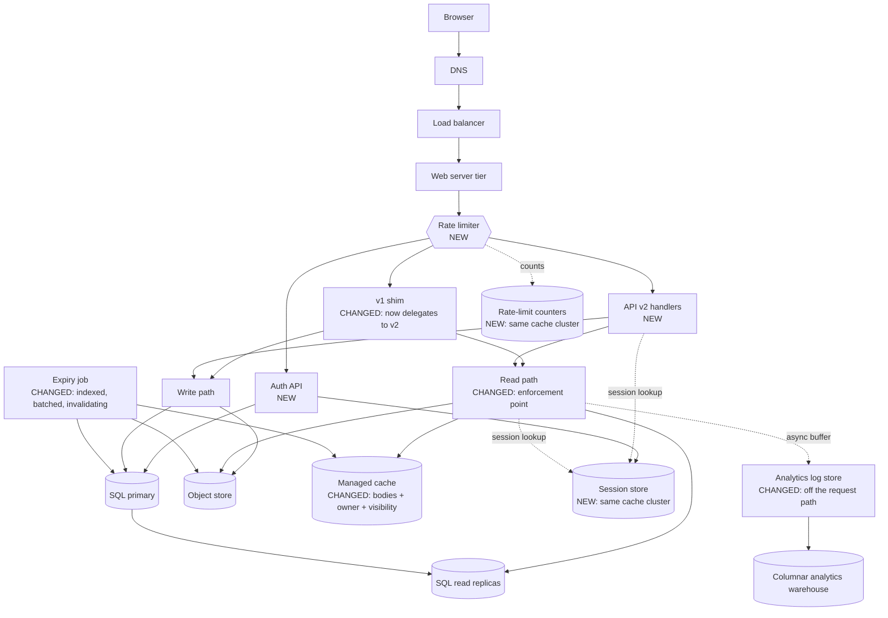

# Problem 2 deliverable: Snippet

Fill in every section. Read `PROMPT.md` for what each one must contain.

---

# Part A: weakness register

## A.0 Two figures the document does not give, and what I assume

Two numbers are needed repeatedly below and appear nowhere in `EXISTING-DESIGN.md`. I state them
here once rather than re-deriving them in each entry.

**Live row count in `snippets`.** §7 deletes rows on expiry, so the table holds live rows only, not
the 360 million links created over three years. At steady state:

```
live rows = arrival rate × average lifetime
          = 10,000,000/month × L months
```

The document never says what expiry periods users choose, so `L` is unconstrained. `L = 1` gives
10M rows, `L = 12` gives 120M, and `L = 36` (nothing expires inside the three-year window) gives
360M. **I use L = 12, so 120 million live rows, as the working figure**, and give the band where
the conclusion is sensitive to it. This is the single most load-bearing assumption in Part A and
the first thing I would measure against the real table.

**Row width on disk.** `CHAR(7)` + `VARCHAR(255)` holding the 16-byte key `snippets/abc1234` +
two 8-byte timestamps = 39 bytes of payload. With per-row header and page alignment I use
**100 bytes/row**. At 120M rows the table is ~12 GB.

Both figures are estimates. Where an entry's severity depends on them, I say so.

## A.1 The register

Ranked most important first. The ranking criterion is stated in A.2.

### A.1.1 The short-link generator produces colliding, guessable links, and no unique constraint catches the collision

- **Issue:** `base62(md5(client_ip + timestamp))[0:7]` draws from a space small enough to collide
  thousands of times at this volume, and because §5 declares no unique constraint on `shortlink`,
  a collision silently overwrites a stranger's snippet instead of failing.

- **Evidence:** The identifier space is 62⁷ = 3,521,614,606,208. §3 gives 360 million links over
  three years, so by the end of year three the probability that a new insert lands on an existing
  link is 3.6 × 10⁸ ÷ 3.52 × 10¹² ≈ **1 in 9,782**. At 10 million writes in month 36 that is
  10,000,000 ÷ 9,782 ≈ **1,022 collisions in that month alone**. Summed over the whole 360 million
  inserts, the expected number of collisions is N²/2S = (3.6 × 10⁸)² ÷ (2 × 3.52 × 10¹²) ≈
  **18,400 collisions to date**. §5 has no collision handling, and the DDL declares
  `shortlink CHAR(7) NOT NULL` with the only index on `created_at` — so nothing rejects the
  duplicate.

  The ordering of §5 makes it worse. Step 3 writes the object to `snippets/<shortlink>` *before*
  step 4 inserts the row. On a collision the object store `PUT` overwrites the earlier author's
  body unconditionally, and the earlier body is gone before SQL is ever consulted. Adding a unique
  constraint alone would not have saved it.

  Separately, the generator is not random. Its inputs are a client IP and a millisecond timestamp:
  about 58 bits of nominal input entropy, but an attacker targeting a known poster on a known day
  searches only 86,400,000 millisecond values, and the IP is often known or guessable (a corporate
  NAT, a published server). `md5` is fast to compute in bulk, so that search is a few seconds of
  CPU. The product's entire confidentiality model is "anyone with the link can read the snippet",
  which assumes the link is unguessable.

- **Impact:** Roughly a thousand times a month at current scale, someone's snippet silently becomes
  someone else's content. The first author's data is destroyed with no error, no log line and — since
  there are no accounts — no way to notify them or recover it. The reader of the older link is now
  served a stranger's text. The duplicate row also makes the §6 read non-deterministic: two rows
  match `WHERE shortlink = ?`, and which one the replica returns is an implementation detail. On
  the security side, anyone who knows roughly when and from where a snippet was posted can find it.

- **Severity: high**, because it is silent, unrecoverable and already happening. The other entries
  in this register describe cost, latency or downtime — things that are visible and reversible once
  noticed. This one has been quietly destroying user data for three years and has produced no
  signal that would make anyone look. An estimated 18,400 snippets are already lost and there is no
  audit trail from which to identify them.

- **Fix:** Two application changes, which are steps 2 and 4 of the four-step sequence set out in
  A.1.2. They are written here because they are changes to the write path rather than to the
  schema; the sequencing argument is in A.1.2 and the priority argument is in A.3.

  1. **Replace the generator** with `base62(CSPRNG(48 bits))`, giving 8 characters.
     `secrets.token_bytes` or equivalent — not a hash of request metadata. 62⁸ = 2.18 × 10¹⁴ drops
     the per-insert collision probability at 360M links from 1 in 9,782 to **1 in 606,000**, a
     factor of 62 improvement, and makes links unguessable rather than merely long. Keep reading
     7-character links forever; only mint 8-character ones.

     **Why 8 characters and not 7**, given that a CSPRNG at 7 characters already fixes the
     predictability and the unique constraint turns the remaining collisions into retries. The
     argument is enumeration, not collision. At 120 million live rows (A.0), a scanner guessing
     7-character links hits a live snippet every 62⁷ ÷ 1.2 × 10⁸ ≈ **29,347 guesses**; at 8
     characters it is **1,819,501 guesses**, 62× harder. Against the anonymous read limit designed
     in B.4 (600/hour), that is the difference between harvesting a live snippet every **49 hours**
     per address and every **3,033 hours** — the first is worth automating across a few thousand
     addresses, the second is not. The extra character costs one byte per row and buys a factor of
     62 against the only attack the product's confidentiality model is exposed to.

     It is not free, though, and the cost is not in the generator: `EXISTING-DESIGN.md` §5 declares
     `shortlink CHAR(7)`, so an 8-character value does not fit the column. Widening it is the one
     genuinely non-additive schema change in this whole document, and B.8 step 2 handles it
     explicitly rather than assuming it away.

     This is the change that actually stops collisions, and it is worth being clear that it does so
     **without depending on the unique constraint at all**. The constraint is a guardrail that
     catches the 1 in 606,000; the generator is what makes the rate 1 in 606,000 in the first
     place. That is why it goes in second in the sequence rather than waiting for the constraint,
     which cannot be declared until the historical duplicates are gone.

  2. **Reverse the write order and make the insert the arbiter.** Insert the SQL row first with
     `INSERT ... ON CONFLICT (shortlink) DO NOTHING`; if zero rows are affected, generate a new
     link and retry, up to three attempts. Only once the row is committed does the object store
     `PUT` happen. The database, not the object store, becomes the thing that decides a link is
     taken, which is the defect that a unique constraint alone would not have fixed — today the
     body is destroyed by the object store write in §5 step 3, before SQL is consulted in §5
     step 4.

     The `ON CONFLICT` clause requires the unique index to exist, so this half lands with step 4 of
     the sequence. The write-order reversal does not, and should ship with the generator change:
     even without a constraint, writing the row before the object means a collision is *detectable*
     after the fact — two rows with one `shortlink` and a known `created_at` ordering — instead of
     leaving no trace at all.

### A.1.2 There is no index on `shortlink`, so every cache miss scans the whole table

- **Issue:** The read query in §6 filters on `shortlink`, but §5 creates an index only on
  `created_at`, so the single most frequent query in the system has no index to serve it.

- **Evidence:** The DDL declares exactly one index:

  ```sql
  CREATE INDEX idx_snippets_created_at ON snippets (created_at);
  ```

  and §6 step 3 runs:

  ```sql
  SELECT object_key, expires_at FROM snippets WHERE shortlink = 'abc1234';
  ```

  There is no access path but a sequential scan. At 120M live rows × 100 bytes that is **12 GB read
  per cache miss**. Worse, because `shortlink` carries no unique constraint, the planner cannot
  stop at the first matching row — it is obliged to scan to the end of the table even after the row
  is found.

  §3 gives 100 million reads/month = 40 reads/s average, 400/s at the team's stated 10× peak. Taking
  a generous 90% cache hit rate, that is 4 misses/s average and **40 misses/s at peak**. Forty
  concurrent 12 GB scans is 480 GB/s of read bandwidth demanded from a replica. Even fully resident
  in page cache at ~1 GB/s a single scan takes ~12 seconds; the replica cannot serve the second
  concurrent miss, let alone the fortieth.

  This is the entry most sensitive to the A.0 assumption, and the sensitivity is itself the finding:
  at `L = 1` (10M rows, ~1 GB) a scan is ~1 second and the system limps; at `L = 12` it does not
  work at all. The service has survived three years because the table started empty and grew into
  this, and because the cache hides it until the moment the cache is cold.

- **Impact:** Cache misses are slow to the point of timing out, and the miss rate is exactly what
  spikes during the events that matter: a cache restart, a failover, a deploy that flushes the
  cache, or a newly posted snippet being shared for the first time. The failure mode is a
  correlated one — after any cache loss the replicas are asked for a full-table scan per request
  and the read tier stops serving entirely. Recovery is not possible by restarting: the empty cache
  guarantees the stampede repeats.

- **Severity: high**, because it converts any cache interruption into a total read outage rather
  than a period of degraded latency, and read is the whole product. It ranks below A.1.1 only
  because it is loud, bounded and completely reversible — one index, and the symptom is gone.

- **Fix: the four-step sequence.** Add the index, then earn the right to make it unique. The whole
  of A.1.1's schema half arrives here too, and the order is forced rather than chosen — A.3 argues
  why this is the first thing to do at all.

  **Why the constraint cannot be step 1.** The obvious move is to build the unique index
  immediately and get both fixes for one table rebuild. It does not work.
  `CREATE UNIQUE INDEX CONCURRENTLY` aborts as soon as it encounters the second copy of a key, and
  by the arithmetic in A.1.1 there are an estimated **18,400 duplicate `shortlink` values already
  in the table**. It does not warn or build a degraded index; the build fails and leaves an
  `INVALID` index to clean up. Nor is there an escape hatch: Postgres supports `NOT VALID` for
  check and foreign-key constraints, so they can be enforced going forward and validated later, but
  **not for unique constraints**. Uniqueness can only be declared over a corpus that is already
  unique. The duplicates must go first, and finding them cheaply requires the index — which is what
  fixes the read path anyway.

  1. **`CREATE INDEX CONCURRENTLY idx_snippets_shortlink ON snippets (shortlink);` — non-unique.**
     One statement, no `ACCESS EXCLUSIVE` lock, so reads and writes continue throughout. Budget two
     passes over a 12 GB table. If it fails it leaves an `INVALID` index, so check
     `pg_index.indisvalid` afterwards rather than assuming success, and drop before retrying.

     **This step alone delivers almost all the user-visible benefit.** The read path goes from a
     12 GB sequential scan per cache miss to a single index lookup, and the correlated failure
     described above — any cache interruption becoming a total read outage — is gone the moment it
     completes. Nothing else in the sequence has to land for that to be true.

  2. **Deploy the A.1.1 generator change** (8 characters from a CSPRNG) and the write-order
     reversal. This drops the collision rate by a factor of 62 on its own, with no dependency on
     the constraint, and it stops the duplicate set growing while step 3 runs. Without it, step 3
     is remediating a set that is still being added to at ~1,022 rows a month.

  3. **Remediate the existing duplicates.** `SELECT shortlink FROM snippets GROUP BY shortlink
     HAVING count(*) > 1;` — an index-only scan now, rather than a 12 GB scan plus a sort, which is
     the concrete reason this step comes after step 1 and not before. For each group keep the
     **newest** row, because the object store holds the newest author's body; the older rows point
     at an object that no longer contains their content and are already unreadable in the sense
     their authors intended. Delete the older rows.

     This is remediation of a loss, not prevention of one. The older snippets are gone and cannot
     be recovered — the object store overwrote them, in some cases years ago. There are no accounts
     (§1), so there is nobody to notify. Deleting the rows only makes the table's state honest
     about what the object store already contains.

  4. **Swap to the unique index and close the write path.**
     `CREATE UNIQUE INDEX CONCURRENTLY idx_snippets_shortlink_uq ON snippets (shortlink);` then
     `ALTER TABLE snippets ADD CONSTRAINT snippets_shortlink_key UNIQUE USING INDEX
     idx_snippets_shortlink_uq;`. The `ALTER` takes a brief `ACCESS EXCLUSIVE` lock, but it is a
     catalogue-only operation against an already-built index — milliseconds, not a rebuild. Set
     `lock_timeout` so it fails fast rather than queueing behind a long read and blocking writes.
     Then drop the non-unique index from step 1, and enable the `ON CONFLICT (shortlink) DO NOTHING`
     retry in the write path, which has something to conflict against for the first time.

     Step 4 is the guardrail, not the cure. After step 2 the expected collision rate is about
     **17 per month** across the whole service rather than 1,022; this step is what turns those 17
     from silent data destruction into a retry nobody notices.

  **One option I considered and rejected**, because it looks like a way to get the constraint into
  step 1: a *partial* unique index, `CREATE UNIQUE INDEX CONCURRENTLY ... WHERE created_at >=
  '<cutoff>'`. It builds successfully despite the historical duplicates, because the predicate
  excludes them. But it only prevents a new row from colliding with another *new* row — a new link
  colliding with one of the 120 million pre-cutoff rows is not in the index and passes straight
  through, and that is where essentially all of the collision probability lives. It buys a small
  fraction of the protection for real added complexity in every `ON CONFLICT` clause, which must
  then repeat the predicate to match the index.

### A.1.3 The expiry job reads the entire table every hour, and never invalidates the cache

- **Issue:** The hourly expiry query has no `WHERE` clause and no `LIMIT`, so it drags every live
  row into application memory to delete about one ten-thousandth of them — and having deleted them,
  it leaves the cached copies in place, so an expired snippet stays readable.

- **Evidence:** §7 runs:

  ```sql
  SELECT shortlink, object_key, expires_at
  FROM snippets
  ORDER BY created_at;
  ```

  and compares `expires_at` in application code. At 120M live rows × 100 bytes that is **12 GB read
  per run, 288 GB/day, 8.6 TB/month** to perform the deletions. The rows actually expiring per hour
  at steady state are 10,000,000 ÷ (30 × 24) ≈ **13,889** — a scanned-to-deleted ratio of about
  **8,640 : 1**.

  The `ORDER BY created_at` does not help; it hurts. §7 claims "the index on `created_at` supports
  the ordering", but the query selects `shortlink` and `object_key`, which the index does not
  contain. The planner's choices are a sequential scan plus an external sort of 12 GB, or an index
  scan with 120M random heap fetches. The second is generally worse than the first. Either way the
  ordering is decorative — the job compares every row to the clock regardless of the order they
  arrive in.

  On the cache: §6 step 5 writes the body into the managed cache and states no TTL. §7 deletes the
  row and the object but touches nothing in the cache. So for any snippet whose cache entry is kept
  warm by ongoing reads — which is precisely the popular ones — deletion from SQL and the object
  store has **no observable effect at all**. §7 says "a snippet may remain readable for up to an
  hour after its expiry time. This is accepted." That is a statement about the job's period. The
  actual bound is unbounded: a snippet read once a minute stays readable forever.

  A third defect in the same job: it deletes the object first and the row second. A crash between
  the two leaves a row pointing at an object that no longer exists, and §6 defines no behaviour for
  a successful row lookup followed by a failed object fetch.

- **Impact:** The operator pays for 288 GB/day of replica I/O and an hourly period where the
  replica's buffer pool is evicted by a scan of cold rows, degrading the read path it shares. The
  user is promised that their snippet expires, and for the popular ones it does not — which is the
  one durability guarantee a service with no delete endpoint (§10) actually offers. Someone who
  pastes something they regret has been told it will disappear; it will not.

- **Severity: high** for the cache half, **medium** for the scan half. The scan is cost and
  collateral latency — unpleasant, bounded, and the operator can see it in a graph. The cache half
  is a broken product promise with a privacy dimension, invisible to everyone including the
  operator, and it fails worst for exactly the snippets that most people are looking at.

- **Fix:** Four changes.

  1. **Add the predicate and the index:** `CREATE INDEX CONCURRENTLY idx_snippets_expires_at ON
     snippets (expires_at);` and query `SELECT shortlink, object_key FROM snippets WHERE expires_at
     < now() ORDER BY expires_at LIMIT 5000;` in a loop until it returns fewer than 5,000 rows.
     Each iteration touches ~13,889 rows per hour instead of 120,000,000 — an index range scan of a
     few megabytes rather than 12 GB.
  2. **Delete in the safe order:** row first, then object. An orphaned object costs storage and is
     reclaimable by a weekly sweep; an orphaned row is a user-visible error.
  3. **Invalidate the cache** as part of the deletion, before the object delete: `DEL <shortlink>`.
  4. **Set a TTL on every cache write** in §6 step 5, of `min(expires_at − now(), 1 hour)`, so
     correctness does not depend on the invalidation step succeeding. Belt and braces, because a
     cache `DEL` that fails silently is exactly how this class of bug returns.

### A.1.4 A missing snippet returns `200 OK` with an empty body, and the response is cacheable

- **Issue:** §6 answers a lookup that finds no row with `200 OK` and an empty body, which means no
  client, proxy, crawler or monitoring system can distinguish "this snippet does not exist" from
  "this snippet is empty" or from "the read path is broken" — and the missing cache-control header
  lets that wrong answer be cached.

- **Evidence:** §6: *"If no row is found, the read API returns `200 OK` with an empty body"* and
  *"The response carries no cache-control header."* Three consequences compound.

  **(a) It is reachable on the happy path, not just for bad links.** §5 step 4 writes to the SQL
  *primary*; §6 step 3 reads from a *replica*, and §5 states "read replicas follow it
  asynchronously". A user who creates a snippet and immediately opens the link they were just
  handed — the single most common action in the entire product, because it is how you check the
  link works — races replication. Reproduction: `POST /api/v1/write`, take the returned link,
  `GET /api/v1/read?shortlink=<link>` within the replication lag window. The row is not on the
  replica yet, so the API returns `200 OK` and an empty body, and the web tier renders an empty
  snippet page. The user believes their paste was lost.

  **(b) The wrong answer can stick.** With no `Cache-Control` header, an intermediary is permitted
  to apply heuristic freshness to a `200` response. A browser, a corporate proxy or a CDN may retain
  that empty body. The user then sees an empty page for their own valid snippet for the heuristic
  lifetime, and reloading does not help.

  **(c) Monitoring is blind.** At 100 million reads/month, a failure that causes every lookup to
  find no row — a replica that has fallen far behind, a bad deploy, an empty table after a botched
  restore — is reported to the load balancer, the dashboard and any HTTP-status-based alert as
  **100% success**. There is no status-code signal that differs between a perfectly healthy month
  and a total read outage. Combined with A.1.2, the most likely real incident (cache cold, replicas
  scanning, lookups timing out) partially presents as a wall of cheerful `200`s.

- **Impact:** Users conclude the service ate their paste, and they have no recourse because there
  are no accounts and no support surface. Operators lose the ability to alert on the product's
  primary failure. And because the same `200` covers both "expired" and "never existed", nobody can
  tell a user which happened.

- **Severity: high.** Not for the wrong status code in itself, which is cosmetic, but because it is
  the mechanism that makes every other read-path failure in this register silent. It is the reason
  a three-year-old service can carry A.1.1, A.1.2 and A.1.3 without anyone noticing.

- **Fix:**
  - Return `404 Not Found` with a JSON error body (`{"error": "not_found"}`) when no row matches,
    and `410 Gone` when a row matches but `expires_at` has passed — distinguishing expiry from
    never-existed is worth the one extra branch, and it is the difference between "you are too
    late" and "you typed it wrong".
  - Send `Cache-Control: no-store` on both, so a negative answer is never retained anywhere.
  - Send `Cache-Control: public, max-age=<min(seconds until expires_at, 300)>` on a successful
    read, which both bounds staleness against expiry and lets browsers and a CDN absorb repeat
    reads that currently all reach origin.
  - Fix the read-after-write race explicitly rather than relying on the status code to explain it:
    on a replica miss, retry the lookup once against the primary before concluding the snippet does
    not exist. At 4 writes/s this costs the primary a negligible number of point lookups, and it
    removes the only case where a correct `404` would still be the wrong answer.
  - Alert on the `404` and `410` rates as a proportion of reads, which is only possible once the
    first change is made.

### A.1.5 Analytics is written synchronously on the read path, making a reporting store a hard dependency of the product

- **Issue:** §6 step 6 appends to the analytics log store *before the response is sent*, so the
  availability and latency of a system that exists to produce monthly reports are inherited by every
  single read.

- **Evidence:** §6 step 6 is explicit: *"This happens on the request path, before the response is
  sent."* §3 gives 100 million reads/month = 40/s average and 400/s at the stated 10× peak. Every
  one of those blocks on a network write.

  The read path's availability is now the product of its dependencies, and the analytics store is
  one of them. A log store at 99.9% caps the read path at 99.9% *no matter how good the cache,
  replicas and object store are* — that is 0.1% of 100,000,000 reads = **100,000 failed reads per
  month**, or 43 minutes, caused entirely by a component with no user-facing purpose. If the log
  store is slower than that, reads fail with it.

  On latency: a cache hit (§6 step 2) should return in a couple of milliseconds. A 20 ms p99 append
  to the log store is added to **100% of reads including every cache hit**, so at the tail the
  cache's entire benefit is erased by the logging call that follows it. At 400 reads/s, 20 ms of
  added hold time is 400 × 0.02 = **8 request slots** occupied at all times purely by logging, and
  if the log store degrades to 500 ms that becomes 200 concurrent connections held open — enough to
  exhaust a connection pool and take the read tier down while every actual dependency is healthy.

- **Impact:** The service can be taken offline by its own reporting pipeline. Worse, this is the
  dependency most likely to be treated as low-priority during maintenance, precisely because
  everyone knows it "only does analytics" — so the riskiest component is the one nobody schedules
  carefully.

- **Severity: medium.** The coupling is real and the availability arithmetic is unarguable, but it
  requires the analytics store to misbehave before anyone sees anything, and the blast radius is
  latency and availability rather than data loss. It ranks below A.1.4 because A.1.4 would hide
  this one's symptoms.

- **Fix:** Take it off the request path. Write the analytics line to a bounded in-process buffer
  (drop on overflow, and emit a counter for drops so silent loss is visible) and flush it
  asynchronously in batches. The response is sent without waiting. Analytics is a sampled,
  best-effort signal for monthly visitor counts and top-snippet rankings — losing a small fraction
  of lines changes no decision anyone makes from that data, whereas failing a read certainly does.
  If loss is genuinely unacceptable, derive the counts from the load balancer's own access logs,
  which are written off the request path by definition and already contain the short link, client
  address, user agent and timestamp.

### A.1.6 Snippet size is unbounded, so one client can outspend the entire service

- **Issue:** §3 records maximum snippet size as "Not enforced", and nothing in §5 rejects a large
  body, so the cost of a single request has no ceiling.

- **Evidence:** §3 sizes the service for 10 million snippets/month at 1 KB average = **10.24 GB of
  new object storage per month**. There is no authentication (§1) and no rate limit anywhere in the
  document.

  Reproduction: `POST /api/v1/write` with a 10 MB body. Nothing in §5 checks the length; the write
  API stores it and returns a link. A single client at 100 requests/second — trivial from one host
  — writes 100 × 10 MB = 1 GB/s = **86.4 TB/day**, which is about **8,400 times the service's
  entire monthly ingest, every day**, from one machine, anonymously.

  The cache is collateral. §6 step 5 writes the body into the managed cache with no size check, so
  a single 10 MB snippet that is being read occupies the space of roughly **10,000 one-kilobyte
  snippets**. A handful of large snippets under repeated read evicts the entire working set, which
  drives the miss rate up, which — via A.1.2 — sends full table scans to the replicas.

  The write API also has no defined streaming behaviour, so a body large enough to be buffered in
  memory is an availability question for the web tier as well as a cost question for the object
  store.

- **Impact:** An unbounded and immediate storage bill from an anonymous source, with no mechanism in
  the design to identify or stop it; degraded cache effectiveness for every legitimate user; and a
  free anonymous file-hosting service that the team did not intend to run, with the content-hosting
  liability that implies.

- **Severity: medium.** The arithmetic is dramatic, but this requires someone to choose to do it,
  whereas A.1.1 through A.1.4 are already happening on their own. It is a latent exposure rather
  than an active fault — which is also why it is cheap to close, and there is no reason not to.

- **Fix:** Enforce a limit at two layers, because either alone can be bypassed or misconfigured.
  At the load balancer, cap the request body (`client_max_body_size 512k` or the equivalent) so an
  oversized upload is rejected before it reaches application memory. In the write API, check
  `Content-Length` and the streamed byte count, and return `413 Payload Too Large` with the limit
  stated in the error body. 512 KB is 500× the 1 KB average, so it constrains nobody real. Add a
  cache-side rule that bodies above, say, 64 KB are not cached at all — they are served from the
  object store, so one large snippet cannot evict thousands of small ones. Rate limiting is the
  other half of this problem and is designed in B.4.

### A.1.7 Single write primary with manual promotion, and no bound on what promotion loses

- **Issue:** §9 states that a primary failure stops all writes until a replica is promoted by hand,
  and since replication is asynchronous, the promotion itself silently discards writes the service
  has already acknowledged.

- **Evidence:** §5: *"There is one SQL primary. All writes go to it. Read replicas follow it
  asynchronously."* §9: *"A failure of the SQL primary stops all writes until a replica is promoted
  by hand."* §10 lists "no automated failover for the SQL primary" as a known and accepted gap.

  At 4 writes/s, a manual promotion with a realistic detection-plus-decision-plus-promotion time of
  one hour refuses 4 × 3,600 = **14,400 snippets**. That part the team has accepted, and the
  acceptance is defensible: reads (40/s, ten times the volume) continue from the cache and
  replicas throughout, so the blast radius is the smaller half of the product.

  The part §10 does **not** record is the data loss. Because replication is asynchronous, any write
  committed on the primary but not yet shipped when it died is lost at promotion. The document
  defines no replication-lag metric, no alert on lag, and no rule about which replica to promote —
  so the loss is not merely non-zero, it is **unmeasured**. At a lag of 30 seconds under the 10×
  peak of 40 writes/s, that is 40 × 30 = **1,200 acknowledged snippets** gone, with their authors
  holding links that will never resolve. And because of A.1.4 those links return `200 OK` with an
  empty body, so the loss presents to every one of those users as "the service ate my paste" and to
  the operator as a successful request.

- **Impact:** An hour of no new snippets per incident, plus an unknown number of snippets that were
  confirmed to their authors and then discarded, indistinguishable afterwards from snippets that
  never existed.

- **Severity: medium.** I rank it below the others rather than high, and deliberately lower than a
  single point of failure would normally sit, for two reasons: the read path — nine-tenths of the
  traffic and the whole of the value for a reader — survives the failure entirely, and the team has
  consciously accepted the downtime half. What I do not accept is the silent, unbounded data loss,
  which §10 does not mention and which nobody has priced.

- **Fix:** The full answer is automated failover, and the team has already decided that is not worth
  the cost, so I would not lead with it. Instead, bound the loss and make the accepted risk an
  informed one:
  - Enable synchronous commit to **one** designated standby (`synchronous_commit = remote_write`
    with one synchronous replica). At 4 writes/s the added commit latency is irrelevant to a user
    who is waiting on an object store write anyway, and it makes the loss on promotion provably
    zero for the acknowledged set.
  - Export replication lag as a first-class metric and alert when it exceeds 5 seconds. Today
    nobody could answer "how much would we lose right now", which is the real gap.
  - Write the promotion runbook down, including which replica is the synchronous one, and rehearse
    it. A manual failover that has been practised is perhaps 10 minutes (2,400 snippets) rather
    than an hour.
  - Have the write API return `503` with `Retry-After` when the primary is unreachable, so clients
    and the browser can retry rather than the user losing what they typed.

## A.2 Ranking rationale

I ranked by **probability × irreversibility**, not by severity in the abstract. The question I
asked of each entry was: how often does this actually happen at the figures in §3, and when it
does, can it be undone afterwards? That criterion puts silent data destruction above loud outages,
because an outage ends and a lost snippet does not.

That produces the top of the list. **A.1.1** is the only entry where the damage is permanent — an
estimated 18,400 snippets have already been overwritten, roughly 1,022 more will be this month, and
there is no log, no account and no backup path by which any of them could be identified or
restored. Everything else in the register is recoverable by deploying a fix. **A.1.2** follows
because although an index is the cheapest fix in the document, the failure it produces is
correlated and self-sustaining: the cache protects the replicas, so the moment the cache is
interrupted every request demands a 12 GB scan, and restarting into an empty cache reproduces the
condition. **A.1.3** is third because half of it is a broken promise to the user rather than a cost
to the operator: a popular snippet is never actually removed, which for a service with no delete
endpoint is the only guarantee it makes about getting rid of something. **A.1.4** is fourth despite
looking cosmetic, and sits this high because of what it does to the other three — it is the reason
a service can carry all of them for three years and see nothing but healthy dashboards.

The bottom three are ranked by whether the fault is active or latent. **A.1.5** requires the
analytics store to misbehave before anything is felt; **A.1.6** requires someone to choose to abuse
it; **A.1.7** requires hardware to fail. All three are real, all three have arithmetic behind them,
but none of them is silently running today in the way the top four are.

Two rankings I would defend against an obvious objection. A single point of failure in the write
path (A.1.7) would normally go near the top of any register, and I have put it last — because at a
10:1 read-to-write ratio the failure costs the smaller tenth of the traffic while readers are
served throughout, and because §10 shows the team priced the downtime deliberately. My criticism
is narrower than "no failover": it is that the *data loss* at promotion is unmeasured and
unmentioned. Conversely, a missing `Cache-Control` header would normally be a footnote, and it does
not get its own entry here — it is folded into A.1.4, because its damage in this system is not the
missed CDN offload, it is that it lets a wrong `200` persist in caches the team does not control.

## A.3 The one to fix first

**`CREATE INDEX CONCURRENTLY` on `shortlink` — step 1 of the A.1.2 sequence.** Not the most severe
entry in the register; A.1.1 is. It goes first because it is the largest improvement available per
unit of risk in the whole document, and because the severe entry's fix cannot proceed without it.

**The payoff is immediate and disproportionate.** One DDL statement, no application change, and the
most frequent query in the system stops reading 12 GB and starts reading a few pages. Every cache
miss — 4/s average, 40/s at the stated 10× peak — goes from tens of seconds to sub-millisecond. The
correlated failure in A.1.2 disappears with it: after this statement, a cache restart is a period
of higher latency instead of a total read outage that cannot recover by restarting. Nothing in the
register offers a comparable change in the system's behaviour for comparable effort, and the effect
is visible on a latency graph within minutes of the build completing, which matters for a fix whose
next three steps need organisational patience.

**The risk of acting is close to zero.** `CREATE INDEX CONCURRENTLY` takes no `ACCESS EXCLUSIVE`
lock, so reads and writes continue throughout. The failure mode is a leftover `INVALID` index,
detected by one catalogue query and resolved by dropping it and retrying. The application is
untouched, so there is no behavioural rollback to plan — only `DROP INDEX CONCURRENTLY`. Compare
with A.1.4, which changes a response contract that unknown anonymous clients already depend on, or
A.1.5, which needs a buffering and flushing mechanism built, tested and reasoned about under load.

**The risk of not acting compounds daily.** The table grows by 10 million rows a month, so every
month of delay lengthens both the scan and the eventual index build. The failure is not gradual: it
is a cliff with the cache standing in front of it. The service is one cache restart away from a
total read outage, and that restart will be scheduled by someone else — a managed-cache maintenance
window, a failover, a deploy.

**Blast radius is asymmetric.** The fix touches one table and one query plan. The fault covers the
entire read path: 100 million reads a month, which is the whole of the product for everyone who is
not currently creating a snippet.

**And it is the precondition for the rest.** Until the index exists:

- A.1.1's duplicate remediation (`GROUP BY shortlink HAVING count(*) > 1`) is a 12 GB scan plus a
  sort, and the `ON CONFLICT` insert has nothing to conflict against — so the fix for the most
  severe entry in the register cannot begin.
- A.1.4's `410 Gone` requires reading `expires_at` on every miss, which today means a full scan per
  request.
- A.1.3's expiry rework, and B.6, assume indexed access to the same table.

So doing it first turns four coupled problems into three independent ones. Immediately behind it I
would ship step 2 — the generator change — because it drops the collision rate by a factor of 62 on
its own and stops the duplicate set growing while step 3 runs. Steps 1 and 2 together are a few
days of work and carry almost all of the benefit; steps 3 and 4 are the slower, less visible half
that makes the guarantee permanent.

## A.4 What the design gets right

**The anonymous, stateless write path.** §1 states there are no accounts and no login, and calls
this simplicity "the product". It is right, and it is right for a structural reason the document
does not spell out: because no request carries identity, the web tier holds no session state, so
§9's claim that it "scales horizontally" is true without qualification. There is no session store
to size, no session replication to get wrong, no sticky routing, and no shared component that a
new web server must join before it can serve traffic. Adding capacity is adding a process. That
property is also what makes the fixes in A.1 cheap to deploy: every one of them is a change to a
stateless tier behind a load balancer.

**The naive redesign that would break it:** reaching for A.1.6 and A.1.1 — unbounded writes and
abuse with no way to identify the abuser — and concluding that the fix is to **require an account
to create a snippet**. It is a natural move. It gives every write an identity to attribute, it
makes rate limiting trivially per-user, and it is exactly what Part B is about to introduce.
Requiring it is the mistake.

**What it would cost.** Three things, in increasing order of importance.

1. **It reintroduces state on the write path.** Every `POST /api/v1/write` gains a session or token
   lookup before it does any work. At 4 writes/s that is nothing; at the 10× peak of 40/s it is
   still nothing — but the *architecture* changes, because the web tier is no longer independently
   scalable, and the auth store becomes a hard dependency of publishing. That is the same mistake
   as A.1.5, made deliberately: a supporting system placed in front of the core action.

2. **It puts a registration form in front of the product's only interaction.** Snippet's entire
   flow is paste, press save, get a link — plausibly under ten seconds. Registration adds an email,
   a password, a verification round trip and a confirmation click. The loss is not a percentage
   shaved off a funnel; it is most of the volume. §3 records 10 million snippets/month, and the
   traffic that generates them is people pasting an error log once. If even 15% of current writers
   would create an account to keep doing that, the service goes from 10,000,000 to about
   **1,500,000 snippets/month**, and the 100 million monthly reads fall with them, since reads are
   driven by links being created and shared. The 10:1 ratio in §3 is the tell: the read traffic
   that justifies the whole infrastructure is a *consequence* of frictionless writing.

3. **It does not even solve the problem it was reached for.** The abuse in A.1.6 is 86 TB/day from
   one host; registration costs an abuser one email address and a few seconds. The actual controls
   are a body-size limit (A.1.6) and per-IP rate limiting (B.4), neither of which needs identity.
   Accounts would have bought a large behavioural cost for a control that does not stop the attack.

So the constraint I carry into Part B is that **accounts are additive, never required**. Anonymous
creation stays on exactly the path it has today; authentication adds capability — ownership, private
snippets, higher rate limits, a delete endpoint — on top of it. B.2 preserves the anonymous write,
and B.4 rate-limits anonymous and authenticated clients separately for this reason.

---

# Part B: the extended design

## B.0 The governing constraint, and four more assumptions

**The constraint, from A.4: accounts are additive, never required.** Anonymous creation and
anonymous reading keep the exact path they have today. Authentication only ever *adds* capability —
ownership, private snippets, higher rate limits, a list endpoint, deletion. Every section below is
written against this, and B.7.1 is the decision record for it.

Four figures are needed repeatedly and appear nowhere in `EXISTING-DESIGN.md`. As in A.0, I state
them once. All four are estimates, and each is marked where its value changes a conclusion.

| Assumption | Value | Why, and what it drives |
|---|---|---|
| Snippets per unique writer per month | **5** | Turns §3's 10M snippets/month into **2,000,000 unique writers/month**, which is the denominator for every rate-limit and account figure |
| Conversion to a registered account | **10%** | **200,000 accounts** in year one. Sizes the users table and the session store. Deliberately low, because B.7.1 makes accounts optional — if it were higher, accounts would be doing work the anonymous path is doing today |
| Snippets created private | **5%** | 500,000/month, **6,000,000 live private rows** at A.0's 120M. Sizes the grants table and the private read rate |
| Named grantees per private snippet | **3** | 18M live grant rows at 24 B = **0.43 GB** — small enough that the grants table needs no special treatment |

I also carry A.0's two figures forward unchanged: **120 million live rows** and **100 bytes/row**.

One reading of the existing document that the rest of Part B depends on, stated explicitly because
§6 is ambiguous about it. §6 step 1 shows the browser calling `GET /api/v1/read?shortlink=abc1234`,
but step 7 says *"the web tier renders it into the snippet page template and serves it as HTML"*.
I read this as: **the artefact a user shares is the short link, rendered at a web URL owned by the
web tier, and `/api/v1/*` is the programmatic contract behind it.** This matters enormously for
B.5.6 and B.8 — it means retiring the v1 *API* does not touch the 360 million links in the wild,
because those links are not v1 API URLs. If the reading is wrong and users really are sharing
`/api/v1/read?shortlink=...` URLs directly, then v1 can never be retired at all, only frozen
forever, and B.5.6 becomes a permanent-shim plan rather than a retirement plan.

## B.1 Overview and diagram



**Unchanged:** DNS, load balancer, web tier, SQL primary and replicas, object store, analytics
warehouse, and the whole anonymous create-and-read flow.

**New:** the rate limiter (an in-process filter, not a service), the auth API, the v2 handlers, and
two new logical stores — sessions and rate-limit counters — both of which live in the **existing**
managed cache cluster rather than introducing a component. That is deliberate: §4 already treats
the cache as a hard dependency of the read path, so adding tenants to it adds no new failure mode
to reason about, whereas a new datastore would.

**Changed:** the read path gains the authorisation check (B.3), the cache value gains two fields,
the expiry job is replaced (B.6), analytics moves off the request path (A.1.5), and v1 becomes a
thin shim over the v2 handlers so there is one implementation of every behaviour.

## B.2 User accounts and authentication

### Registration and credential storage

`POST /api/v2/auth/register` with email and password. Stored as:

```sql
CREATE TABLE users (
  user_id       BIGSERIAL PRIMARY KEY,
  email         CITEXT NOT NULL,
  password_hash TEXT NOT NULL,
  created_at    TIMESTAMPTZ NOT NULL DEFAULT now(),
  CONSTRAINT users_email_key UNIQUE (email)
);
```

Passwords are hashed with **Argon2id** at `m = 64 MiB, t = 3, p = 1`, which is the OWASP baseline
and costs roughly 50 ms per verify. That cost is often the objection to a memory-hard hash, so it
is worth pricing against this system's actual traffic rather than against a general worry: at §3's
10 million writes/month, even assuming logins run at 10% of write volume, that is 0.39 logins/s at
the stated 10× peak, and 0.39 × 50 ms = **0.019 of a CPU core**. The memory is the real cost —
64 MiB × the concurrency — and at this rate the concurrency is under one. There is no argument for
a weaker hash here.

Email verification is required before an account can hold private snippets, but **not** before it
can log in and own public ones, so the friction sits in front of the feature that needs identity
rather than in front of the product.

### Sessions

An **opaque 256-bit token** (32 bytes from a CSPRNG, base64url) returned in a `HttpOnly; Secure;
SameSite=Lax` cookie and also usable as a bearer token for API clients. Server state lives in the
managed cache:

```
key:   sess:<token>
value: { user_id, created_at, last_seen, email_verified }
TTL:   30 days, sliding
```

At 200,000 accounts with 5% concurrently active, that is 10,000 live sessions × ~200 B = **2 MB**.
The session store is a rounding error against a cache already holding snippet bodies.

**Opaque tokens rather than JWTs**, and this is the decision in B.7.1. A JWT cannot be withdrawn
before it expires without building the revocation list that the JWT was supposed to avoid. B.3
makes revocation a *correctness* property rather than a security nicety: when an owner removes
someone's access to a private snippet, the expectation is that access ends now, not within the
token's lifetime. A stateless token forces a choice between very short expiry (a refresh round
trip on the read path, which is the coupling A.1.5 already criticises) and accepting a revocation
lag. An opaque token in a cache lookup we are already making has neither problem.

### What happens to the existing anonymous snippets

**They stay ownerless, permanently, and they keep working unchanged.** There is no claim flow —
not for the 360 million already created, and not retroactively.

The reason is A.1.1. Nothing binds an anonymous snippet to a person: no account, no email, no
creation-time secret. The only candidate proof of ownership is *knowing the short link*, and A.1.1
establishes that links are currently derived from `md5(client_ip + timestamp)` and are guessable by
anyone who can bracket when and from where a snippet was posted — 86,400,000 candidate
milliseconds for a known IP on a known day. A claim-by-link flow would therefore be an ownership
transfer primitive driven by an enumeration attack: an attacker discovers links, claims them, and
now controls snippets that other people are actively sharing. Handing out ownership on the strength
of a credential we have already proven is forgeable would be a worse bug than the one it fixes.

A creation-time ownership token would work for *new* snippets, but that is not the question the
prompt asks — the 360 million existing snippets pre-date any token, so it answers nothing about
them while adding a mechanism.

The consequence is honest and worth stating: **early users can never manage, edit or delete their
old snippets.** Those snippets expire on their original schedule and that is the end of them. The
cost is a real one and falls on the service's most loyal users. I take it because the alternative
gives away other people's content.

Newly created anonymous snippets behave the same way — ownerless, unmanageable — which is exactly
their behaviour today. A logged-in user's snippets are owned from creation.

## B.3 Private snippets and access control

### The access model

`visibility` is an enum with two values. I deliberately did **not** add a third:

| Value | Who can read | Notes |
|---|---|---|
| `public` | anyone with the link | Exactly today's behaviour. The default for every existing row and every anonymous creation |
| `private` | the owner, plus named grantees | Requires an authenticated, email-verified owner |

The obvious third value is `unlisted`, and it is already what `public` means — §1 says "anyone with
the link can read the snippet" and §2 puts search and listing out of scope, so every existing
snippet is unlisted in practice. Adding the word without adding behaviour would be a contract with
nothing behind it.

```sql
ALTER TABLE snippets ADD COLUMN owner_id   BIGINT NULL REFERENCES users(user_id);
ALTER TABLE snippets ADD COLUMN visibility TEXT NOT NULL DEFAULT 'public';

CREATE TABLE snippet_grants (
  shortlink  VARCHAR(16) NOT NULL,   -- matches the widened column from B.8 step 2
  grantee_id BIGINT NOT NULL REFERENCES users(user_id),
  granted_at TIMESTAMPTZ NOT NULL DEFAULT now(),
  PRIMARY KEY (shortlink, grantee_id)
);
CREATE INDEX idx_grants_grantee ON snippet_grants (grantee_id);
```

`owner_id` is nullable and that nullability is load-bearing: `NULL` means anonymous, which is both
every pre-existing row and every future anonymous creation. At B.0's figures the grants table holds
18 million live rows at ~24 B = **0.43 GB**, small enough to need no partitioning, no archival and
no special thought.

### The enforcement point

**A single place: the read API, in-process, after the body is retrieved and before it is returned.
Nowhere else.**

Not the web tier, which would put an authorisation decision in a template renderer. Not the load
balancer, which cannot see `visibility`. Not the cache, which has no concept of a caller. Not the
CDN, which is a shared cache and must never hold private content at all. One function, one call
site, on the path every read already takes.

The read sequence becomes:

1. Resolve the session token to a `user_id`, or `NULL` for anonymous. One cache lookup.
2. Fetch `{body, owner_id, visibility}` — from the cache, or from the replica plus object store on
   a miss, populating the cache.
3. **Authorise.** If `visibility = 'public'`, serve. If `owner_id = viewer`, serve. Otherwise look
   up `snippet_grants (shortlink, grantee_id)` — a primary-key point lookup — and serve on a hit.
4. On failure, return **404, not 403**. A 403 confirms that a snippet exists at that link, which
   turns the read endpoint into an oracle for enumerating private snippets. A private snippet must
   be indistinguishable from a link that was never created, and A.1.4 has already defined exactly
   what that response looks like.
5. Set `Cache-Control: private, no-store` on every private response, and the public
   `max-age` from A.1.4 only on public ones.

### How this interacts with the cache in §6

This is the part of the extension most likely to go wrong, so the reasoning is spelled out.

**The cache value changes shape.** Today §6 step 5 caches the body alone. It now caches
`{body, owner_id, visibility}` — about 24 extra bytes on a 1 KB average entry, a 2.4% increase.
That small change is what lets the authorisation decision be made on a cache hit without going to
the database, which is what keeps private reads as fast as public ones.

**Private bodies are cached, in the same keyspace, under the same key.** The two obvious
alternatives are both worse:

- *Key the cache per viewer* (`<shortlink>:<user_id>`). Correct, and it multiplies entries by the
  sharing fan-out — 6,000,000 live private snippets × 4 readers (owner + 3 grantees) = 24,000,000
  entries instead of 6,000,000, for content that is by definition read by few people. It buys
  nothing, because step 3 above already prevents the wrong viewer being served.
- *Refuse to cache private snippets at all.* This is the instinctively safe option and it is the
  one I want to argue against hardest, because it introduces a **timing side channel**: a private
  snippet would always miss the cache and always cost a replica round trip, so response latency
  would reliably distinguish "this link is private" from "this link does not exist" — reintroducing
  exactly the oracle that returning 404 instead of 403 was meant to close. Uniform caching keeps
  the two indistinguishable.

The safety of caching private bodies rests on one property, which is worth naming so it can be
checked: **the managed cache is an internal component with no direct client access, and it is never
the thing that decides who gets served.** It is storage. If that stopped being true — if the cache
were ever exposed at the edge, or if a CDN were put in front of the read API without
`Cache-Control` discrimination — the design breaks. That is the "what would change my mind" in
B.7.2.

**The grants lookup is not cached, and revocation is therefore immediate.** Step 3 hits the
database on every private read by a non-owner. At B.0's figures private reads are 5% of 100 million
reads/month ≈ 1.9/s average, 19/s at peak, against an indexed primary-key lookup — noise, and it
is affordable only because A.1.2's index exists. In exchange, removing a grant takes effect on the
very next request with no invalidation to get right. Given that the failure mode of a stale
authorisation cache is *serving private content to someone whose access was revoked*, paying 1.9
lookups per second to make that impossible is the correct trade.

**Changing visibility must invalidate.** `public → private` leaves a cached entry whose
`visibility` field says `public`, and every hit on it would serve the body to anyone. The visibility
update therefore does `DEL <shortlink>` as part of the same operation, and — because a cache `DEL`
that silently fails is precisely how this class of bug returns — A.1.3's TTL cap of
`min(expires_at − now(), 1 hour)` is the backstop that bounds the exposure even if the `DEL` is
lost.

## B.4 Rate limiting and abuse protection

### The algorithm and where the counter lives

**Sliding-window counter**, in the **existing managed cache**. Each identity keeps two fixed-window
counters and the limiter weights the previous window by how much of it remains:

```
rate ≈ current_window_count + previous_window_count × (1 − elapsed_fraction_of_current_window)
```

Two keys per identity per window class, `INCR` with `EXPIRE` on first write, TTL of two windows.
One round trip on a pipeline, no Lua, no locks.

Chosen over the two standard alternatives for specific reasons. A **sliding-window log** is exact
but stores one entry per request — at 385.8 reads/s peak that is a per-identity list to trim on
every call, for accuracy nobody needs. A **token bucket** allows a full-bucket burst on a cold key,
which is the opposite of what is wanted here: the attack in A.1.6 is a burst. The weighted counter's
error is bounded by the window granularity and is fine when the limits are chosen with an order of
magnitude of headroom, as they are below.

Counters live in the cache cluster because it is already a hard dependency of the read path (§4),
so no new failure mode is introduced. At 200,000 active identities in a window × 64 B that is
**12.8 MB** — irrelevant beside the snippet bodies already there.

**Identity** is the `user_id` for authenticated callers, and for anonymous callers the client
address — **as an IPv6 /64, not a single address**, since a single host is routinely handed 2⁶⁴
addresses and a per-address limit is no limit at all.

### The limits

| Scope | Limit | Window |
|---|---|---|
| Anonymous create | **10** | per hour, per IP or /64 |
| Anonymous read | **600** | per hour, per IP or /64 |
| Authenticated create | **60** | per hour, per user |
| Authenticated read | **3,600** | per hour, per user |
| Login attempts | **5 failures** | per 15 min, per account — *and* 20/hour per IP |
| Registration | **3** | per hour, per IP or /64 |

These are chosen against §3's figures rather than picked as round numbers:

- **Anonymous create at 10/hour** is 240/day. §3's whole service creates 333,333 snippets/day, so
  one IP pinned at the cap is **0.072% of daily writes**. To reproduce the team's own 10× write
  peak of 38.6/s you would need **13,896 distinct IPs** all pegged at the limit simultaneously —
  which is a botnet, not a script, and is the point at which the answer stops being rate limiting
  and starts being an abuse team.
- **Anonymous read at 600/hour** is one request every 6 seconds sustained, far above a human
  reading snippets and far below the 385.8/s peak; **2,315 capped IPs** would be needed to
  reproduce that peak.
- **Authenticated limits are 6× the anonymous ones**, which is the concrete expression of A.4's
  constraint: identity buys you more, and never buys you the right to exist. An anonymous user is
  never blocked from the product, only from abusing it.
- **Login at 5 failures per 15 minutes** is survivable for someone mistyping a password and useless
  for credential stuffing: 480 attempts/day against one account. The per-IP limit is the one that
  actually matters, since stuffing spreads across accounts rather than hammering one.

**Rate limiting does not replace the size cap from A.1.6**, and it is worth doing the arithmetic
rather than assuming it does. Ten writes/hour of unbounded size is still unbounded. With A.1.6's
512 KB cap, one capped IP can write 240 × 512 KB = **123 MB/day** — a thousand such IPs is 123 GB/day,
which is a bill worth watching but is four orders of magnitude below A.1.6's 86.4 TB/day. The two
controls multiply; neither alone is sufficient.

### What a limited client receives

```http
HTTP/1.1 429 Too Many Requests
Retry-After: 1800
RateLimit-Limit: 10
RateLimit-Remaining: 0
RateLimit-Reset: 1800
Cache-Control: no-store
Content-Type: application/json

{
  "error": {
    "code": "rate_limited",
    "message": "Too many snippets created from this address. Try again in 30 minutes.",
    "retryable": true,
    "retry_after_seconds": 1800
  }
}
```

`Cache-Control: no-store` matters — A.1.4 established that this system lets uncontrolled responses
persist in caches it does not own, and a cached `429` would lock a client out past the window.

### Behaviour when the cache is unavailable

The limiter depends on the cache, and A.1.5 criticises exactly this kind of coupling, so the
fallback is stated rather than left implicit: **fail open on reads, fail closed-ish on writes.** A
cache outage is already a read-path emergency (A.1.2), and refusing reads because the limiter is
blind would convert a degradation into an outage. Writes fall back to a per-process in-memory
counter with the same limits — imperfect across N web servers, since an attacker could get N× the
limit, but N is small and bounded, whereas failing open on writes is unbounded. The limiter is
never allowed to add a synchronous dependency that can fail the request it is protecting.

## B.5 API v2 contract

### B.5.1 Endpoints

| Method | Path | Auth | Purpose |
|---|---|---|---|
| `POST` | `/api/v2/snippets` | optional | Create. Anonymous permitted — this is A.4's constraint in the contract |
| `GET` | `/api/v2/snippets/{shortlink}` | optional | Read. Authorised per B.3 |
| `DELETE` | `/api/v2/snippets/{shortlink}` | **required** | Delete own snippet. Closes the §10 gap "no delete endpoint for the author" |
| `PATCH` | `/api/v2/snippets/{shortlink}` | **required** | Change `visibility` or `expires_at` |
| `GET` | `/api/v2/snippets` | **required** | List the caller's own snippets, paginated |
| `PUT` | `/api/v2/snippets/{shortlink}/grants` | **required** | Replace the grantee set |
| `POST` | `/api/v2/auth/register` | none | Create an account |
| `POST` | `/api/v2/auth/login` | none | Exchange credentials for a session |
| `POST` | `/api/v2/auth/logout` | **required** | Revoke the current session |

Resource-shaped paths rather than v1's `/api/v1/write` and `/api/v1/read`, and the short link moves
from a query parameter into the path — which is what makes `GET`, `PATCH` and `DELETE` on the same
URL coherent.

Create:

```http
POST /api/v2/snippets
Authorization: Bearer <token>          ← optional
Idempotency-Key: 3f8a1c2e-...
Content-Type: application/json

{ "body": "...", "expires_in_seconds": 604800, "visibility": "private" }
```

```http
HTTP/1.1 201 Created
Location: /api/v2/snippets/K7mQp2xZ
Cache-Control: no-store

{
  "shortlink": "K7mQp2xZ",
  "url": "https://snip.example/K7mQp2xZ",
  "visibility": "private",
  "expires_at": "2026-09-25T12:00:00Z",
  "owner_id": "4417"
}
```

`shortlink` is 8 characters per A.1.1. `owner_id` crosses the wire as a **string**, because a
`BIGSERIAL` exceeds `Number.MAX_SAFE_INTEGER` and a JSON number would silently lose precision in a
browser client.

### B.5.2 Authentication

`Authorization: Bearer <session-token>` for API clients; the same opaque token in an `HttpOnly`
cookie for the browser. One token type, one validation path — the cache lookup from B.2.

Endpoints marked *optional* accept both authenticated and anonymous callers and behave differently
only in what they are permitted to do: an anonymous create produces an ownerless public snippet, an
authenticated create produces an owned one that may be private. Missing or invalid credentials on
an *optional* endpoint are **never** an error; they simply mean anonymous. This is the single most
important line in the contract for A.4's constraint, because the easy mistake is to make auth
optional in the documentation and mandatory in a middleware.

### B.5.3 Pagination

Cursor-based, on `GET /api/v2/snippets` only — the one endpoint that returns a collection.

```http
GET /api/v2/snippets?limit=50&cursor=eyJjIjoiMjAyNi0wOS0xOFQxMjowMDowMFoiLCJzIjoiSzdtUXAyeFoifQ
```

```json
{
  "items": [ ... ],
  "next_cursor": "eyJjIjoiMjAyNi0wOS0xOFQxMTo1OTowMFoiLCJzIjoiYjJIOG4ifQ",
  "has_more": true
}
```

The cursor is an opaque base64 of `{created_at, shortlink}` and the query is
`WHERE owner_id = $1 AND (created_at, shortlink) < ($2, $3) ORDER BY created_at DESC, shortlink DESC
LIMIT $4`, served by `(owner_id, created_at DESC, shortlink DESC)`. Default page 50, maximum 100.

**Not offset pagination**, and the reason is a number rather than a preference: `OFFSET n` makes the
database count and discard `n` rows, so page 1,000 costs 50,000 row visits for 50 results, and the
cost grows with depth on a table A.0 sizes at 120 million rows. Keyset pagination is O(page size)
at any depth. Offset also skips and repeats rows when the underlying set changes between requests,
which on a list of "my snippets" happens every time the user creates one. `shortlink` is in the key
as a tiebreak because `created_at` is not unique — at 3.9 writes/s average, timestamp collisions
are routine, and a cursor on `created_at` alone would silently drop rows.

### B.5.4 Idempotency

`Idempotency-Key` on `POST /api/v2/snippets` and `POST /api/v2/auth/register`. The client sends a
UUID; the server stores `(key, user_or_ip) → (status, response_body)` in the cache for **24 hours**
and replays the stored response verbatim on a repeat. At 333,333 writes/day × ~120 B that is
**40 MB** — affordable, and the retention is chosen to comfortably exceed any client's retry
schedule.

This matters more here than in most APIs because of the interaction with B.4: a client that times
out and retries a create would otherwise consume two of its ten hourly writes and produce two
snippets with two different links, of which it only knows one. The replayed response returns the
*same* short link, and a replay does not re-count against the rate limit.

A key presented with a **different request body** returns `409 idempotency_key_reuse` rather than
replaying, because replaying the old response for new content would silently discard the caller's
snippet.

`DELETE` and `PUT /grants` are naturally idempotent and take no key. `PATCH` is not, and takes an
`If-Match` on an ETag of the row's version instead — an unconditional retry could otherwise undo a
concurrent visibility change.

### B.5.5 Error model

One envelope, on every non-2xx response, from every endpoint and every version:

```json
{
  "error": {
    "code": "not_found",
    "message": "No snippet at that link.",
    "retryable": false
  }
}
```

| Status | `code` | `retryable` | Meaning |
|---|---|---|---|
| 400 | `validation_failed` | false | Malformed body, bad `expires_in_seconds` |
| 401 | `authentication_required` | false | Missing or invalid credentials on a required endpoint |
| 404 | `not_found` | false | No such link — **or** a private snippet the caller may not read (B.3) |
| 409 | `idempotency_key_reuse` | false | Key replayed with a different body |
| 410 | `gone` | false | The link existed and has expired (A.1.4) |
| 412 | `precondition_failed` | false | `If-Match` did not match |
| 413 | `payload_too_large` | false | Body over the A.1.6 cap; the limit is stated in `message` |
| 429 | `rate_limited` | **true** | B.4; carries `retry_after_seconds` |
| 503 | `write_unavailable` | **true** | SQL primary unreachable (A.1.7); carries `Retry-After` |

`retryable` is an explicit field rather than something the client infers from the status, because
the status alone is ambiguous — a 409 here is permanent while a 503 is not, and every client would
otherwise have to encode that table itself and get it subtly wrong.

There is no `403`. B.3 explains why: a 403 would confirm the existence of a private snippet.

### B.5.6 Coexistence with v1, and the retirement plan

**v1 is reimplemented as a shim over the v2 handlers on day one.** `/api/v1/write` and
`/api/v1/read` keep their exact request and response shapes, but translate to the same internal
calls v2 makes. There is one implementation of create, one of read, one of authorise — so a bug
fixed in v2 is fixed in v1, and the two can never drift. Two versions with two implementations is
how a v1 becomes permanent.

v1 callers are always anonymous and always produce `visibility = 'public'`, which is exactly
today's behaviour, so the shim needs no new concepts.

**One deliberate exception, and it is a breaking change to v1.** A.1.4's fix — returning `404`/`410`
instead of `200 OK` with an empty body — is applied to **v1 as well as v2**, not just to the new
version. The argument for breaking a live contract: a client cannot meaningfully have depended on
the old behaviour, because an empty `200` is indistinguishable from a genuinely empty snippet, so
there is no correct logic anyone could have written against it. Leaving it in place would mean the
register's highest-ranked *observability* defect survives in the version carrying 100% of today's
traffic, which is most of the point of fixing it. It ships behind a flag, canaried at 1% of reads,
watching the `404` and `410` rates — if they are wildly higher than the ~fraction of reads we expect
to be misses, the assumption is wrong and it rolls back.

**Retirement.** Because of B.0's reading, the 360 million links in the wild are web URLs, not v1
API URLs, so retiring v1 does not break them. The sequence:

1. **Announce and instrument.** `Deprecation: true` and `Sunset: <date>` headers (RFC 8594) on
   every v1 response, and a per-caller v1 usage metric — which does not exist today and is the
   precondition for every later step.
2. **Migrate the web tier first.** It is the largest v1 caller by far and it is ours, so this
   removes the bulk of v1 traffic without asking anyone's permission.
3. **Watch the residual.** Whatever v1 traffic remains after step 2 is third-party integrations.
   Their volume, not a calendar, sets the timeline.
4. **Brownouts.** Scheduled short v1 outages — 5 minutes, then an hour — announced in advance. This
   is the only reliable way to find callers who ignore headers, and it surfaces them while a
   rollback is still one flag away.
5. **Retire**, leaving v1 returning `410 Gone` with a `Link` header pointing at the v2 docs, rather
   than a connection reset.

I would not commit to a date in this document. The honest position is that v1 retirement is gated
on step 3's measurement, and that measurement does not exist yet.

## B.6 Correct expiry at scale

This replaces §7 entirely. A.1.3 described the minimum viable repair; this is the design that is
correct at A.0's 120 million live rows.

### The data change

Only an index. No new columns, no partitioning, no status flag:

```sql
CREATE INDEX CONCURRENTLY idx_snippets_expires_at
  ON snippets (expires_at) INCLUDE (shortlink, object_key);
```

The `INCLUDE` is the whole trick and it is the specific failure of §7's existing index. §7 claims
`idx_snippets_created_at` "supports the ordering", but the query selects `shortlink` and
`object_key`, which that index does not contain, so every row needs a heap fetch and the planner
sensibly prefers a sequential scan. Carrying both payload columns in the index leaf makes the
expiry query **index-only** — it never touches the heap at all.

### The query

```sql
SELECT shortlink, object_key
FROM snippets
WHERE expires_at < now()
ORDER BY expires_at
LIMIT 5000;
```

Run in a loop until it returns fewer than 5,000 rows, deleting as it goes.

The arithmetic against §3's figures: at steady state **13,889 rows expire per hour**
(10,000,000/month ÷ 720 hours), so a run reads 13,889 × 100 B ≈ **1.39 MB** as an index-only range
scan, against §7's current **12 GB** full scan — a factor of **8,640**, which is precisely the
scanned-to-deleted ratio A.1.3 identified. Daily I/O falls from 288 GB to about 33 MB.

`LIMIT 5000` bounds each transaction rather than the total work: **2.8 batches per hourly run**, or
fewer per run once the job runs more often. The bound exists so that a backlog — after an outage, or
on the first run after deployment — is drained in short transactions instead of one enormous one
that holds a snapshot open and bloats the table.

### The job shape

Every **5 minutes**, not hourly. §7 accepts up to an hour of post-expiry readability as the price of
the scan; once the scan costs 1.39 MB there is nothing left to buy with that hour. Twelve runs an
hour is ~17 MB/hour of index reads, and the user-visible staleness drops from 60 minutes to 5.

Per batch, in this order, which is chosen so that every possible crash point leaves a recoverable
state:

1. **`DELETE FROM snippets WHERE shortlink = ANY($1)`** — one statement for the batch. The snippet
   is now unresolvable via the replica path.
2. **`DEL <shortlink>`** in the cache, for each. At 13,889/hour this is **3.9 deletes/s** — nothing.
3. **Enqueue the object keys for deletion** by a separate sweeper, rather than deleting inline.

Crash between 1 and 2: the row is gone, the cache may still serve until its TTL — bounded by the
TTL cap below. Crash between 2 and 3: an orphaned object, which costs storage and is reclaimed by
the sweeper reconciling object keys against the table. Both are recoverable. §7's current order —
object first, row second — has the one unrecoverable crash point: a row pointing at an object that
no longer exists, for which §6 defines no behaviour at all.

### What happens to cached copies

This is the half of A.1.3 that is a correctness bug rather than a cost problem, and it needs two
independent mechanisms, because a design where correctness depends on a single cache `DEL`
succeeding is a design that will serve expired content.

1. **Explicit invalidation** — step 2 above. The fast path, effective within the 5-minute cycle.
2. **A TTL on every cache write**, of `min(expires_at − now(), 1 hour)`, set at §6 step 5. This is
   the backstop, and it is what actually bounds the guarantee: even if the expiry job is down, the
   queue is lost, or the `DEL` silently fails, **no cached copy outlives its expiry by more than an
   hour**, and most by far less.

Without (2), §7's stated bound of "up to an hour" is simply false — A.1.3 shows that a snippet
being read once a minute keeps its cache entry warm forever and stays readable indefinitely. With
(2), the bound in the document becomes true for the first time, and it is enforced by the cache
itself rather than by a job completing.

`Cache-Control: public, max-age=<min(seconds to expiry, 300)>` from A.1.4 does the same job for
copies held in browsers and any CDN — caches we do not control and cannot invalidate. This is why
the `max-age` is capped at 300 seconds: it bounds how long a downstream cache can serve a snippet
that has since expired.

### The alternative I rejected

**Declarative range partitioning on `expires_at`**, with expiry as `DROP TABLE` on a whole
partition. It is the textbook answer for time-series deletion, it makes expiry nearly free, and I am
not using it.

**Postgres requires every unique constraint on a partitioned table to include the partition key.**
Partitioning by `expires_at` therefore makes `UNIQUE (shortlink)` impossible; the best available is
`UNIQUE (shortlink, expires_at)`, which permits the same short link to exist in two partitions and
enforces nothing that matters. That directly destroys A.1.2's four-step sequence, whose entire
purpose is a global uniqueness guarantee on `shortlink`, and A.1.1 is the highest-ranked entry in
the register. Recovering uniqueness would mean a separate `shortlink_registry` table — a second
write on the create path, a second lookup on the read path, and a two-table consistency problem to
hold correct forever.

The trade is therefore: a distributed-consistency problem in exchange for deleting 13,889 rows/hour
more cheaply than a 1.39 MB index scan already deletes them. At ten or a hundred times this volume
the calculation changes and the registry table starts to earn its cost. At §3's figures it does not.

## B.7 Decision records

### B.7.1 Accounts and authentication

> **Decision:** Optional accounts with email plus Argon2id, and **opaque session tokens in the
> existing managed cache**. Anonymous create and read keep their current path unchanged.
> Pre-existing anonymous snippets stay ownerless permanently, with no claim flow.
>
> **Alternative rejected:** Stateless JWTs with a short expiry and a refresh token, plus a
> claim-by-link flow so early users could adopt their existing snippets.
>
> **The numbers that forced it:** Argon2id at the OWASP baseline costs ~50 ms per verify; at §3's
> 10M writes/month, logins at 10% of that volume are 0.39/s at the stated 10× peak, so the hash
> costs **0.019 of a CPU core** — the usual reason to reach for something weaker does not exist
> here. Sessions are **10,000 concurrent × 200 B = 2 MB**, against a cache already sized for
> snippet bodies, so statefulness is free. The claim flow dies on A.1.1's arithmetic: links come
> from `md5(client_ip + timestamp)`, and a known IP on a known day is **86,400,000** candidate
> milliseconds — cheap to brute-force — so "knows the link" is a forgeable credential, and claiming
> would transfer ownership of other people's live snippets. A.4's figures are the reason accounts
> are optional at all: registration in front of creation plausibly costs 85% of volume, taking
> **10M snippets/month to ~1.5M**, and §3's 100M reads follow the writes.
>
> **What this costs:** Every authenticated request pays a cache lookup that a JWT would have
> avoided, and the auth path gains a hard dependency on the cache. Early users can never manage,
> edit or delete their existing snippets — a permanent, real cost falling on the service's
> longest-standing users. And the system carries two classes of snippet, owned and ownerless,
> forever.
>
> **What would change my mind:** If session lookups became a measurable fraction of read latency —
> say above 5% of the p99 — a short-lived JWT for the *read* path only, with the cache lookup kept
> for writes and revocations, would be worth the revocation lag. On claiming: if the A.1.1 generator
> fix had shipped years ago and links were genuinely unguessable, claim-by-link would be defensible
> for snippets created after that date.

### B.7.2 Private snippets

> **Decision:** Two visibility values, enforced at **one point** — in the read API, after the body
> is fetched, before it is returned. Private bodies are cached in the same keyspace as public ones
> with `owner_id` and `visibility` alongside; the grants lookup is **not** cached; unauthorised
> reads return **404, never 403**.
>
> **Alternative rejected:** Do not cache private snippets at all — the instinctively safe option.
>
> **The numbers that forced it:** Refusing to cache private bodies creates a timing side channel: a
> private snippet always misses the cache and always pays a replica round trip, so latency alone
> distinguishes "private" from "does not exist" and reopens the enumeration oracle that the 404
> closes. Per-viewer cache keys, the other alternative, multiply entries by the sharing fan-out —
> **6,000,000 live private snippets × 4 readers = 24,000,000 entries** instead of 6,000,000 — to
> prevent something the in-process check already prevents. Leaving grants uncached costs 5% of
> §3's 100M reads/month = **1.9 lookups/s average, 19/s at peak**, on a primary-key index, in
> exchange for revocation that takes effect on the next request. The extra 24 B per cache entry is
> **2.4%** of a 1 KB average body.
>
> **What this costs:** Private bodies sit in a shared cache, so the design depends on the cache
> never being exposed at the edge and never being the component that decides who is served. Every
> private read by a non-owner pays a database round trip the cache could have absorbed. And
> `public → private` transitions need an explicit `DEL`, which is a step that can be forgotten.
>
> **What would change my mind:** Any change that puts a cache or CDN in front of the read API
> *outside* the enforcement point — at that moment private bodies must leave the shared keyspace
> immediately. Separately, if grant checks rose above roughly 200/s, or if the grants table grew
> far past B.0's 18M rows because sharing turned out to be a primary use case, a short-TTL
> authorisation cache with explicit invalidation on revoke would become worth its complexity.

### B.7.3 Rate limiting

> **Decision:** Sliding-window counters in the existing managed cache, keyed by `user_id` or by
> IPv6 **/64**. Anonymous 10 creates and 600 reads per hour; authenticated 60 and 3,600. Fail open
> on reads, fall back to per-process counters on writes.
>
> **Alternative rejected:** A token bucket, the usual default.
>
> **The numbers that forced it:** A token bucket permits a full-bucket burst against a cold key,
> and the attack in A.1.6 *is* a burst — 100 requests/second from one host. The limits are set
> against §3 rather than chosen for roundness: one IP at 10 creates/hour is 240/day against a
> service total of **333,333/day = 0.072%**, and reproducing the team's own 10× write peak of
> 38.6/s would take **13,896 distinct capped IPs**. Counters for 200,000 active identities cost
> **12.8 MB**. And the limit does not stand alone: with A.1.6's 512 KB cap, a capped IP writes
> **123 MB/day**, against **86.4 TB/day** with no size limit — the two controls multiply, and rate
> limiting alone would have left the storage attack fully open.
>
> **What this costs:** The weighted-window approximation can permit modest overshoot at a window
> boundary, which is why every limit has an order of magnitude of headroom. The write fallback lets
> a determined attacker get N× the limit during a cache outage, where N is the web-tier size. And
> legitimate users behind a large NAT share an anonymous budget.
>
> **What would change my mind:** If NAT complaints appeared — many users at one address hitting 10
> creates/hour — the answer is a proof-of-work or CAPTCHA challenge on the anonymous create path
> rather than a higher limit, since raising the limit raises the abuse ceiling by the same factor.
> If abuse arrived as a distributed low-and-slow pattern, per-identity limits would be the wrong
> tool entirely and a global admission control would have to sit above them.

### B.7.4 API v2

> **Decision:** A resource-shaped v2 with optional auth on create and read, cursor pagination,
> `Idempotency-Key` on create, and one error envelope. **v1 is reimplemented as a shim over the v2
> handlers**, and A.1.4's status-code fix is applied to v1 as well, as a deliberate breaking change.
>
> **Alternative rejected:** Leave v1's implementation untouched and build v2 beside it, which is the
> lower-risk option on the day of the change.
>
> **The numbers that forced it:** v1 carries **100% of today's 100M reads/month**, so a fix that
> lands only in v2 fixes nothing measurable for a long time — and A.1.4 is the entry that makes
> every other read-path failure in the register invisible. Two implementations means every one of
> the register's fixes is written twice and can regress independently. On pagination: `OFFSET`
> makes the database count and discard, so page 1,000 costs **50,000 row visits for 50 rows** on a
> table A.0 sizes at 120M rows, while keyset pagination is O(50) at any depth. On idempotency:
> 333,333 writes/day × 120 B = **40 MB** for 24 hours of keys, which also stops a timed-out retry
> consuming two of an anonymous client's ten hourly writes and creating two snippets it cannot both
> find.
>
> **What this costs:** Rewriting v1 as a shim is real work with real regression risk on the path
> that carries all current traffic, taken up front. The `200 → 404` change is a breaking change to
> a live contract, and any client that was treating an empty body as "no snippet" — even though
> that logic could never have been correct — will see errors where it saw success.
>
> **What would change my mind:** If step 1 of the retirement plan showed significant third-party v1
> traffic from callers who cannot be contacted, I would keep v1's `200` behaviour behind a
> per-caller flag rather than break them, and accept the observability gap for those callers only.
> If the 1% canary showed a `404` rate far above the expected miss rate, the change is wrong and
> rolls back.

### B.7.5 Expiry

> **Decision:** Keep `snippets` unpartitioned. Add a covering index on `expires_at`, query with a
> predicate and `LIMIT 5000`, run every 5 minutes, and bound cached copies with **both** an explicit
> `DEL` and a `min(expires_at − now(), 1 hour)` TTL on every cache write.
>
> **Alternative rejected:** Declarative range partitioning on `expires_at`, with expiry as
> `DROP TABLE` on a whole partition — the textbook answer for time-series deletion.
>
> **The numbers that forced it:** Postgres requires the partition key in every unique constraint, so
> partitioning by `expires_at` makes `UNIQUE (shortlink)` impossible and leaves only
> `UNIQUE (shortlink, expires_at)`, which permits the same link in two partitions. That destroys
> A.1.2's four-step sequence and with it the fix for A.1.1 — the **highest-ranked entry in the
> register**, at ~1,022 silent overwrites/month and ~18,400 to date. The cost side does not justify
> it: at **13,889 rows expiring per hour**, a covering index-only scan reads **1.39 MB** against
> §7's **12 GB** (a factor of **8,640**), so daily expiry I/O is ~33 MB rather than 288 GB.
> Partitioning would optimise 33 MB/day in exchange for a `shortlink_registry` table — a second
> write on create, a second lookup on read, and a permanent two-table consistency problem.
>
> **What this costs:** Expiry stays O(rows expiring) rather than O(1), so the job must keep running
> and can fall behind; a long outage leaves a backlog to drain at 5,000 rows per batch. Deletes
> produce dead tuples and therefore autovacuum load that a `DROP TABLE` would not. And the hard
> guarantee on cached copies is an hour, not instant.
>
> **What would change my mind:** An order of magnitude. At ~140,000 rows expiring per hour the scan
> approaches 14 MB per run and delete-driven vacuum load starts to matter, and the registry table
> begins to earn its complexity. Equally, if `shortlink` ever stopped needing to be globally unique
> — for instance if links became scoped to an owner — the constraint that blocks partitioning
> disappears and I would revisit immediately.

## B.8 Migration

**The invariant: at no point does an existing link stop resolving.** The service has 360 million
links created over three years, of which A.0 puts ~120 million live at any moment, and every one of
them must keep working through every step below.

Three properties make that achievable, and they are the reason the ordering looks the way it does:

- **Every schema change is additive, with exactly one exception.** Columns are added, never dropped
  or renamed. `ALTER TABLE ... ADD COLUMN` with a constant default has been a catalogue-only
  operation since Postgres 11 — **O(1) regardless of the 120 million rows**, no table rewrite, no
  long lock. The exception is widening `shortlink` from `CHAR(7)` to hold A.1.1's 8-character
  links, which is the only step in this plan that touches existing rows; step 3 below is devoted to
  it.
- **`visibility` defaults to `public`**, so all 120 million existing rows are readable on the new
  code path exactly as they were on the old one, with no data migration at all.
- **Existing links are web URLs, not v1 API URLs** (B.0). API versioning is therefore invisible to
  the people holding those links.

Steps 1–5 are the Part A repairs, because the extension depends on them: B.3's grants lookup needs
the `shortlink` index, and B.6's job replaces the one A.1.3 criticises. Each step lists its
rollback.

| # | Step | Rollback |
|---|---|---|
| 1 | **A.1.2 step 1**: `CREATE INDEX CONCURRENTLY idx_snippets_shortlink`. No lock, no application change | `DROP INDEX CONCURRENTLY`. Nothing depends on it yet |
| 2 | **Widen `shortlink`** from `CHAR(7)` to `VARCHAR(16)`, so the column can hold A.1.1's 8-character links. The one non-additive step — detailed below | Depends on the technique; see below. Under the safe technique, drop the new column — the original is untouched throughout |
| 3 | **A.1.2 step 2**: deploy the 8-character CSPRNG generator and the reversed write order. New links are 8 chars; 7-char links keep resolving forever, because the read is an equality lookup, not a parse | Revert the deploy. The 8-char links already minted keep working — the column is wide enough and the read path never cared about length |
| 4 | **A.1.2 steps 3–4**: remediate duplicates, then swap to the unique index and enable `ON CONFLICT` retry | Step 3 is not reversible (the rows are gone, and their bodies were already gone). Step 4 is: `DROP INDEX` and disable the retry |
| 5 | **Read-path fixes**: 404/410, cache-control headers, the `min(expiry, 1 h)` cache TTL, read-after-write retry against the primary, analytics moved off the request path. Flag-gated, canaried at 1% | Flag off. This is the one step with a live-contract change (B.7.4), so it canaries longest |
| 6 | **Add columns**: `owner_id BIGINT NULL`, `visibility TEXT NOT NULL DEFAULT 'public'`. Catalogue-only, milliseconds. Nothing reads them yet | `DROP COLUMN`. No reader exists |
| 7 | **Create `users`, `snippet_grants`; add the session and counter keyspaces to the cache.** All inert — no code path touches them | `DROP TABLE`. Inert by construction |
| 8 | **Deploy v2 handlers and re-point v1 at them.** v1's external shape is unchanged; only its implementation moves. Canary by traffic share | Flip v1 back to the original handler, which stays in the binary until step 13 |
| 9 | **Rate limiting in shadow mode**: counters increment, nothing is rejected, and the would-have-blocked rate is a metric. Run it for a full traffic cycle, then enforce | Flag off. Shadow mode *is* the rollback for enforcement — the limits are tuned against observed traffic before anyone is refused |
| 10 | **Enable accounts**: register, login, logout, and ownership on authenticated creates. The anonymous path is untouched and unflagged | Flag off registration and login. Any accounts already created keep working; their snippets are owned rows, which read identically to ownerless ones |
| 11 | **Enable private visibility** and the B.3 enforcement check. Until now every row is `public`, so the check is a no-op in production and can be deployed and observed before any row can exercise it | Flag off the ability to *set* `private`. Rows already private stay private — the enforcement code stays, only the transition is disabled. **Never** roll back by making private rows public |
| 12 | **Replace the expiry job** (B.6). Run the new job alongside the old one for one cycle with deletes disabled, and compare the row sets they select | Re-enable the old job. It is the broken one, but it is strictly better than no expiry — see the note below |
| 13 | **Begin v1 retirement**: `Deprecation`/`Sunset` headers and per-caller v1 metrics. This starts a measurement, not a countdown | Remove the headers. Nothing has been switched off |

### Step 2 in detail: the one change that touches existing rows

This is the step I nearly wrote as "additive" and it is not, so it gets its own treatment.
`EXISTING-DESIGN.md` §5 declares `shortlink CHAR(7)`. A.1.1 mints 8-character links. They cannot
coexist until the column is widened, which is why this step precedes the generator deploy rather
than following it.

**Attempt the cheap path first, but verify it rather than assuming.**
`ALTER TABLE snippets ALTER COLUMN shortlink TYPE VARCHAR(16)` *may* be catalogue-only, because
Postgres skips the rewrite when the conversion is binary-coercible and the new type constraint
cannot be violated. Whether that holds for `bpchar(7) → varchar(16)` depends on the server version,
and blank-padding semantics differ between the two types, so **this must be tested against a
restored copy of production, not reasoned about.** The test is cheap: run the `ALTER` on the copy
and check whether `pg_class.relfilenode` changed. If it did not, the step is a metadata update that
takes milliseconds, and the rollback is the reverse `ALTER`.

**If it does rewrite, do not run it.** A rewrite takes an `ACCESS EXCLUSIVE` lock for the duration
of a full 12 GB copy, which blocks every read and write on the table — the exact outage this plan
exists to avoid. Use the standard expand-and-contract sequence instead:

1. `ALTER TABLE snippets ADD COLUMN shortlink_v2 VARCHAR(16) NULL;` — catalogue-only, O(1).
2. Deploy code that **writes both columns** and still reads the old one. Reversible at any moment.
3. Backfill in batches: `UPDATE snippets SET shortlink_v2 = shortlink WHERE shortlink_v2 IS NULL`
   over keyed ranges of 5,000. At 120 million rows that is **24,000 batches** — roughly **20
   minutes** at 50 ms per batch, throttled to whatever the replicas tolerate, and resumable because
   the predicate is self-describing. This deliberately reuses the same batching shape as B.6's
   expiry job rather than inventing a second one.
4. Add the index and unique constraint on `shortlink_v2`, then switch reads to it behind a flag.
5. Once reads have been stable on the new column for a full cycle, drop `shortlink` and rename.

The rollback for steps 1–4 is to flip the read flag back; the old column is still being written and
is still correct. Only step 5 is one-way, and it comes after the new column has served all
production reads for a cycle.

**Why this is worth the trouble** rather than keeping 7 characters: A.1.1 gives the arithmetic —
7-character links are harvestable at one live snippet per 49 hours per address under B.4's read
limit, 8-character links at one per 3,033 hours. Since B.3 is about to put private content behind
these links, the 62× matters.

**Three things about this ordering that are deliberate:**

**Step 11's no-op window is the most valuable property in the plan.** Because `visibility` defaults
to `public` and nothing can set it otherwise until step 10, the enforcement check in B.3 runs
against 100% of production traffic — 100 million reads/month — while being incapable of denying
anyone, for as long as we want. A bug in the authorisation path shows up as an error rate or a
latency change with zero confidentiality consequence, because there is nothing private to leak yet.
Any ordering that enabled private snippets and enforcement together would be testing an access
control in the one configuration where a mistake is unrecoverable.

**Step 12's rollback is honest rather than clean.** Reverting to §7's job restores a full 12 GB
scan every hour and restores the bug where popular snippets never actually expire. It is still the
right rollback, because an expiry job that is wasteful and late beats no expiry at all — an outage
here means snippets stay readable past their promised lifetime, which is the exact guarantee A.1.3
says the product is failing to keep. I would hold the old job in the codebase until the new one has
run for a month.

**Step 4 is the only irreversible step, and it is worth naming.** Deleting duplicate rows cannot be
undone. It is defensible only because those rows are already unreadable in the sense their authors
intended — the object store overwrote their bodies at creation time, possibly years ago, and A.1.1
establishes there is no way to identify the affected users or recover the content. The deletion
makes the table honest about a loss that has already happened; it does not cause one. I would still
snapshot the table before running it, so that the *record* of what was deleted survives even though
the content does not.

**What is not in this plan, with one exception:** apart from step 2, there is no cutover, no
dual-write, no shadow column and no backfill, because nothing is being moved. Every other change is
a column added, an index built, a handler re-pointed or a flag flipped. That is the main reason 360
million links never stop resolving — mostly the absence of anything to switch, rather than a
carefully choreographed switch.

Step 2 is the exception and it is worth being blunt about how it arrived: I wrote the first draft
of this section claiming the migration was *entirely* additive, and it was not. `shortlink` is
`CHAR(7)` in §5 and A.1.1 mints 8 characters, which I had carried through five sections without
noticing they collide. It is the only place in Part B where the extension forces existing rows to
change, it is the step most likely to cause an outage if run carelessly, and it is the one I would
put in front of a DBA before running anything.

## B.9 What you did not do

**Deliberately out of scope, with the reason:**

- **Automated failover for the SQL primary (A.1.7).** §10 records this as a consciously accepted
  gap and I did not overturn it. B.7 would have needed a sixth record to do so properly, and the
  prompt asks for five. What I *would* do first is the cheap half of A.1.7's fix — one synchronous
  standby and a replication-lag alert — because that closes the unmeasured data loss without
  building failover.
- **Deleting a user's account and their snippets.** B.5.1 adds `DELETE` for a single snippet, but
  "delete my account and everything in it" raises cascade, retention and analytics-log questions
  (the log store in §8 keeps IP and user-agent indefinitely) that deserve their own design rather
  than a paragraph.
- **The indefinite analytics log retention in §8.** I cut it from the Part A register as the entry
  with the weakest arithmetic, and accounts make it worse rather than better — once reads can be
  attributed to a `user_id`, a log kept forever becomes a per-person reading history. It needs a
  retention policy and it is not in Part B.
- **Sharing by link-with-token**, e.g. a private snippet shared via a secret URL rather than by
  naming a user. It is the most requested feature this design does not have, and it is a genuinely
  different access model — capability-based rather than identity-based — which would interact with
  the B.3 cache reasoning in ways I have not worked through.
- **Organisations, teams or roles.** B.3's model is owner plus a flat list of named grantees. Groups
  are the obvious next step and are pure scope.
- **Syntax highlighting**, from §10's accepted gaps. Still out of scope, still a client-side concern.
- **A date for v1 retirement.** B.5.6 explains why: the per-caller v1 usage metric does not exist
  yet, so any date would be invented. The plan produces the measurement that the date should come
  from.

**Two places where I am least confident, and what would settle them:**

- **B.0's reading of what a shared link actually is.** If users share `/api/v1/read?shortlink=...`
  URLs directly, v1 can never be retired, and B.5.6 becomes a permanent-shim plan. One afternoon
  with the access logs settles it, and it should be checked before B.5.6 is treated as a plan.
- **The 5% private and 10% conversion figures in B.0.** They size the grants table and the session
  store, and both are comfortable at an order of magnitude more. Where they would really bite is
  B.7.2: if sharing turned out to be the primary use case rather than a minority one, the uncached
  grants lookup at 1.9/s becomes a much larger number and the decision record's "what would change
  my mind" triggers.
