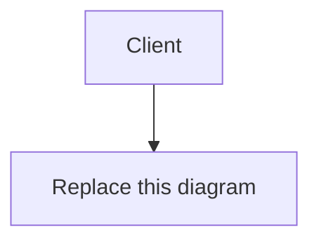

# Problem 2 deliverable: Snippet

Fill in every section. Read `PROMPT.md` for what each one must contain.

---

# Part A: weakness register

## A.0 Two figures the document does not give, and what I assume

Two numbers are needed repeatedly below and appear nowhere in `EXISTING-DESIGN.md`. I state them
here once rather than re-deriving them in each entry.

**Live row count in `snippets`.** §7 deletes rows on expiry, so the table holds live rows only, not
the 360 million links created over three years. At steady state:

```
live rows = arrival rate × average lifetime
          = 10,000,000/month × L months
```

The document never says what expiry periods users choose, so `L` is unconstrained. `L = 1` gives
10M rows, `L = 12` gives 120M, and `L = 36` (nothing expires inside the three-year window) gives
360M. **I use L = 12, so 120 million live rows, as the working figure**, and give the band where
the conclusion is sensitive to it. This is the single most load-bearing assumption in Part A and
the first thing I would measure against the real table.

**Row width on disk.** `CHAR(7)` + `VARCHAR(255)` holding the 16-byte key `snippets/abc1234` +
two 8-byte timestamps = 39 bytes of payload. With per-row header and page alignment I use
**100 bytes/row**. At 120M rows the table is ~12 GB.

Both figures are estimates. Where an entry's severity depends on them, I say so.

## A.1 The register

Ranked most important first. The ranking criterion is stated in A.2.

### A.1.1 The short-link generator produces colliding, guessable links, and no unique constraint catches the collision

- **Issue:** `base62(md5(client_ip + timestamp))[0:7]` draws from a space small enough to collide
  thousands of times at this volume, and because §5 declares no unique constraint on `shortlink`,
  a collision silently overwrites a stranger's snippet instead of failing.

- **Evidence:** The identifier space is 62⁷ = 3,521,614,606,208. §3 gives 360 million links over
  three years, so by the end of year three the probability that a new insert lands on an existing
  link is 3.6 × 10⁸ ÷ 3.52 × 10¹² ≈ **1 in 9,782**. At 10 million writes in month 36 that is
  10,000,000 ÷ 9,782 ≈ **1,022 collisions in that month alone**. Summed over the whole 360 million
  inserts, the expected number of collisions is N²/2S = (3.6 × 10⁸)² ÷ (2 × 3.52 × 10¹²) ≈
  **18,400 collisions to date**. §5 has no collision handling, and the DDL declares
  `shortlink CHAR(7) NOT NULL` with the only index on `created_at` — so nothing rejects the
  duplicate.

  The ordering of §5 makes it worse. Step 3 writes the object to `snippets/<shortlink>` *before*
  step 4 inserts the row. On a collision the object store `PUT` overwrites the earlier author's
  body unconditionally, and the earlier body is gone before SQL is ever consulted. Adding a unique
  constraint alone would not have saved it.

  Separately, the generator is not random. Its inputs are a client IP and a millisecond timestamp:
  about 58 bits of nominal input entropy, but an attacker targeting a known poster on a known day
  searches only 86,400,000 millisecond values, and the IP is often known or guessable (a corporate
  NAT, a published server). `md5` is fast to compute in bulk, so that search is a few seconds of
  CPU. The product's entire confidentiality model is "anyone with the link can read the snippet",
  which assumes the link is unguessable.

- **Impact:** Roughly a thousand times a month at current scale, someone's snippet silently becomes
  someone else's content. The first author's data is destroyed with no error, no log line and — since
  there are no accounts — no way to notify them or recover it. The reader of the older link is now
  served a stranger's text. The duplicate row also makes the §6 read non-deterministic: two rows
  match `WHERE shortlink = ?`, and which one the replica returns is an implementation detail. On
  the security side, anyone who knows roughly when and from where a snippet was posted can find it.

- **Severity: high**, because it is silent, unrecoverable and already happening. The other entries
  in this register describe cost, latency or downtime — things that are visible and reversible once
  noticed. This one has been quietly destroying user data for three years and has produced no
  signal that would make anyone look. An estimated 18,400 snippets are already lost and there is no
  audit trail from which to identify them.

- **Fix:** Two application changes, which are steps 2 and 4 of the four-step sequence set out in
  A.1.2. They are written here because they are changes to the write path rather than to the
  schema; the sequencing argument is in A.1.2 and the priority argument is in A.3.

  1. **Replace the generator** with `base62(CSPRNG(48 bits))`, giving 8 characters.
     `secrets.token_bytes` or equivalent — not a hash of request metadata. 62⁸ = 2.18 × 10¹⁴ drops
     the per-insert collision probability at 360M links from 1 in 9,782 to **1 in 606,000**, a
     factor of 62 improvement, and makes links unguessable rather than merely long. Keep reading
     7-character links forever; only mint 8-character ones.

     This is the change that actually stops collisions, and it is worth being clear that it does so
     **without depending on the unique constraint at all**. The constraint is a guardrail that
     catches the 1 in 606,000; the generator is what makes the rate 1 in 606,000 in the first
     place. That is why it goes in second in the sequence rather than waiting for the constraint,
     which cannot be declared until the historical duplicates are gone.

  2. **Reverse the write order and make the insert the arbiter.** Insert the SQL row first with
     `INSERT ... ON CONFLICT (shortlink) DO NOTHING`; if zero rows are affected, generate a new
     link and retry, up to three attempts. Only once the row is committed does the object store
     `PUT` happen. The database, not the object store, becomes the thing that decides a link is
     taken, which is the defect that a unique constraint alone would not have fixed — today the
     body is destroyed by the object store write in §5 step 3, before SQL is consulted in §5
     step 4.

     The `ON CONFLICT` clause requires the unique index to exist, so this half lands with step 4 of
     the sequence. The write-order reversal does not, and should ship with the generator change:
     even without a constraint, writing the row before the object means a collision is *detectable*
     after the fact — two rows with one `shortlink` and a known `created_at` ordering — instead of
     leaving no trace at all.

### A.1.2 There is no index on `shortlink`, so every cache miss scans the whole table

- **Issue:** The read query in §6 filters on `shortlink`, but §5 creates an index only on
  `created_at`, so the single most frequent query in the system has no index to serve it.

- **Evidence:** The DDL declares exactly one index:

  ```sql
  CREATE INDEX idx_snippets_created_at ON snippets (created_at);
  ```

  and §6 step 3 runs:

  ```sql
  SELECT object_key, expires_at FROM snippets WHERE shortlink = 'abc1234';
  ```

  There is no access path but a sequential scan. At 120M live rows × 100 bytes that is **12 GB read
  per cache miss**. Worse, because `shortlink` carries no unique constraint, the planner cannot
  stop at the first matching row — it is obliged to scan to the end of the table even after the row
  is found.

  §3 gives 100 million reads/month = 40 reads/s average, 400/s at the team's stated 10× peak. Taking
  a generous 90% cache hit rate, that is 4 misses/s average and **40 misses/s at peak**. Forty
  concurrent 12 GB scans is 480 GB/s of read bandwidth demanded from a replica. Even fully resident
  in page cache at ~1 GB/s a single scan takes ~12 seconds; the replica cannot serve the second
  concurrent miss, let alone the fortieth.

  This is the entry most sensitive to the A.0 assumption, and the sensitivity is itself the finding:
  at `L = 1` (10M rows, ~1 GB) a scan is ~1 second and the system limps; at `L = 12` it does not
  work at all. The service has survived three years because the table started empty and grew into
  this, and because the cache hides it until the moment the cache is cold.

- **Impact:** Cache misses are slow to the point of timing out, and the miss rate is exactly what
  spikes during the events that matter: a cache restart, a failover, a deploy that flushes the
  cache, or a newly posted snippet being shared for the first time. The failure mode is a
  correlated one — after any cache loss the replicas are asked for a full-table scan per request
  and the read tier stops serving entirely. Recovery is not possible by restarting: the empty cache
  guarantees the stampede repeats.

- **Severity: high**, because it converts any cache interruption into a total read outage rather
  than a period of degraded latency, and read is the whole product. It ranks below A.1.1 only
  because it is loud, bounded and completely reversible — one index, and the symptom is gone.

- **Fix: the four-step sequence.** Add the index, then earn the right to make it unique. The whole
  of A.1.1's schema half arrives here too, and the order is forced rather than chosen — A.3 argues
  why this is the first thing to do at all.

  **Why the constraint cannot be step 1.** The obvious move is to build the unique index
  immediately and get both fixes for one table rebuild. It does not work.
  `CREATE UNIQUE INDEX CONCURRENTLY` aborts as soon as it encounters the second copy of a key, and
  by the arithmetic in A.1.1 there are an estimated **18,400 duplicate `shortlink` values already
  in the table**. It does not warn or build a degraded index; the build fails and leaves an
  `INVALID` index to clean up. Nor is there an escape hatch: Postgres supports `NOT VALID` for
  check and foreign-key constraints, so they can be enforced going forward and validated later, but
  **not for unique constraints**. Uniqueness can only be declared over a corpus that is already
  unique. The duplicates must go first, and finding them cheaply requires the index — which is what
  fixes the read path anyway.

  1. **`CREATE INDEX CONCURRENTLY idx_snippets_shortlink ON snippets (shortlink);` — non-unique.**
     One statement, no `ACCESS EXCLUSIVE` lock, so reads and writes continue throughout. Budget two
     passes over a 12 GB table. If it fails it leaves an `INVALID` index, so check
     `pg_index.indisvalid` afterwards rather than assuming success, and drop before retrying.

     **This step alone delivers almost all the user-visible benefit.** The read path goes from a
     12 GB sequential scan per cache miss to a single index lookup, and the correlated failure
     described above — any cache interruption becoming a total read outage — is gone the moment it
     completes. Nothing else in the sequence has to land for that to be true.

  2. **Deploy the A.1.1 generator change** (8 characters from a CSPRNG) and the write-order
     reversal. This drops the collision rate by a factor of 62 on its own, with no dependency on
     the constraint, and it stops the duplicate set growing while step 3 runs. Without it, step 3
     is remediating a set that is still being added to at ~1,022 rows a month.

  3. **Remediate the existing duplicates.** `SELECT shortlink FROM snippets GROUP BY shortlink
     HAVING count(*) > 1;` — an index-only scan now, rather than a 12 GB scan plus a sort, which is
     the concrete reason this step comes after step 1 and not before. For each group keep the
     **newest** row, because the object store holds the newest author's body; the older rows point
     at an object that no longer contains their content and are already unreadable in the sense
     their authors intended. Delete the older rows.

     This is remediation of a loss, not prevention of one. The older snippets are gone and cannot
     be recovered — the object store overwrote them, in some cases years ago. There are no accounts
     (§1), so there is nobody to notify. Deleting the rows only makes the table's state honest
     about what the object store already contains.

  4. **Swap to the unique index and close the write path.**
     `CREATE UNIQUE INDEX CONCURRENTLY idx_snippets_shortlink_uq ON snippets (shortlink);` then
     `ALTER TABLE snippets ADD CONSTRAINT snippets_shortlink_key UNIQUE USING INDEX
     idx_snippets_shortlink_uq;`. The `ALTER` takes a brief `ACCESS EXCLUSIVE` lock, but it is a
     catalogue-only operation against an already-built index — milliseconds, not a rebuild. Set
     `lock_timeout` so it fails fast rather than queueing behind a long read and blocking writes.
     Then drop the non-unique index from step 1, and enable the `ON CONFLICT (shortlink) DO NOTHING`
     retry in the write path, which has something to conflict against for the first time.

     Step 4 is the guardrail, not the cure. After step 2 the expected collision rate is about
     **17 per month** across the whole service rather than 1,022; this step is what turns those 17
     from silent data destruction into a retry nobody notices.

  **One option I considered and rejected**, because it looks like a way to get the constraint into
  step 1: a *partial* unique index, `CREATE UNIQUE INDEX CONCURRENTLY ... WHERE created_at >=
  '<cutoff>'`. It builds successfully despite the historical duplicates, because the predicate
  excludes them. But it only prevents a new row from colliding with another *new* row — a new link
  colliding with one of the 120 million pre-cutoff rows is not in the index and passes straight
  through, and that is where essentially all of the collision probability lives. It buys a small
  fraction of the protection for real added complexity in every `ON CONFLICT` clause, which must
  then repeat the predicate to match the index.

### A.1.3 The expiry job reads the entire table every hour, and never invalidates the cache

- **Issue:** The hourly expiry query has no `WHERE` clause and no `LIMIT`, so it drags every live
  row into application memory to delete about one ten-thousandth of them — and having deleted them,
  it leaves the cached copies in place, so an expired snippet stays readable.

- **Evidence:** §7 runs:

  ```sql
  SELECT shortlink, object_key, expires_at
  FROM snippets
  ORDER BY created_at;
  ```

  and compares `expires_at` in application code. At 120M live rows × 100 bytes that is **12 GB read
  per run, 288 GB/day, 8.6 TB/month** to perform the deletions. The rows actually expiring per hour
  at steady state are 10,000,000 ÷ (30 × 24) ≈ **13,889** — a scanned-to-deleted ratio of about
  **8,640 : 1**.

  The `ORDER BY created_at` does not help; it hurts. §7 claims "the index on `created_at` supports
  the ordering", but the query selects `shortlink` and `object_key`, which the index does not
  contain. The planner's choices are a sequential scan plus an external sort of 12 GB, or an index
  scan with 120M random heap fetches. The second is generally worse than the first. Either way the
  ordering is decorative — the job compares every row to the clock regardless of the order they
  arrive in.

  On the cache: §6 step 5 writes the body into the managed cache and states no TTL. §7 deletes the
  row and the object but touches nothing in the cache. So for any snippet whose cache entry is kept
  warm by ongoing reads — which is precisely the popular ones — deletion from SQL and the object
  store has **no observable effect at all**. §7 says "a snippet may remain readable for up to an
  hour after its expiry time. This is accepted." That is a statement about the job's period. The
  actual bound is unbounded: a snippet read once a minute stays readable forever.

  A third defect in the same job: it deletes the object first and the row second. A crash between
  the two leaves a row pointing at an object that no longer exists, and §6 defines no behaviour for
  a successful row lookup followed by a failed object fetch.

- **Impact:** The operator pays for 288 GB/day of replica I/O and an hourly period where the
  replica's buffer pool is evicted by a scan of cold rows, degrading the read path it shares. The
  user is promised that their snippet expires, and for the popular ones it does not — which is the
  one durability guarantee a service with no delete endpoint (§10) actually offers. Someone who
  pastes something they regret has been told it will disappear; it will not.

- **Severity: high** for the cache half, **medium** for the scan half. The scan is cost and
  collateral latency — unpleasant, bounded, and the operator can see it in a graph. The cache half
  is a broken product promise with a privacy dimension, invisible to everyone including the
  operator, and it fails worst for exactly the snippets that most people are looking at.

- **Fix:** Four changes.

  1. **Add the predicate and the index:** `CREATE INDEX CONCURRENTLY idx_snippets_expires_at ON
     snippets (expires_at);` and query `SELECT shortlink, object_key FROM snippets WHERE expires_at
     < now() ORDER BY expires_at LIMIT 5000;` in a loop until it returns fewer than 5,000 rows.
     Each iteration touches ~13,889 rows per hour instead of 120,000,000 — an index range scan of a
     few megabytes rather than 12 GB.
  2. **Delete in the safe order:** row first, then object. An orphaned object costs storage and is
     reclaimable by a weekly sweep; an orphaned row is a user-visible error.
  3. **Invalidate the cache** as part of the deletion, before the object delete: `DEL <shortlink>`.
  4. **Set a TTL on every cache write** in §6 step 5, of `min(expires_at − now(), 1 hour)`, so
     correctness does not depend on the invalidation step succeeding. Belt and braces, because a
     cache `DEL` that fails silently is exactly how this class of bug returns.

### A.1.4 A missing snippet returns `200 OK` with an empty body, and the response is cacheable

- **Issue:** §6 answers a lookup that finds no row with `200 OK` and an empty body, which means no
  client, proxy, crawler or monitoring system can distinguish "this snippet does not exist" from
  "this snippet is empty" or from "the read path is broken" — and the missing cache-control header
  lets that wrong answer be cached.

- **Evidence:** §6: *"If no row is found, the read API returns `200 OK` with an empty body"* and
  *"The response carries no cache-control header."* Three consequences compound.

  **(a) It is reachable on the happy path, not just for bad links.** §5 step 4 writes to the SQL
  *primary*; §6 step 3 reads from a *replica*, and §5 states "read replicas follow it
  asynchronously". A user who creates a snippet and immediately opens the link they were just
  handed — the single most common action in the entire product, because it is how you check the
  link works — races replication. Reproduction: `POST /api/v1/write`, take the returned link,
  `GET /api/v1/read?shortlink=<link>` within the replication lag window. The row is not on the
  replica yet, so the API returns `200 OK` and an empty body, and the web tier renders an empty
  snippet page. The user believes their paste was lost.

  **(b) The wrong answer can stick.** With no `Cache-Control` header, an intermediary is permitted
  to apply heuristic freshness to a `200` response. A browser, a corporate proxy or a CDN may retain
  that empty body. The user then sees an empty page for their own valid snippet for the heuristic
  lifetime, and reloading does not help.

  **(c) Monitoring is blind.** At 100 million reads/month, a failure that causes every lookup to
  find no row — a replica that has fallen far behind, a bad deploy, an empty table after a botched
  restore — is reported to the load balancer, the dashboard and any HTTP-status-based alert as
  **100% success**. There is no status-code signal that differs between a perfectly healthy month
  and a total read outage. Combined with A.1.2, the most likely real incident (cache cold, replicas
  scanning, lookups timing out) partially presents as a wall of cheerful `200`s.

- **Impact:** Users conclude the service ate their paste, and they have no recourse because there
  are no accounts and no support surface. Operators lose the ability to alert on the product's
  primary failure. And because the same `200` covers both "expired" and "never existed", nobody can
  tell a user which happened.

- **Severity: high.** Not for the wrong status code in itself, which is cosmetic, but because it is
  the mechanism that makes every other read-path failure in this register silent. It is the reason
  a three-year-old service can carry A.1.1, A.1.2 and A.1.3 without anyone noticing.

- **Fix:**
  - Return `404 Not Found` with a JSON error body (`{"error": "not_found"}`) when no row matches,
    and `410 Gone` when a row matches but `expires_at` has passed — distinguishing expiry from
    never-existed is worth the one extra branch, and it is the difference between "you are too
    late" and "you typed it wrong".
  - Send `Cache-Control: no-store` on both, so a negative answer is never retained anywhere.
  - Send `Cache-Control: public, max-age=<min(seconds until expires_at, 300)>` on a successful
    read, which both bounds staleness against expiry and lets browsers and a CDN absorb repeat
    reads that currently all reach origin.
  - Fix the read-after-write race explicitly rather than relying on the status code to explain it:
    on a replica miss, retry the lookup once against the primary before concluding the snippet does
    not exist. At 4 writes/s this costs the primary a negligible number of point lookups, and it
    removes the only case where a correct `404` would still be the wrong answer.
  - Alert on the `404` and `410` rates as a proportion of reads, which is only possible once the
    first change is made.

### A.1.5 Analytics is written synchronously on the read path, making a reporting store a hard dependency of the product

- **Issue:** §6 step 6 appends to the analytics log store *before the response is sent*, so the
  availability and latency of a system that exists to produce monthly reports are inherited by every
  single read.

- **Evidence:** §6 step 6 is explicit: *"This happens on the request path, before the response is
  sent."* §3 gives 100 million reads/month = 40/s average and 400/s at the stated 10× peak. Every
  one of those blocks on a network write.

  The read path's availability is now the product of its dependencies, and the analytics store is
  one of them. A log store at 99.9% caps the read path at 99.9% *no matter how good the cache,
  replicas and object store are* — that is 0.1% of 100,000,000 reads = **100,000 failed reads per
  month**, or 43 minutes, caused entirely by a component with no user-facing purpose. If the log
  store is slower than that, reads fail with it.

  On latency: a cache hit (§6 step 2) should return in a couple of milliseconds. A 20 ms p99 append
  to the log store is added to **100% of reads including every cache hit**, so at the tail the
  cache's entire benefit is erased by the logging call that follows it. At 400 reads/s, 20 ms of
  added hold time is 400 × 0.02 = **8 request slots** occupied at all times purely by logging, and
  if the log store degrades to 500 ms that becomes 200 concurrent connections held open — enough to
  exhaust a connection pool and take the read tier down while every actual dependency is healthy.

- **Impact:** The service can be taken offline by its own reporting pipeline. Worse, this is the
  dependency most likely to be treated as low-priority during maintenance, precisely because
  everyone knows it "only does analytics" — so the riskiest component is the one nobody schedules
  carefully.

- **Severity: medium.** The coupling is real and the availability arithmetic is unarguable, but it
  requires the analytics store to misbehave before anyone sees anything, and the blast radius is
  latency and availability rather than data loss. It ranks below A.1.4 because A.1.4 would hide
  this one's symptoms.

- **Fix:** Take it off the request path. Write the analytics line to a bounded in-process buffer
  (drop on overflow, and emit a counter for drops so silent loss is visible) and flush it
  asynchronously in batches. The response is sent without waiting. Analytics is a sampled,
  best-effort signal for monthly visitor counts and top-snippet rankings — losing a small fraction
  of lines changes no decision anyone makes from that data, whereas failing a read certainly does.
  If loss is genuinely unacceptable, derive the counts from the load balancer's own access logs,
  which are written off the request path by definition and already contain the short link, client
  address, user agent and timestamp.

### A.1.6 Snippet size is unbounded, so one client can outspend the entire service

- **Issue:** §3 records maximum snippet size as "Not enforced", and nothing in §5 rejects a large
  body, so the cost of a single request has no ceiling.

- **Evidence:** §3 sizes the service for 10 million snippets/month at 1 KB average = **10.24 GB of
  new object storage per month**. There is no authentication (§1) and no rate limit anywhere in the
  document.

  Reproduction: `POST /api/v1/write` with a 10 MB body. Nothing in §5 checks the length; the write
  API stores it and returns a link. A single client at 100 requests/second — trivial from one host
  — writes 100 × 10 MB = 1 GB/s = **86.4 TB/day**, which is about **8,400 times the service's
  entire monthly ingest, every day**, from one machine, anonymously.

  The cache is collateral. §6 step 5 writes the body into the managed cache with no size check, so
  a single 10 MB snippet that is being read occupies the space of roughly **10,000 one-kilobyte
  snippets**. A handful of large snippets under repeated read evicts the entire working set, which
  drives the miss rate up, which — via A.1.2 — sends full table scans to the replicas.

  The write API also has no defined streaming behaviour, so a body large enough to be buffered in
  memory is an availability question for the web tier as well as a cost question for the object
  store.

- **Impact:** An unbounded and immediate storage bill from an anonymous source, with no mechanism in
  the design to identify or stop it; degraded cache effectiveness for every legitimate user; and a
  free anonymous file-hosting service that the team did not intend to run, with the content-hosting
  liability that implies.

- **Severity: medium.** The arithmetic is dramatic, but this requires someone to choose to do it,
  whereas A.1.1 through A.1.4 are already happening on their own. It is a latent exposure rather
  than an active fault — which is also why it is cheap to close, and there is no reason not to.

- **Fix:** Enforce a limit at two layers, because either alone can be bypassed or misconfigured.
  At the load balancer, cap the request body (`client_max_body_size 512k` or the equivalent) so an
  oversized upload is rejected before it reaches application memory. In the write API, check
  `Content-Length` and the streamed byte count, and return `413 Payload Too Large` with the limit
  stated in the error body. 512 KB is 500× the 1 KB average, so it constrains nobody real. Add a
  cache-side rule that bodies above, say, 64 KB are not cached at all — they are served from the
  object store, so one large snippet cannot evict thousands of small ones. Rate limiting is the
  other half of this problem and is designed in B.4.

### A.1.7 Single write primary with manual promotion, and no bound on what promotion loses

- **Issue:** §9 states that a primary failure stops all writes until a replica is promoted by hand,
  and since replication is asynchronous, the promotion itself silently discards writes the service
  has already acknowledged.

- **Evidence:** §5: *"There is one SQL primary. All writes go to it. Read replicas follow it
  asynchronously."* §9: *"A failure of the SQL primary stops all writes until a replica is promoted
  by hand."* §10 lists "no automated failover for the SQL primary" as a known and accepted gap.

  At 4 writes/s, a manual promotion with a realistic detection-plus-decision-plus-promotion time of
  one hour refuses 4 × 3,600 = **14,400 snippets**. That part the team has accepted, and the
  acceptance is defensible: reads (40/s, ten times the volume) continue from the cache and
  replicas throughout, so the blast radius is the smaller half of the product.

  The part §10 does **not** record is the data loss. Because replication is asynchronous, any write
  committed on the primary but not yet shipped when it died is lost at promotion. The document
  defines no replication-lag metric, no alert on lag, and no rule about which replica to promote —
  so the loss is not merely non-zero, it is **unmeasured**. At a lag of 30 seconds under the 10×
  peak of 40 writes/s, that is 40 × 30 = **1,200 acknowledged snippets** gone, with their authors
  holding links that will never resolve. And because of A.1.4 those links return `200 OK` with an
  empty body, so the loss presents to every one of those users as "the service ate my paste" and to
  the operator as a successful request.

- **Impact:** An hour of no new snippets per incident, plus an unknown number of snippets that were
  confirmed to their authors and then discarded, indistinguishable afterwards from snippets that
  never existed.

- **Severity: medium.** I rank it below the others rather than high, and deliberately lower than a
  single point of failure would normally sit, for two reasons: the read path — nine-tenths of the
  traffic and the whole of the value for a reader — survives the failure entirely, and the team has
  consciously accepted the downtime half. What I do not accept is the silent, unbounded data loss,
  which §10 does not mention and which nobody has priced.

- **Fix:** The full answer is automated failover, and the team has already decided that is not worth
  the cost, so I would not lead with it. Instead, bound the loss and make the accepted risk an
  informed one:
  - Enable synchronous commit to **one** designated standby (`synchronous_commit = remote_write`
    with one synchronous replica). At 4 writes/s the added commit latency is irrelevant to a user
    who is waiting on an object store write anyway, and it makes the loss on promotion provably
    zero for the acknowledged set.
  - Export replication lag as a first-class metric and alert when it exceeds 5 seconds. Today
    nobody could answer "how much would we lose right now", which is the real gap.
  - Write the promotion runbook down, including which replica is the synchronous one, and rehearse
    it. A manual failover that has been practised is perhaps 10 minutes (2,400 snippets) rather
    than an hour.
  - Have the write API return `503` with `Retry-After` when the primary is unreachable, so clients
    and the browser can retry rather than the user losing what they typed.

## A.2 Ranking rationale

I ranked by **probability × irreversibility**, not by severity in the abstract. The question I
asked of each entry was: how often does this actually happen at the figures in §3, and when it
does, can it be undone afterwards? That criterion puts silent data destruction above loud outages,
because an outage ends and a lost snippet does not.

That produces the top of the list. **A.1.1** is the only entry where the damage is permanent — an
estimated 18,400 snippets have already been overwritten, roughly 1,022 more will be this month, and
there is no log, no account and no backup path by which any of them could be identified or
restored. Everything else in the register is recoverable by deploying a fix. **A.1.2** follows
because although an index is the cheapest fix in the document, the failure it produces is
correlated and self-sustaining: the cache protects the replicas, so the moment the cache is
interrupted every request demands a 12 GB scan, and restarting into an empty cache reproduces the
condition. **A.1.3** is third because half of it is a broken promise to the user rather than a cost
to the operator: a popular snippet is never actually removed, which for a service with no delete
endpoint is the only guarantee it makes about getting rid of something. **A.1.4** is fourth despite
looking cosmetic, and sits this high because of what it does to the other three — it is the reason
a service can carry all of them for three years and see nothing but healthy dashboards.

The bottom three are ranked by whether the fault is active or latent. **A.1.5** requires the
analytics store to misbehave before anything is felt; **A.1.6** requires someone to choose to abuse
it; **A.1.7** requires hardware to fail. All three are real, all three have arithmetic behind them,
but none of them is silently running today in the way the top four are.

Two rankings I would defend against an obvious objection. A single point of failure in the write
path (A.1.7) would normally go near the top of any register, and I have put it last — because at a
10:1 read-to-write ratio the failure costs the smaller tenth of the traffic while readers are
served throughout, and because §10 shows the team priced the downtime deliberately. My criticism
is narrower than "no failover": it is that the *data loss* at promotion is unmeasured and
unmentioned. Conversely, a missing `Cache-Control` header would normally be a footnote, and it does
not get its own entry here — it is folded into A.1.4, because its damage in this system is not the
missed CDN offload, it is that it lets a wrong `200` persist in caches the team does not control.

## A.3 The one to fix first

**`CREATE INDEX CONCURRENTLY` on `shortlink` — step 1 of the A.1.2 sequence.** Not the most severe
entry in the register; A.1.1 is. It goes first because it is the largest improvement available per
unit of risk in the whole document, and because the severe entry's fix cannot proceed without it.

**The payoff is immediate and disproportionate.** One DDL statement, no application change, and the
most frequent query in the system stops reading 12 GB and starts reading a few pages. Every cache
miss — 4/s average, 40/s at the stated 10× peak — goes from tens of seconds to sub-millisecond. The
correlated failure in A.1.2 disappears with it: after this statement, a cache restart is a period
of higher latency instead of a total read outage that cannot recover by restarting. Nothing in the
register offers a comparable change in the system's behaviour for comparable effort, and the effect
is visible on a latency graph within minutes of the build completing, which matters for a fix whose
next three steps need organisational patience.

**The risk of acting is close to zero.** `CREATE INDEX CONCURRENTLY` takes no `ACCESS EXCLUSIVE`
lock, so reads and writes continue throughout. The failure mode is a leftover `INVALID` index,
detected by one catalogue query and resolved by dropping it and retrying. The application is
untouched, so there is no behavioural rollback to plan — only `DROP INDEX CONCURRENTLY`. Compare
with A.1.4, which changes a response contract that unknown anonymous clients already depend on, or
A.1.5, which needs a buffering and flushing mechanism built, tested and reasoned about under load.

**The risk of not acting compounds daily.** The table grows by 10 million rows a month, so every
month of delay lengthens both the scan and the eventual index build. The failure is not gradual: it
is a cliff with the cache standing in front of it. The service is one cache restart away from a
total read outage, and that restart will be scheduled by someone else — a managed-cache maintenance
window, a failover, a deploy.

**Blast radius is asymmetric.** The fix touches one table and one query plan. The fault covers the
entire read path: 100 million reads a month, which is the whole of the product for everyone who is
not currently creating a snippet.

**And it is the precondition for the rest.** Until the index exists:

- A.1.1's duplicate remediation (`GROUP BY shortlink HAVING count(*) > 1`) is a 12 GB scan plus a
  sort, and the `ON CONFLICT` insert has nothing to conflict against — so the fix for the most
  severe entry in the register cannot begin.
- A.1.4's `410 Gone` requires reading `expires_at` on every miss, which today means a full scan per
  request.
- A.1.3's expiry rework, and B.6, assume indexed access to the same table.

So doing it first turns four coupled problems into three independent ones. Immediately behind it I
would ship step 2 — the generator change — because it drops the collision rate by a factor of 62 on
its own and stops the duplicate set growing while step 3 runs. Steps 1 and 2 together are a few
days of work and carry almost all of the benefit; steps 3 and 4 are the slower, less visible half
that makes the guarantee permanent.

## A.4 What the design gets right

**The anonymous, stateless write path.** §1 states there are no accounts and no login, and calls
this simplicity "the product". It is right, and it is right for a structural reason the document
does not spell out: because no request carries identity, the web tier holds no session state, so
§9's claim that it "scales horizontally" is true without qualification. There is no session store
to size, no session replication to get wrong, no sticky routing, and no shared component that a
new web server must join before it can serve traffic. Adding capacity is adding a process. That
property is also what makes the fixes in A.1 cheap to deploy: every one of them is a change to a
stateless tier behind a load balancer.

**The naive redesign that would break it:** reaching for A.1.6 and A.1.1 — unbounded writes and
abuse with no way to identify the abuser — and concluding that the fix is to **require an account
to create a snippet**. It is a natural move. It gives every write an identity to attribute, it
makes rate limiting trivially per-user, and it is exactly what Part B is about to introduce.
Requiring it is the mistake.

**What it would cost.** Three things, in increasing order of importance.

1. **It reintroduces state on the write path.** Every `POST /api/v1/write` gains a session or token
   lookup before it does any work. At 4 writes/s that is nothing; at the 10× peak of 40/s it is
   still nothing — but the *architecture* changes, because the web tier is no longer independently
   scalable, and the auth store becomes a hard dependency of publishing. That is the same mistake
   as A.1.5, made deliberately: a supporting system placed in front of the core action.

2. **It puts a registration form in front of the product's only interaction.** Snippet's entire
   flow is paste, press save, get a link — plausibly under ten seconds. Registration adds an email,
   a password, a verification round trip and a confirmation click. The loss is not a percentage
   shaved off a funnel; it is most of the volume. §3 records 10 million snippets/month, and the
   traffic that generates them is people pasting an error log once. If even 15% of current writers
   would create an account to keep doing that, the service goes from 10,000,000 to about
   **1,500,000 snippets/month**, and the 100 million monthly reads fall with them, since reads are
   driven by links being created and shared. The 10:1 ratio in §3 is the tell: the read traffic
   that justifies the whole infrastructure is a *consequence* of frictionless writing.

3. **It does not even solve the problem it was reached for.** The abuse in A.1.6 is 86 TB/day from
   one host; registration costs an abuser one email address and a few seconds. The actual controls
   are a body-size limit (A.1.6) and per-IP rate limiting (B.4), neither of which needs identity.
   Accounts would have bought a large behavioural cost for a control that does not stop the attack.

So the constraint I carry into Part B is that **accounts are additive, never required**. Anonymous
creation stays on exactly the path it has today; authentication adds capability — ownership, private
snippets, higher rate limits, a delete endpoint — on top of it. B.2 preserves the anonymous write,
and B.4 rate-limits anonymous and authenticated clients separately for this reason.

---

# Part B: the extended design

## B.1 Overview and diagram

One Mermaid diagram of the extended system. Mark clearly what is new and what is unchanged.



## B.2 User accounts and authentication

## B.3 Private snippets and access control

State the enforcement point explicitly, and how it interacts with the cache.

## B.4 Rate limiting and abuse protection

State the limits as numbers, the algorithm, where the counter lives, and the response a limited
client receives.

## B.5 API v2 contract

### B.5.1 Endpoints

### B.5.2 Authentication

### B.5.3 Pagination

### B.5.4 Idempotency

### B.5.5 Error model

### B.5.6 Coexistence with v1, and the retirement plan

## B.6 Correct expiry at scale

Data change, query, index, job shape, and the effect on cached copies.

## B.7 Decision records

One record per extension, five in total. Use the template in `PROMPT.md`. Cite numbers.

### B.7.1 Accounts and authentication

### B.7.2 Private snippets

### B.7.3 Rate limiting

### B.7.4 API v2

### B.7.5 Expiry

## B.8 Migration

How you get from the live system with 360 million existing links to the extended design, with no
period in which an existing link stops working. State the order of the steps and the rollback for
each.

## B.9 What you did not do

What you left out of the extension, and why.
