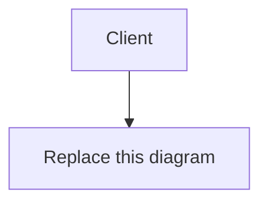

# Problem 2 deliverable: Snippet

Fill in every section. Read `PROMPT.md` for what each one must contain.

---

# Part A: weakness register

## A.1 The register

Ranked, most important first. Add as many rows as you need. Every row carries all five fields.
Write the evidence field as arithmetic or as a reproduction, never as an assertion.

The table is a starting shape. If a longer prose entry serves you better, use prose, but keep the
five fields labelled.

### A.1.1 Weakness 1

- **Issue:**
- **Evidence:**
- **Impact:**
- **Severity:** (high / medium / low) because ...
- **Fix:**

### A.1.2 Weakness 2

- **Issue:**
- **Evidence:**
- **Impact:**
- **Severity:** (high / medium / low) because ...
- **Fix:**

### A.1.3 Weakness 3

- **Issue:**
- **Evidence:**
- **Impact:**
- **Severity:** (high / medium / low) because ...
- **Fix:**

<!-- Copy the block above for each further weakness. -->

## A.2 Ranking rationale

Why this order. Two or three paragraphs.

## A.3 The one to fix first

Which weakness, and the argument for putting it ahead of the others. Consider risk, cost, blast
radius and what the fix unblocks.

## A.4 What the design gets right

One thing the existing design gets right that a naive redesign would break. Name the naive
redesign you have in mind and state what it would cost.

---

# Part B: the extended design

## B.1 Overview and diagram

One Mermaid diagram of the extended system. Mark clearly what is new and what is unchanged.

## B.2 User accounts and authentication

## B.3 Private snippets and access control

State the enforcement point explicitly, and how it interacts with the cache.

## B.4 Rate limiting and abuse protection

State the limits as numbers, the algorithm, where the counter lives, and the response a limited
client receives.

## B.5 API v2 contract

### B.5.1 Endpoints

### B.5.2 Authentication

### B.5.3 Pagination

### B.5.4 Idempotency

### B.5.5 Error model

### B.5.6 Coexistence with v1, and the retirement plan

## B.6 Correct expiry at scale

Data change, query, index, job shape, and the effect on cached copies.

## B.7 Decision records

One record per extension, five in total. Use the template in `PROMPT.md`. Cite numbers.

### B.7.1 Accounts and authentication

### B.7.2 Private snippets

### B.7.3 Rate limiting

### B.7.4 API v2

### B.7.5 Expiry

## B.8 Migration

How you get from the live system with 360 million existing links to the extended design, with no
period in which an existing link stops working. State the order of the steps and the rollback for
each.

## B.9 What you did not do

What you left out of the extension, and why.
