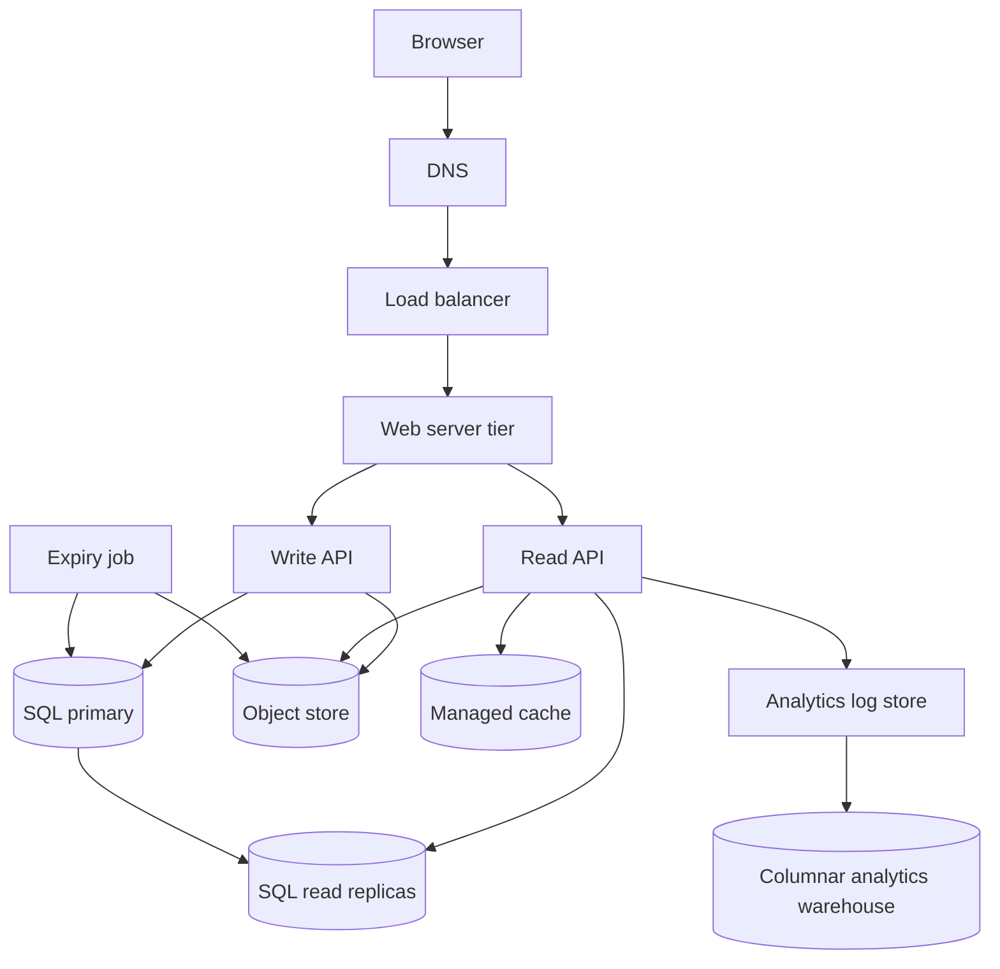

# Snippet: system design

> **Status:** approved, in production for three years.
> **Audience:** engineers joining the team.
>
> This document describes the system as it is built today. It is presented to you as the team
> wrote it. Read it as a real design document from a real service, not as an exercise. Your job
> is described in `PROMPT.md`.

---

## 1. What Snippet does

Snippet is a public snippet-sharing service. A user pastes a block of text, presses save, and gets
back a short link. Anyone with the link can read the snippet. The snippet expires after a period
the user chooses.

There are no user accounts. There is no login. Anyone can create a snippet and anyone with the
link can read it. The team considers this simplicity to be the product.

## 2. Use cases

In scope:

- A user creates a snippet and receives a short link.
- A user opens a short link and reads the snippet, rendered in the browser.
- A snippet expires and stops being readable.
- The service records read events for analytics: monthly visitor counts and top snippets.
- The service is highly available.

Out of scope: accounts, private snippets, editing, deletion by the author, syntax highlighting.

## 3. Scale

| Figure | Value |
|--------|-------|
| New snippets | 10 million per month |
| Reads | 100 million per month |
| Read to write ratio | 10 to 1 |
| Average snippet size | 1 KB |
| Maximum snippet size | Not enforced |
| Retention target | 3 years of history retained for analytics |
| Links created over 3 years | 360 million |

Derived: about 4 writes per second and about 40 reads per second, averaged. The team sizes for a
peak of ten times the average.

## 4. Architecture



## 5. Write path

1. The browser posts the snippet body and the chosen expiry to `POST /api/v1/write`.
2. The write API generates the short link:

   ```
   shortlink = base62(md5(client_ip + timestamp))[0:7]
   ```

   `client_ip` is the requesting address. `timestamp` is the server time in milliseconds. Base62
   uses `[a-zA-Z0-9]`. The first 7 characters are taken.

3. The write API writes the snippet body to the object store under the key `snippets/<shortlink>`.
4. The write API inserts a row into the SQL primary:

   ```sql
   CREATE TABLE snippets (
     shortlink   CHAR(7) NOT NULL,
     object_key  VARCHAR(255) NOT NULL,
     expires_at  TIMESTAMP NOT NULL,
     created_at  TIMESTAMP NOT NULL
   );
   CREATE INDEX idx_snippets_created_at ON snippets (created_at);
   ```

5. The write API returns the short link to the browser.

The short link is 7 characters. The team chose 7 because a 7 character base62 space holds about
3.5 trillion values, which the team judged to be far more than the service will ever need.

There is one SQL primary. All writes go to it. Read replicas follow it asynchronously.

## 6. Read path

1. The browser requests `GET /api/v1/read?shortlink=abc1234`.
2. The read API checks the managed cache for the key `abc1234`. On a hit it returns the body.
3. On a miss the read API selects the row from a read replica:

   ```sql
   SELECT object_key, expires_at FROM snippets WHERE shortlink = 'abc1234';
   ```

4. The read API fetches the object from the object store using `object_key`.
5. The read API writes the body into the managed cache.
6. The read API appends a line to the analytics log store, containing the short link, the client
   address and the user agent. This happens on the request path, before the response is sent.
7. The read API returns the body. The web tier renders it into the snippet page template and
   serves it as HTML.

If no row is found, the read API returns `200 OK` with an empty body. The page template then
renders an empty snippet.

The response carries no cache-control header.

## 7. Expiry

A job runs every hour. It removes snippets whose expiry has passed.

```sql
SELECT shortlink, object_key, expires_at
FROM snippets
ORDER BY created_at;
```

The job reads the result, compares `expires_at` to the current time in application code, and for
each expired row deletes the object from the object store and then deletes the row from SQL.

The index on `created_at` supports the ordering.

The team notes that a snippet may remain readable for up to an hour after its expiry time. This is
accepted.

## 8. Analytics

The analytics log store receives one line per read. Lines carry the short link, the client
address, the user agent and the timestamp. A batch job loads the log store into a columnar
analytics warehouse each night. Analysts query the warehouse for monthly visitor counts and for
the most-read snippets.

Log lines are kept indefinitely, because the warehouse loader occasionally needs to be re-run
against old data.

## 9. Availability and scaling

- The web tier is stateless and sits behind the load balancer. It scales horizontally.
- Read load is absorbed by the managed cache and by the read replicas.
- The object store is treated as always available and infinitely scalable.
- Writes are limited by the single SQL primary. The team measured the primary at well above the
  current 4 writes per second and considers write scaling a future problem.
- A failure of the SQL primary stops all writes until a replica is promoted by hand.

## 10. What the team knows it has not done

The team recorded these as accepted gaps at approval time:

- No automated failover for the SQL primary.
- No syntax highlighting.
- No delete endpoint for the author.

Everything else in this document is considered done.
